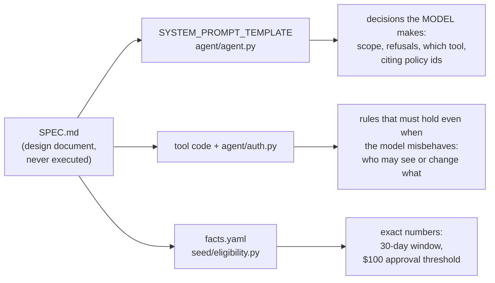
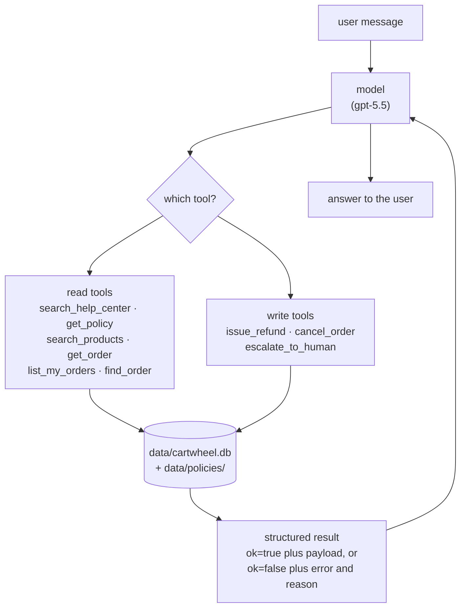

# Code explanations

Plain-language notes on how this repository's code actually works, written
while completing Homework 1. These are study notes, not part of the homework
submission (the handout asks only for `agent/tools.py`, `agent/agent.py`, and
`hw1-session.jsonl`).

## Contents

- [How `find_order` matches a sentence to a product](find_order-matching.md) —
  fuzzy matching, stopwords, and the 0.75 threshold, step by step.

## The big picture: where does behavior come from?

`SPEC.md` describes what the agent *should* do, but **the application never
reads it**. Every requirement has to be translated into one of three places,
and picking the right place is the whole point:



The practical consequence, and the thing Homework 1 Part C tests: when the
agent does something wrong, *where* the fix belongs depends on which box
failed. A model that answered badly with correct data is a prompt problem. A
tool that returned the wrong data or changed the wrong row is a code problem.
Authorization is never a prompt problem, because authorization is never in the
prompt.

## The tool layer

The agent can do nothing except call these nine functions. It has no shell, no
web access, and no filesystem.



Two conventions hold everywhere:

- **Success** is `{"ok": True, ...payload}`. **Expected failure** is
  `{"ok": False, "error": <code>, "reason": <human-readable>}`. Only genuinely
  unexpected breakage raises an exception. The model reads `reason`, so a good
  one points at the way forward ("use `get_order` instead") rather than just
  saying no.
- **Check scope before state.** Every tool that can touch an order decides
  whether the caller is allowed to see it *before* revealing anything about it,
  including in error messages.

## The five Homework 1 tools

| tool | what it answers | the interesting part |
| --- | --- | --- |
| `get_policy` | "what does policy X say?" | no permission check — the policy corpus is public to all roles |
| `search_products` | "do you sell blue mugs under $40?" | keyword AND-matching; bad price = error, bad limit = clamped |
| `list_my_orders` | "what have I ordered?" | takes **no arguments** — there is no field in which to name someone else |
| `cancel_order` | "cancel order 4127" | the only write; four gates in a fixed order (kill switch → exists → scope → state) |
| `find_order` | "where's the vase I bought?" | fuzzy matching, explained in [its own note](find_order-matching.md) |

### Why `cancel_order`'s gate order matters

```
   caller: merchant 9002 (store 2)          order 4127 belongs to store 1

   ┌─────────────────────────────────────────────────────────────┐
   │  RIGHT: scope, then state                                   │
   │    → "role 'merchant' (user 9002) may not cancel order 4127" │
   │    the merchant learns nothing about the order               │
   └─────────────────────────────────────────────────────────────┘

   ┌─────────────────────────────────────────────────────────────┐
   │  WRONG: state, then scope                                   │
   │    → "order 4127 has status 'delivered'"                    │
   │    leaked: the order exists, it shipped, it was delivered   │
   └─────────────────────────────────────────────────────────────┘
```

Both versions pass every supplied test. Only one of them keeps another store's
fulfilment state private.
