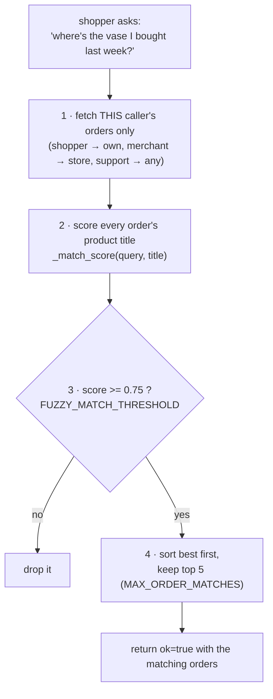
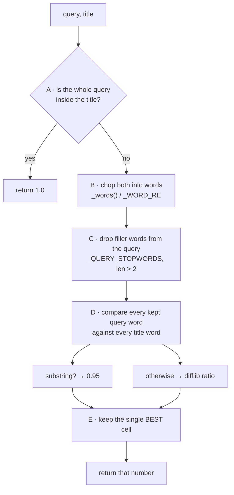

# How `find_order` matches a sentence to a product

Beginner-friendly walkthrough of `_match_score` and friends in
[`agent/tools.py`](../agent/tools.py).

## 1. The problem

A shopper types a *sentence*. The database stores a *product title*. They never
look alike:

```
   what the shopper types            what the database has
   ───────────────────────           ─────────────────────
   "the vase I bought last week"     "Heavy-Duty Vase"
```

A computer comparing those two strings directly says "not equal" and gives up.
`_match_score` is the function that says *"these are 95% about the same thing"*
instead. It takes two strings and returns **one number between 0.0 and 1.0**.

```
                 ┌─────────────────┐
  query ───────► │                 │
                 │  _match_score   │ ───► 0.95   (a "how alike?" score)
  title ───────► │                 │
                 └─────────────────┘
```

## 2. Where the score is used

`_match_score` is only step 2 below. Everything else is bookkeeping.



Step 1 is the security part: the caller's role decides *which database query
runs*, so a shopper's search physically cannot reach another shopper's orders,
no matter how the sentence is worded.

Worked through with shopper 1's real orders:

```
            order 4455 ─ "Heavy-Duty Vase"  → 0.95  ✓
            order 4127 ─ "Heavy-Duty Vase"  → 0.95  ✓
            order 3980 ─ "Heavy-Duty Vase"  → 0.95  ✓
            order 3711 ─ "Compact Mug"      → 0.29  ✗ too low
                                    │
                                    ▼
                        [4455, 4127, 3980]
```

## 3. Inside `_match_score`, step by step



### Step A — cheap win first

Lowercase both, then ask: is the whole query sitting inside the title?

```
  query "vase"  ───►  is "vase" inside "heavy-duty vase" ?  YES ──► return 1.0, done
```

For our sentence it fails — `"the vase i bought last week"` is not inside
`"heavy-duty vase"` — so we continue.

### Step B — chop both into words

`_words()` uses `_WORD_RE = [a-z0-9]+`, meaning "runs of letters and digits",
which quietly throws punctuation away:

```
  "the vase I bought last week"  ──►  [the] [vase] [i] [bought] [last] [week]
  "Heavy-Duty Vase"              ──►  [heavy] [duty] [vase]
                    ▲
                    └─ the hyphen just disappears; it isn't a letter or digit
```

### Step C — throw away the junk words

`_QUERY_STOPWORDS` applies **only to the query**, never to the title:

```
  [the]     ✗ in stopword list
  [vase]    ✓ KEEP
  [i]       ✗ in stopword list  (also too short)
  [bought]  ✗ in stopword list
  [last]    ✗ in stopword list
  [week]    ✗ in stopword list
                        │
                        ▼
              query_words = [vase]
```

Why bother? "bought" and "week" say nothing about *which product*. If they were
allowed to compete, a product called "Weekend Bag" would match the word "week"
and the tool would return the wrong order. The `len(word) > 2` test does the
same job for stray short words that are not on the list.

### Step D — compare every kept word against every title word

This is the double `for` loop. Picture it as a grid:

```
                    heavy      duty       vase
                 ┌──────────┬──────────┬──────────┐
        vase     │   0.22   │   0.00   │   0.95   │
                 └──────────┴──────────┴──────────┘
                                            ▲
                                            └── the winner
```

Each cell is filled by one of two rules, in order:

```
   rule 1 — substring?   is "vase" inside "vase"?  YES  ──► 0.95
   rule 2 — otherwise, difflib similarity:
                         "vase" vs "heavy"  ──► 0.22   (v and e in common, barely)
                         "vase" vs "duty"   ──► 0.00   (nothing in common)
```

`SequenceMatcher(...).ratio()` is Python's built-in "how similar are these two
strings, 0 to 1". Its real value is typos:

```
   "earmufs"  vs  "earmuffs"   ──►  0.93     one missing letter, still recognisable
```

### Step E — take the biggest cell

```
   0.22 , 0.00 , 0.95   ──►  max  ──►  0.95   ◄── the returned score
```

### Step F — compare against the threshold (back in `find_order`)

```
      0.0                     0.75                    1.0
       ├────────────────────────┼───────────────────────┤
       │        ignore          │        match          │
       └────────────────────────┴───────────────────────┘
                                ▲
                    FUZZY_MATCH_THRESHOLD
```

## 4. The one real design decision: `max`, not average

```
  AVERAGE of the row  =  (0.22 + 0.00 + 0.95) / 3  =  0.39  ──► below 0.75 ──► NO MATCH ✗
  MAX     of the row  =   0.95                              ──► above 0.75 ──► MATCH   ✓
```

With an average, a sentence would *always* score badly, because most of its
words are unrelated to any one product title: the good word gets diluted by the
bad ones. Taking the max means **one strong word is enough**.

The price: `"I want a vase and also a mug"` matches vases *and* mugs, because
each has a word that scores high. For a "help me find my order" tool, offering
five candidates the shopper can choose from beats offering nothing.

## 5. Measured scores

Real output, all against the title `"Heavy-Duty Vase"`:

| query | score | result |
| --- | --- | --- |
| `"Heavy-Duty Vase"` | 1.00 | ✓ whole query inside the title |
| `"vase"` | 1.00 | ✓ whole query inside the title |
| `"the vase I bought last week"` | 0.95 | ✓ one strong word survives the filler |
| `"heavy duty"` | 0.95 | ✓ substring hit |
| `"earmufs"` | 0.33 | ✗ genuinely a different product |
| `"mug"` | 0.29 | ✗ |
| `"zzzznonexistent9999"` | 0.09 | ✗ |

Reproduce them yourself:

```bash
uv run python -c "
from agent import tools
for q in ['vase', 'the vase I bought last week', 'mug']:
    print(q, tools._match_score(q, 'Heavy-Duty Vase'))
"
```

## 6. The names, one line each

| name | what it is |
| --- | --- |
| `MAX_ORDER_MATCHES = 5` | never return more than 5 orders (the docstring requires this) |
| `FUZZY_MATCH_THRESHOLD = 0.75` | the ✓/✗ line. Lower = more matches and more junk |
| `_WORD_RE = [a-z0-9]+` | "a word is letters and digits"; punctuation is dropped |
| `_QUERY_STOPWORDS` | filler words that must never win a match on their own |
| `_words()` | the chopper: text ──► list of lowercase words |
| `_match_score()` | the scorer: (query, title) ──► one number 0.0–1.0 |

## 7. Knobs to turn if Part B shows problems

- **Real orders being missed** → lower `FUZZY_MATCH_THRESHOLD` (0.75 → 0.65), or
  remove a word from `_QUERY_STOPWORDS` that turned out to carry meaning.
- **Unrelated orders coming back** → raise the threshold, or add the offending
  filler word to `_QUERY_STOPWORDS`.
- **Only the product title is searched.** Descriptions and categories are not.
  A shopper asking for "the ceramic thing" matches nothing unless "ceramic" is
  in the title.
