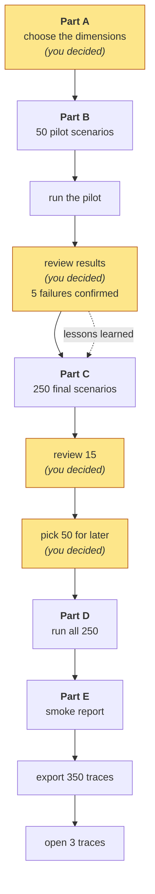
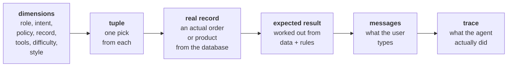
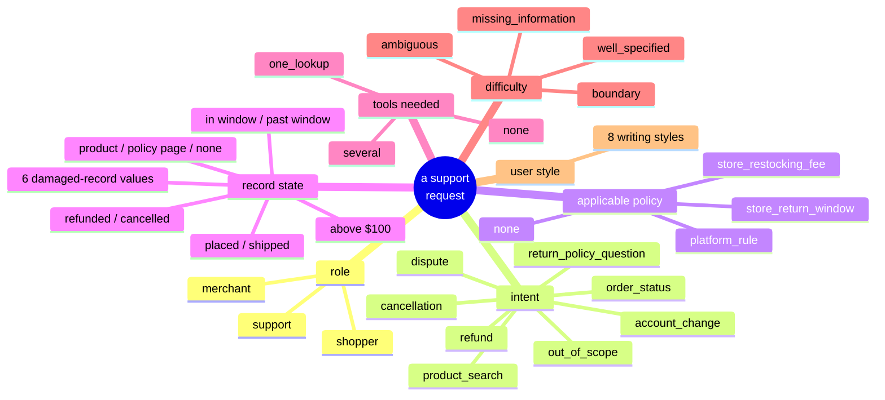
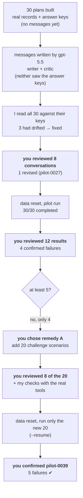
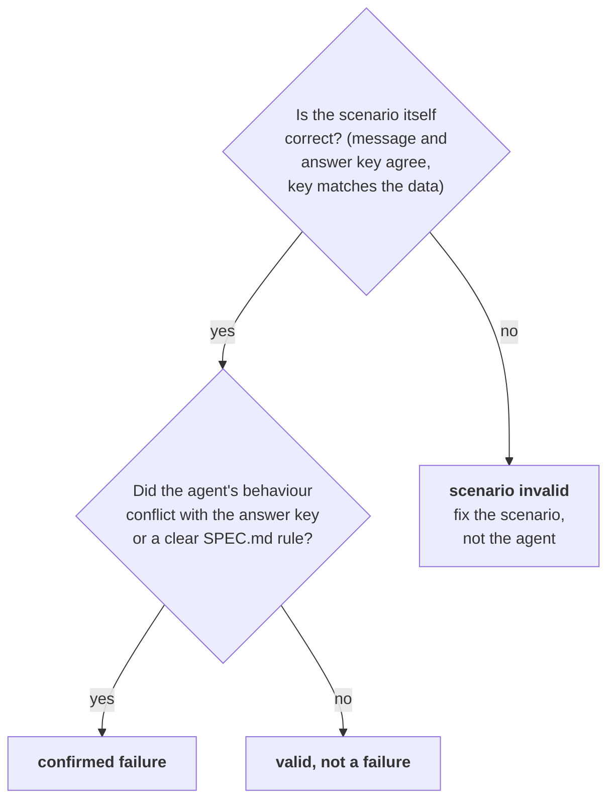
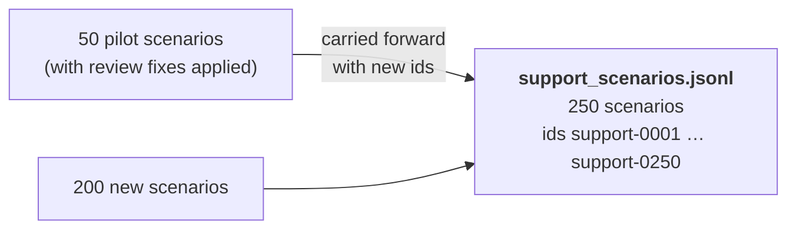
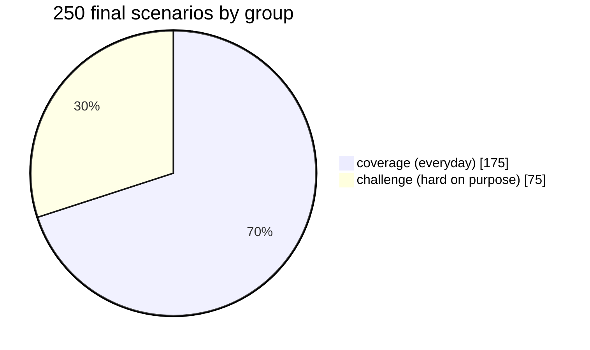
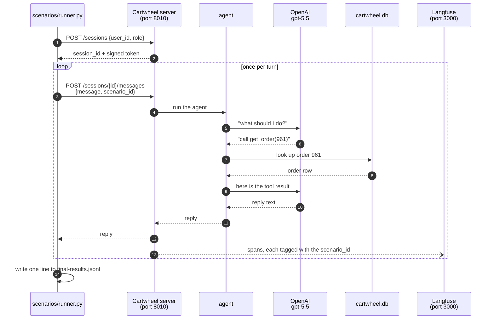
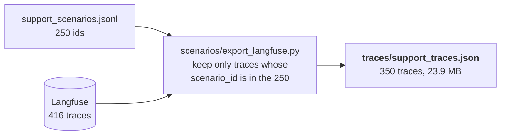

# Homework 3: what was done, and why

A plain-language record of the Homework 3 work: building a test set for the
support agent, running it, and saving the recordings. It assumes no background
in evaluation and explains each term the first time it appears.

- Detailed step log: [module-1/hw3-progress.md](module-1/hw3-progress.md)
- The assignment itself: [module-1/hw3.md](module-1/hw3.md)
- The recipe it follows: [../scenarios/skill/SKILL.md](../scenarios/skill/SKILL.md)

---

## 1. Homework 3 in one sentence

Write **250 realistic customer conversations**, each with the **correct answer
worked out ahead of time**, send them all to the agent, and **save the
recordings** so Homework 4 can study where the agent goes wrong.

In one picture:

```
  Homework 1          Homework 2              Homework 3                    Homework 4
 ───────────        ─────────────          ─────────────────              ─────────────
 build the          put the agent          write an exam, sit             mark the exam,
 tools              behind a door,         the agent in front of          find patterns
                    add a camera           it, keep the recordings        in the mistakes
```

Homework 3 does **not** grade the agent's mistakes or give them names. It builds
the exam and collects the answer sheets. (The pilot in Part B did confirm five
failures, because the handout requires it.)

---

## 2. Why build an exam at all?

Without a test set you can only try the agent by hand, a few messages at a time.
You will mostly try the easy cases, and you will not notice when a later change
breaks something that used to work.

```
  Trying it by hand                          A test set
  ─────────────────                          ──────────
  "seems fine to me"                         250 conversations, the same every time
  a few easy questions                       easy AND deliberately tricky ones
  no written right answer                    every conversation has a written answer key
  can't repeat it exactly                    rerun it after any change and compare
```

One rule matters more than any other: **the right answer must come from the
data and the rules, never from the model.** If you ask the model "what should
the agent say?" and then check the agent against that, you are checking the
model against itself, so a wrong idea shared by both would count as correct.

---

## 3. Ten words worth knowing

| Word | Plain meaning | Example from this homework |
| --- | --- | --- |
| **scenario** | One test conversation: who the user is, what they type, and the correct result | `support-0019`: a shopper asks to return a field guide |
| **expected result** (answer key) | What the agent *should* do, written down *before* the agent runs | "refund_auto_approved" |
| **grounding** | Tying the answer key to a real source: a database row, a policy page, or a function in the code | "seed/eligibility.py, order 961" |
| **dimension** | One way requests can differ from each other | *role*: shopper, merchant or support |
| **tuple** | One pick from every dimension, like a row on a menu | shopper + refund + store window + confused writing style + … |
| **coverage set** | 175 everyday requests, spread across all the dimensions | "where is my order?" |
| **challenge set** | 75 deliberately hard requests | a broken database record, a last-day return |
| **pilot** | A small trial run before the big one, to catch problems cheaply | 50 scenarios before the 250 |
| **damaged record** | A row the course planted in the database with something wrong in it, on purpose | order 8002 has no delivery date |
| **trace** | The recording of one message: what the user said, which tools ran, what the agent replied | one Langfuse page per message |

A few more you will see:

- **world date**: the database pretends today is **2026-07-01**. Every "how
  many days ago" question is measured from that date. The agent itself is never
  told this date. It isn't in the agent's instructions, and no tool returns it.
- **turn**: one user message. A 4-turn scenario means the user sends 4 messages,
  so it produces 4 traces.
- **JSONL**: a text file with one record per line. Every scenario file in this
  homework is JSONL.

---

## 4. The whole assignment on one page



The yellow boxes are **review points**. At each one the work stopped, and you
made the decision before anything went further.

### The path from an idea to a recording

This path is the heart of the homework. Every one of the 250 scenarios went
through it.



Two things about the order of these steps:

1. **The answer key is written before the messages.** The right answer depends
   only on the record and the rules, not on how the user phrases the request.
2. **The message writer never saw the answer key.** A real customer does not
   know that their order is "refund eligible". If the writer had seen the key,
   the messages could have leaked the answer ("I know I'm inside the 45-day
   window…"), and the test would be too easy.

---

## 5. What one scenario looks like

This is `support-0019`, copied from `scenarios/support_scenarios.jsonl` and
labelled:

```
┌─────────────────────────────────────────────────────────────────────────────┐
│ id:              support-0019                                               │
│ scenario_group:  challenge            ← one of the 75 hard ones             │
│ data_quality_case_id: null            ← not about a damaged record          │
├───────────────── tuple (one pick from each dimension) ──────────────────────┤
│ role:            shopper                                                    │
│ user_id:         338                  ← a real user in the database         │
│ intent:          refund                                                     │
│ record_state:    order_in_window                                            │
│ applicable_policy: store_return_window  ← the store's own rule applies      │
│ tools_needed:    several                                                    │
│ difficulty:      well_specified                                             │
│ user_style:      confused_rambling                                          │
│ turn_count:      2                                                          │
│ order_id:        961                                                        │
├───────────────── what the user types ───────────────────────────────────────┤
│ message 1: "hi, I'm not totally sure if this is even something I can still  │
│            ask about, but I bought an Everyday Field Guide a while back and │
│            it got delivered maybe like 5 weeks ago? ..."                    │
│ message 2: "oh sorry, I should've said it was from Northwind Books. ..."    │
├───────────────── expected result (the answer key) ──────────────────────────┤
│ outcome: refund_auto_approved                                               │
│ reason:  Delivered 2026-05-28, 34 days before 2026-07-01, inside Northwind  │
│          Books's 45-day store window; $48.25 is at or below the $100        │
│          threshold.                                                         │
│ source:  eligibility_function → seed/eligibility.py, orders.id=961          │
└─────────────────────────────────────────────────────────────────────────────┘
```

Where each answer key came from:

```
      source type               what it points at                   example
  ─────────────────────   ─────────────────────────────────   ──────────────────────────
  sql                     a database query                    "which mugs does Juniper sell?"
  eligibility_function    seed/eligibility.py                 "is this order refundable?"
  policy_document         a help-centre page                  "cw-payouts: Fridays, 2 days"
  data_quality_table      one of the six damaged records      "dq-order-store-mismatch"
  human judgment          a written rule for a person to      "politely decline a mortgage
                          apply when marking                  question, call no tools"
```

Most keys (the "objective" ones) have a single right answer you can look up. A
few, like out-of-scope requests, can't be looked up, so the key describes what a
good reply must do.

---

## 6. Part A: choosing the dimensions

**The question:** in what ways can a support request differ?

The handout required six dimensions. You named *intent* and *applicable policy*
yourself. The scenario recipe (the skill) and the validator also require
*user style*.



**Your decisions at this review:**

| Decision | What it means | Why |
| --- | --- | --- |
| **A.** Keep `account_change` as an intent | Include "change my email" requests | SPEC.md rule ESC-2 says these must go to a human. In HW1 the agent refused them without escalating, so they are worth testing. |
| **B.** Split store policy in two | `store_return_window` and `store_restocking_fee` | They are different rules, written in different documents. |
| **C.** Approve the seven dimensions | The plan above | |
| **Option B** (decided in Part B) | Each damaged record gets its own `record_state` value | Order 8002 has no delivery date, so it is neither "in window" nor "past window". It needed a label of its own. |

### Why "store rules" were such an important dimension

The platform says 30 days for returns, but some stores override it, in both
directions:

```
 days after delivery:  0        7       14       21       30             45
                       ├────────┼────────┼────────┼────────┼──────────────┤
 Saltbox Pantry        ████████                                              7 days
 Juniper Home Goods    █████████████████                                    14 days
 Meridian Cycles       ██████████████████████████                           21 days
 platform rule         ████████████████████████████████████                 30 days
 Northwind Books       ██████████████████████████████████████████████████   45 days
```

An agent that always says "30 days" will be wrong for four stores. The test set
had to include those stores, including orders on the exact last day of a window.

### The six damaged records

The course planted six broken rows in the database. The challenge set uses
**each one exactly five times**.

| Case id | What is wrong | The right behaviour, in short |
| --- | --- | --- |
| `dq-order-missing-delivery-date` | Order 8002 has no delivery date | Don't calculate a return deadline |
| `dq-order-reversed-dates` | Order 8001 was "delivered" before it was ordered | Don't trust the dates; flag the problem |
| `dq-order-store-mismatch` | Order 8003 is filed under Blue Heron, but its product belongs to Golden Hour Coffee | Flag it; don't name either store as the seller; merchant 9014 must not see it |
| `dq-product-duplicate-title` | Several products share one title | Ask which one is meant |
| `dq-product-invalid-price` | Product 4 costs **−$5.00** | Don't state it as a real price |
| `dq-product-missing-title` | Product 3 has a blank title | Don't give it someone else's name |

---

## 7. Part B: the pilot

**Why run a pilot?** The final run takes more than an hour and costs about
$11. A small trial first shows whether the scenarios themselves are any good,
and whether the agent fails often enough to be worth studying.

### What happened, in order



### What "the data reset" means, and why it happened twice

Some scenarios **change** the database: a refund marks an order refunded, and a
cancellation marks it cancelled. Run the same scenario a second time and the
answer key is wrong, because the order is already refunded.

```
   seed.generate          pilot run               seed.generate          final run
  ┌────────────┐        ┌────────────┐          ┌────────────┐        ┌────────────┐
  │ order 961  │  ───►  │ order 961  │   ───►   │ order 961  │  ───►  │ order 961  │
  │ delivered  │        │ REFUNDED   │  (reset) │ delivered  │        │ REFUNDED   │
  └────────────┘        └────────────┘          └────────────┘        └────────────┘
    answer key                                    answer key
    matches ✔                                     matches again ✔
```

`uv run python -m seed.generate` rebuilds the database from scratch and puts
the pinned demo orders (#4127, #3980, #4455) back.

### How a result was judged

For every result you reviewed, you picked one of three verdicts:



The first question comes first on purpose. If the exam question is wrong, the
agent's answer can't be marked.

### The 13 reviewed pilot results

| Verdict | Scenarios |
| --- | --- |
| **Confirmed failure (5)** | pilot-0019, 0006, 0020, 0010, 0039 |
| Valid, not a failure (6) | pilot-0005, 0023, 0024, 0030, 0022, 0014 |
| Scenario invalid (2) | pilot-0004, 0015 |

### The five confirmed failures, one at a time

Each is described on its own. Grouping them into types is Homework 4's job.

**pilot-0019: an eligible return was not refunded.** Order 961, Northwind
Books, 45-day window.

```
   May 28                               Jul 1                     Jul 12
 delivered                         "today" (day 34)          window closes (day 45)
     ●━━━━━━━━━━━━━━━━━━━━━━━━━━━━━━━━━━━━━●━━━━━━━━━━━━━━━━━━━━━━━━━━━━●
     └────────────── still inside the window ─────────────────────────────┘

 Agent: "the window ended around July 12, 2026, so it looks like it's outside
         the normal return window now"                      → no refund issued
 Key:   refund_auto_approved
```

The agent worked out the right closing date (July 12), then decided that date
had already passed.

**pilot-0006: correct rule, wrong source.** The agent said 30 days, which is
the platform rule, but cited `store-northwind-books-policy`, which is Northwind
Books' own **45-day** page. The platform rule lives in `cw-returns`. SPEC.md
rule RESP-1 requires citing the right policy for every policy claim.

**pilot-0020: invented a problem instead of refusing.** Order 377, Saltbox
Pantry, 7-day window.

```
   Jun 5        Jun 12                                      Jul 1
 delivered   window closes                            "today" (day 26)
     ●━━━━━━━━━━━●───────────────────────────────────────────●
                 └──────────── past the window ──────────────┘

 User said:  "about 4 weeks ago"          26 days ≈ 4 weeks ✔ (no conflict)
 Agent:      named the 7-day window, then escalated a "delivery-date
             discrepancy" that does not exist             → ticket 154
 Key:        refund_denied_past_return_window
```

**pilot-0010: told a shopper their dispute was too late when it wasn't.**
Order 22, 60-day dispute window.

```
   May 20                              Jul 1                 Jul 19
 delivered                        "today" (day 42)      window closes (day 60)
     ●━━━━━━━━━━━━━━━━━━━━━━━━━━━━━━━━━━●━━━━━━━━━━━━━━━━━━━━━━●

 Agent: escalated (correct), but said "Your order appears to be outside
        that standard 60-day window"                     (false)
```

**pilot-0039: the same kind of statement, on a different order.** Order 81,
delivered May 4. July 1 is day 58, and the window closes on July 3.

```
   May 4                                               Jul 1  Jul 3
 delivered                                        day 58 ●━━━━● day 60
     ●━━━━━━━━━━━━━━━━━━━━━━━━━━━━━━━━━━━━━━━━━━━━━━━━━━━━●    ●

 Agent: "This order appears to be outside that 60-day window"   (false)
```

A fact noted during review, not a verdict: the agent is **never given
today's date**. Nothing in its instructions or tool results says "today is
2026-07-01". Homework 4 is where that kind of observation gets analysed.

### The two invalid scenarios: the exam was wrong, not the agent

```
 pilot-0004                                    pilot-0015
 ──────────                                    ──────────
 message:  "Can I cancel it?"   (a question)   key:    Juniper sells 2 mugs
 key:      order_cancelled      (an action)    truth:  Juniper sells 5 mugs
 agent:    answered the question correctly     agent:  listed all 5 correctly

 cause:    the planned facts described the     cause:  my query used LIMIT 4
           situation, not what the user wanted         across all stores (my error)
 fix:      message rewritten as a direct       fix:    key rewritten with all 5
           request in the final set                    in the final set
```

A third mistake of mine was caught in review: pilot-0030's key said two
products share the title "Heavy-Duty Vase", but Blue Heron has four. That
result was still judged valid, and the key was corrected in the final set.

### Remedy A: the 20 extra challenge scenarios

The first 30 gave only four failures, and the handout needs five. You chose to
add 20 challenge scenarios. The handout's rule is *don't copy the requests that
failed*, so the 20 were built from **dimensions** instead:

```
  store windows, both directions    boundary days              dispute window
  ─────────────────────────────     ─────────────              ──────────────
  Northwind 45 (eligible + past)    Saltbox day 7 and day 8    inside (day 58)
  Saltbox 7                         platform day 31            outside (day 63)
  Meridian 21                       Meridian day 22

  missing information               correction across turns    damaged records not yet used
  ───────────────────               ───────────────────────    ───────────────────────────
  two Travel Pitcher orders,        user names the wrong       order 8003, product 4 (−$5),
  only one eligible                 store, then corrects it    product 3 (blank title)
```

Only the 20 new ones were run (the `--resume` flag keeps finished results). One
of them, **pilot-0039**, became the fifth confirmed failure.

---

## 8. Part C: the final 250

### Where the 250 came from



**Why new ids?** The export in Part E finds traces by scenario id. If a final
scenario reused `pilot-0019`, the export would also pick up the pilot's old
traces.

### The mix you approved



```
 COVERAGE (175), by intent                   CHALLENGE (75), by kind
 ─────────────────────────                   ───────────────────────
 order status       ███████████████████ 35   damaged records    ███████████████ 30  (5 × 6)
 refund             ███████████████████ 35   store windows      ██████████      20
 product search     █████████████       25   authorization      ███              6
 cancellation       ████████████        22   ambiguous matches  ███              6
 return policy      ███████████         20   dispute windows    ███              5
 out of scope       ████████            16   corrections        ███              5
 dispute            ██████              12   $100 threshold     ██               3
 account change     █████               10
```

```
 ROLES (all 250)                              TURNS (all 250)
 ───────────────                              ───────────────
 shopper   ██████████████████████████  150    1 turn     ███████████████████████  190
 merchant  ██████████                   55    2 turns    ████                      35
 support   ████████                     45    3 turns    ██                        17
                                              4–6 turns  █                          8
```

### Problems found while building, and how each was fixed

| Problem | How it was found | Fix |
| --- | --- | --- |
| Repeated openings: 18 groups of conversations started the same way ("I want to dispute the …" ×5) | A script compared all 250 openings | 26 regenerated with a list of openings to avoid, then 2 more, then 3 one at a time |
| Orders too old: 84% of delivered orders in the database are over 90 days old, so random picks were mostly ancient | Checking the order ages | **You chose to fix it.** 27 scenarios re-picked with 19–60 day and 32–118 day orders |
| No order sits on the exact last day of an override store's window (the only one was already used) | The build script's safety check | Meridian Cycles day 20 used instead (support-0232) |
| "Pick which order" scenarios where *neither* order was refundable, so a wrong guess cost nothing | The build script's safety check | Pairs now need exactly one refundable order |

### The review of 15 (your decisions)

The handout requires both groups, all three roles and every intent. The sample
had 8 coverage and 7 challenge, all 3 roles and all 8 intents.

```
  accepted as is ████████████████████████████████████ 13
  revised        ██████                                2
  rejected                                             0
```

The two revisions:

```
 support-0168  (a merchant asks about payouts)
 ─────────────────────────────────────────────
 before:  follow-ups asked about "payout day definition" and "bank holidays"
 problem: the cw-payouts page covers neither, so the key had nothing to say
          about 2 of the 3 turns
 after:   follow-ups ask about processing time (2 business days) and whether
          refunds are deducted (yes, from the next payout). The page covers both.

 support-0134  (price of "Vintage Granola" at Saltbox Pantry)
 ────────────────────────────────────────────────────────────
 problem: a search also finds a Vintage Granola at Golden Hour Coffee ($7.50,
          against $257.00), and the key didn't say that answer is wrong
 after:   one sentence added to the key. The same gap was fixed in 6 more
          price-lookup scenarios outside the sample (0116, 0119, 0120, 0121,
          0128, 0135)
```

### The 50 saved for later (monitoring set)

Homework 7 will change the agent and rerun the **same** 50 requests to see
whether things improved or broke. You chose:

```
  split:    30 coverage + 20 challenge
  anchored on: the 15 you reviewed  +  the 5 carried from confirmed pilot failures
               (support-0006, 0010, 0019, 0020, 0039)
  then:     30 more chosen to spread across intents, kinds and roles

  result:   roles 31 shopper / 11 merchant / 8 support
            all 8 intents, one scenario for each damaged record
```

They are copied **byte for byte** into `scenarios/monitoring_scenarios.jsonl`,
so they can be compared exactly with the originals.

---

## 9. Part D: running all 250

### What happens when one scenario runs



This is the Homework 2 work in action. `POST /sessions` is your
`create_session`, and `POST .../messages` is your `post_message`. The
`cartwheel.scenario_id` label on the trace is what lets Part E find these
recordings again.

### Two jobs that were kept apart

The recipe insists that **writing the scenarios** and **running the agent** are
separate steps. They used different programs, at different times:

```
   WRITING (Parts B and C)                          RUNNING (Parts B and D)
   ───────────────────────                          ───────────────────────
   gpt-5.5 writes what a user would type            the Cartwheel agent answers
   sees: the plan and the user's facts              sees: only the user's messages
   never sees: the answer key                       never sees: the answer key
   output: scenarios/*.jsonl                        output: *-results.jsonl + traces
```

The agent never sees the answer key either. Otherwise it would be a copy of
the answers, not an exam.

### The numbers

| | Coverage | Challenge | Total |
| --- | --- | --- | --- |
| Scenarios completed | 175 / 175 | 75 / 75 | **250 / 250** |
| Average time per scenario | 16.7 s | 19.8 s | about 19 s |
| Wall-clock time | 49 min | 25 min | about 74 min |

- **Errors or timeouts:** none, so no reruns were needed.
- **Model:** every record says `gpt-5.5`, the same model as the pilot. Using one
  model keeps the traces comparable.
- **Estimates vs reality:** the handout's estimate of 8 s per scenario and about
  35 minutes did not hold here. My own estimate of 45 minutes was also low.
- **Why challenge was slower:** challenge scenarios made more tool calls on
  average, about 3.4 per scenario against 2.3 for coverage (counted from the
  exported traces).

---

## 10. Part E: checking and exporting

### Step 1: the smoke report (is the machine on?)

`reports/smoke.sql` asks Langfuse's database eight questions: how many traces,
which roles, any errors, how many escalations, tokens and cost, the longest
traces, which tools ran, and how many permission denials. The answers were
saved to `reports/smoke-output.txt`.

**The report counts everything Langfuse has ever recorded**, not just the final
run, so its totals were split by where each trace came from:

```
 all 416 traces in Langfuse
 ├── final run   (support-…)        350 traces   $11.13   ← this homework's main output
 ├── pilot       (pilot-…)           57 traces    $2.75
 ├── setup check (setup-check-001)    1 trace     $0.02
 └── HW2 manual requests              8 traces    $0.01
```

For the final run alone: **1,156,913 input tokens**, **174,298 output tokens**,
**88 escalations**, **6 permission denials**. The error query returned
**no rows**.

Tool calls across all traces, which shows the agent's habits:

```
 get_order            ████████████████████████████████████████████  218
 get_policy           ████████████████████████████████              160
 search_help_center   ████████████████████████████████              159
 escalate_to_human    ███████████████████████                       113
 search_products      █████████████████                              82
 find_order           ███████████                                    56
 issue_refund         ██████████                                     48
 cancel_order         ████                                           17
 list_my_orders       █                                               5
 list_orders_by_status                                                1
```

The report describes **what ran**, not **how well**. A high escalation count
could be right or wrong. Homework 4 decides which.

### Step 2: the export



Result: **"Exported 350 traces for 250 of 250 scenarios"**, on the first try.

Why 350 and not 250: each **message** is its own trace, and multi-turn
scenarios have several messages.

```
 190 scenarios × 1 turn   = 190 traces
  35 scenarios × 2 turns  =  70
  17 scenarios × 3 turns  =  51
   8 scenarios × 4–6 turns=  39
                            ────
                             350 ✔  (checked: traces per scenario = turns, for all 250)
```

### Step 3: three traces opened from the exported file

| Scenario | Why this one | What the trace shows |
| --- | --- | --- |
| **support-0220** | challenge, damaged record | A merchant asks why order 8003 is under their store. `get_order`, two `search_products`, then `escalate_to_human` |
| **support-0189** | 4 turns → 4 traces | 5, 3, 2 and 1 tool calls across the four messages |
| **support-0144** | coverage | `get_order` (placed), `cancel_order` → "Done — order 5473 has been cancelled." |

Every one contained all four things the handout asks for:

```
  ✔ the conversation (user message and agent reply)
  ✔ the model name: gpt-5.5-2026-04-23
  ✔ tool activity (each tool's input and output)
  ✔ cartwheel_scenario_id
```

The links work while Langfuse is running in Docker:
- support-0220: http://localhost:3000/project/cartwheel-dev/traces/8cc0c4d6ce7baff36708ea9239d3fafc
- support-0189, first message: http://localhost:3000/project/cartwheel-dev/traces/d47b1edd42b9a3bb6185fa408c52d505
- support-0144: http://localhost:3000/project/cartwheel-dev/traces/988958506bb72a4c844c18d66f4fa51a

---

## 11. Who decided what

```
  YOU (the reviewer)                          CLAUDE (the builder)
  ──────────────────                          ────────────────────
  approved the dimensions (A, B, C)           proposed dimensions from SPEC.md and the data
  chose one label per damaged record          queried the database for real records
  revised pilot-0027's wording                computed answer keys from data and rules
  judged 13 pilot results                     wrote messages with gpt-5.5 (no answer keys)
  chose remedy A                              ran the checks, validator and tools
  judged 8 of the 20 new challenge ones       ran the pilot and the final run
  confirmed all 5 failures                    listed candidate failures for you to judge
  approved the final mix                      applied every revision you decided on
  chose to fix the order ages                 wrote the progress note
  reviewed 15 final scenarios
  chose the 50 monitoring scenarios
```

---

## 12. Mistakes along the way, and what each taught

Being honest about these matters, because a wrong answer key produces a false
"failure".

| Mistake | Whose | Lesson now built into the process |
| --- | --- | --- |
| pilot-0015 key listed 2 mugs; there are 5 | mine (query used `LIMIT`) | Build every product-list key from the scenario's own query |
| pilot-0030 key said 2 vases; there are 4 | mine | Check every key against the full data, not a sample |
| pilot-0004 message asked a question; key expected an action | plan wording | The user's planned facts say what they **want done** |
| 0008, 0009, 0018 messages drifted from their keys | the writer | Read every conversation against its key; the critic alone can't see keys |
| Many conversations opened the same way | the writer | Compare all openings; regenerate with an "avoid these" list |
| Orders were mostly very old | random picks | Check the spread of values, not just that they are valid |
| 0168 and 0134 keys didn't cover the whole conversation | mine | Your review of 15 caught these |

---

## 13. Checks, and which used a live model

| Check | Live model? | Result |
| --- | --- | --- |
| Tracing check (`setup-check-001`) | yes | trace had scenario id, model, tool call, tokens |
| Message writing and critic | yes (gpt-5.5) | 250 conversations |
| Pilot run | yes | 50 / 50 completed |
| Final run | yes | 250 / 250 completed |
| `validate` on the pilot file | no | 50 records, no errors |
| `validate --final` on the final file | no | 250 records, 175 / 75, 30 damaged-record scenarios, no errors |
| Status count of `final-results.jsonl` | no | 250 completed (run in Python, since `jq` isn't installed) |
| Smoke report | no (reads Langfuse's database) | error query returned no rows |
| Export | no (reads Langfuse) | 250 of 250 scenarios, 350 traces |
| Reading answer keys against the real tools | no (the tools only read the local database) | used to confirm keys in Parts B and C |

---

## 14. Where the work lives

Branch **`homework_3`**.

```
scenarios/
├── pilot_scenarios.jsonl       50 pilot scenarios                  ✔ committed (0477502)
├── pilot-results.jsonl         50 pilot run records                ✔ committed
├── pilot_review.jsonl          13 reviews, 5 confirmed failures    ✔ committed
├── support_scenarios.jsonl     250 final scenarios                 ✔ committed
├── support_review.jsonl        15 reviews                          ✔ committed
├── monitoring_scenarios.jsonl  50 for Homework 7                   ✔ committed
└── final-results.jsonl         250 final run records               ✘ not committed yet
reports/
└── smoke-output.txt            the smoke report                    ✘ not committed yet
traces/
└── support_traces.json         350 exported traces (23.9 MB)       ✘ not committed yet
homework/
├── homework3_report.md         this document                       ✘ not committed yet
└── module-1/hw3-progress.md    detailed step log                   ✘ changes not committed
```

These are working files, not deliverables:

- `scenarios/pilot_plan.jsonl` and `scenarios/support_plan.jsonl` hold the plans
  behind the scenarios. They are still uncommitted.
- The scripts that built the plans and wrote the messages live in a temporary
  scratch folder, not in the repository. They may disappear when this session
  ends.

---

## 15. What is left

- [ ] **Commit** the files marked ✘ above (push only when you say so)
- [ ] **Install jq** with `sudo apt install jq`. The video's last step needs it.
- [ ] **Record the video**, 5 minutes or less:
  1. a failed pilot scenario with its expected result and evidence (any of the
     five in `pilot_review.jsonl`; pilot-0019 has the clearest timeline)
  2. a final scenario you revised (support-0168 or support-0134)
  3. one complete final trace with its scenario id and tool activity
     (support-0220 works well)
  4. run `jq '[.traces[].cartwheel_scenario_id] | unique | length' traces/support_traces.json`,
     which should print **250**
- [ ] **Assessments**: yours to complete

Before recording, make sure Docker Desktop and Langfuse are running, or the
trace links won't open.

---

## 16. Glossary

| Term | Meaning |
| --- | --- |
| answer key | Same as expected result |
| authorization boundary | A request for something the user may not see, e.g. a merchant asking about another store's order |
| boundary day | The first or last day a rule applies, e.g. day 7 of a 7-day window (still eligible, because the window is inclusive) |
| challenge set | The 75 deliberately hard scenarios |
| coverage set | The 175 everyday scenarios, spread across the dimensions |
| critic | A second model call that checks a written conversation sounds natural; it never saw the answer key |
| damaged record | One of six broken rows planted in the database on purpose |
| dimension | One way requests differ (role, intent, …) |
| escalate | Hand the case to a human by opening a ticket (`escalate_to_human`) |
| export | Copy traces out of Langfuse into a file |
| grounding | Tying an answer key to a real source |
| JSONL | A file with one JSON record per line |
| Langfuse | The trace viewer running in Docker at localhost:3000 |
| monitoring set | The 50 scenarios Homework 7 will rerun |
| override | A store rule that replaces the platform rule |
| pilot | The small trial run before the final run |
| `--resume` | Runner option that skips scenarios already completed |
| scenario | One test conversation plus its answer key |
| seed / reset | Rebuild the database to its starting state (`seed.generate`) |
| smoke report | A quick "is everything recording?" summary, not a grade |
| SPEC.md | The document of rules the agent must follow (e.g. ESC-2, RESP-1, RESP-3) |
| threshold | $100: refunds above it wait for human approval |
| trace | The recording of one message and everything the agent did for it |
| tuple | One pick from each dimension |
| turn | One user message |
| validator | `scenarios/validate.py`, which checks the scenario files' format and counts |
| world date | 2026-07-01, the "today" the database is built around |
| writer | The model call that turned a plan into what the user types |
