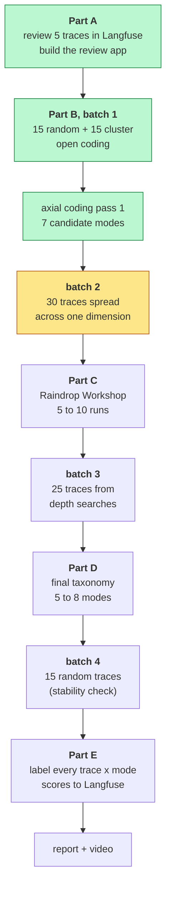
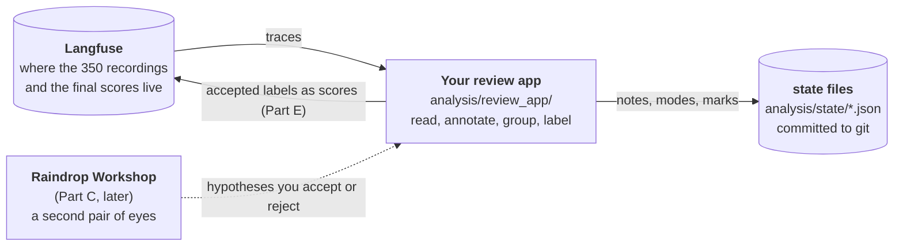
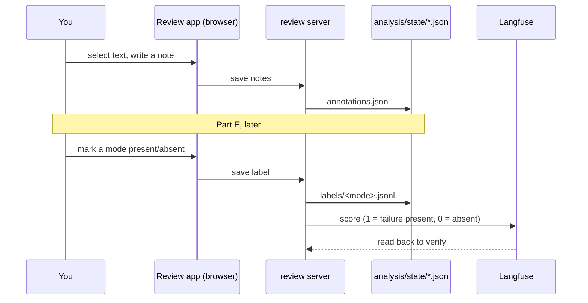
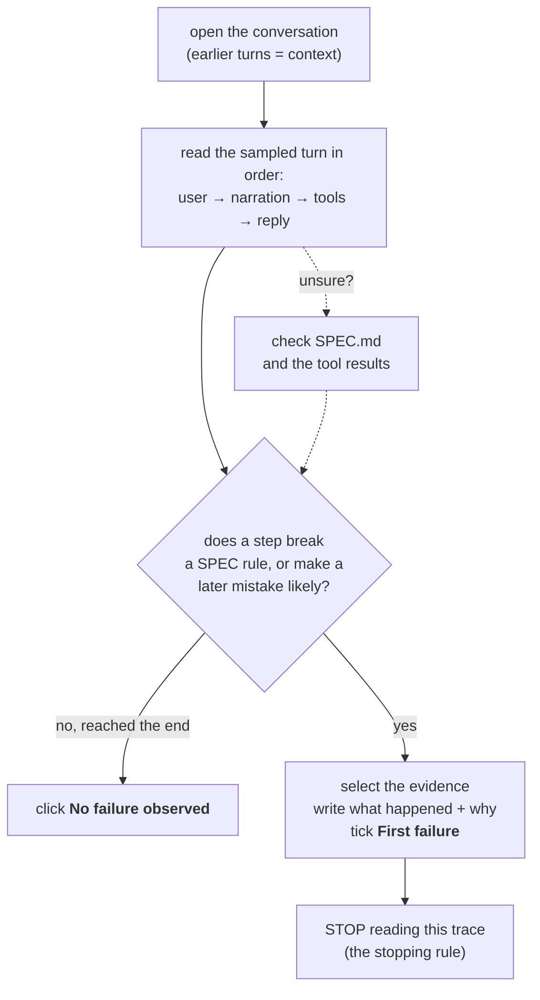
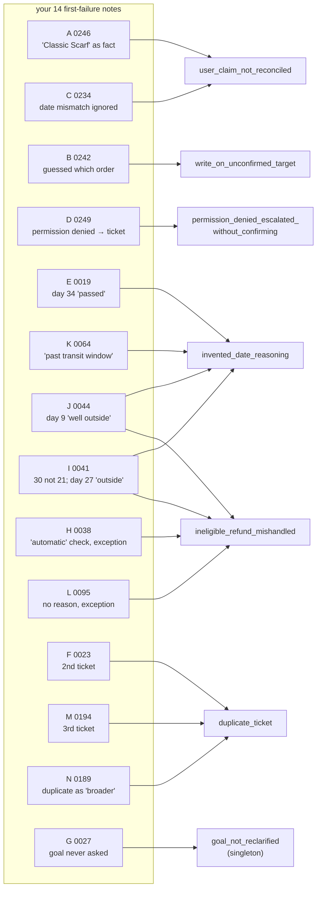

# Homework 4: what was done, and why

A plain-language record of the Homework 4 work: reading the agent's recordings
by hand, writing down every mistake in your own words, and sorting those
mistakes into named groups. It assumes no background in evaluation and explains
each term the first time it appears.

> **This is a living report.** It is updated as the homework progresses. The
> [progress tracker](#4-the-whole-assignment-on-one-page) shows what is done,
> what is in progress, and what is still to do.
>
> *Last updated: 2026-09-19, after axial coding pass 2 (60 of 100 traces
> reviewed, 8 candidate modes).*

- The assignment itself: [module-2/hw4.md](module-2/hw4.md)
- The method it follows: the [error-discovery skill](https://github.com/ai-evals-course/evals-skills/blob/main/skills/error-discovery/SKILL.md)
- The previous homework: [homework3_report.md](homework3_report.md)
- The rules the agent must follow: [../SPEC.md](../SPEC.md)

**How to read the diagrams.** The `mermaid` diagrams render on GitHub and in
VS Code with a Mermaid preview extension. The coloured pictures are inline SVG;
they render in VS Code's Markdown preview. The plain-text diagrams render
everywhere.

---

## 1. Homework 4 in one sentence

**Read the agent's recordings from Homework 3 like a detective, write down
each mistake in plain words, and group the mistakes into 5 to 8 named "failure
modes"** that a second person could check the same way you did.

```
  Homework 3                 Homework 4                          Homework 5
 ─────────────             ──────────────────────────           ─────────────────
 write an exam,            MARK the exam by hand:               build an automatic
 run the agent,            find the mistakes, name them,        checker ("judge")
 keep 350                  group them into failure modes        for each mode, and
 recordings                                                      test it against
                                                                 your labels
```

Homework 4 does **not** fix the agent. It produces a map of *what goes wrong
and how often in your sample*, which later homeworks turn into automatic checks.

---

## 2. Why read the recordings by hand?

It is tempting to jump straight to an automatic grader. But you cannot grade
for a mistake you have never seen. Reading first is how you *discover* which
mistakes exist.

```
  Guessing the mistakes up front          Reading the recordings first
  ──────────────────────────────          ────────────────────────────
  "the agent probably hallucinates"       "in support-0019 it said a 45-day window
  vague, untestable                        had passed when it was only day 34"
  misses surprises                        finds mistakes nobody predicted
  one person's opinion                    evidence anyone can re-open and check
```

Batch 1 proved the point. The most common mistake found, **the agent inventing
today's date**, was not on anyone's list beforehand. It only showed up by
reading traces one at a time.

---

## 3. Words worth knowing

| Word | Plain meaning | Example from this homework |
| --- | --- | --- |
| **trace** | The recording of **one user message**: what they typed, which tools ran, what the agent replied | trace `8bde52f6…` is turn 4 of `support-0189` |
| **session** (conversation) | All the messages in one chat, in order. A 3-message chat = 3 traces | `support-0205` is 1 session with 6 traces |
| **turn** | One user message and the agent's answer to it | "turn 2 of 3" |
| **narration** | A sentence the agent writes *to itself* before calling a tool. The user never sees it | "I'll look up order 2880 to verify its status…" |
| **open code** | Your own free-text note describing one mistake, with evidence | "Reply says the window has passed, but it is day 34 of 45" |
| **first failure** | The *earliest* step in a trace that breaks a rule or makes a later mistake likely. You stop reading there | the narration in `support-0044` that calls day 9 "well outside" 30 days |
| **no failure observed** | Your mark for a trace that you read and found correct | `support-0087`: the refund was correct |
| **axial coding** | Comparing open codes and grouping the ones that share a cause | 4 notes about invented dates become one group |
| **failure mode** | A named, yes/no-checkable kind of mistake | `duplicate_ticket` |
| **close negative** | A trace that *looks* like it has the mistake but doesn't. It shows where the line is | `support-0201`: user repeats a request, agent points to the existing ticket instead of opening a new one |
| **SPEC requirement** | A numbered rule in `SPEC.md`, like `RESP-3` | RESP-3: "state when information is missing or inconsistent" |
| **pending revision** | A rule you decided `SPEC.md` is missing, written down before a mistake can be counted against it | #5: "reuse an open ticket for the same issue" |
| **AI suggestion** | A note or mark drafted by Claude that you must **accept or reject** before it counts | 15 so far: 14 accepted, 1 rejected |
| **sample fraction** | How often a mode appeared *in the traces you chose to read*. Not a rate for all traffic | "4 of 30" |

One fact matters everywhere:

- **world date**: the course database pretends today is **2026-07-01**. Every
  "how many days ago" is measured from that date. **The agent is never told
  this date.** It is not in its instructions and no tool returns it. This one
  gap turned out to cause a whole family of mistakes (Section 11).

---

## 4. The whole assignment on one page



Green = done. Yellow = next. White = still to do.

### Progress tracker

| Step | Status | Result |
| --- | --- | --- |
| Part A: review 5 traces in the standard Langfuse view | ✅ done (2026-09-18) | 5 traces, friction notes, 4 open codes, pending revisions #1 to #4 |
| Part A: build the review interface | ✅ done (2026-09-19) | `analysis/review_app/`, merged and pushed |
| Part A: `interface_comparison.md` | 🟡 drafted | needs rewriting in your own words |
| Batch 1: 15 random + 15 cluster traces | ✅ done | 30/30 reviewed: 10 failures, 20 no failure |
| Axial coding, pass 1 | ✅ done | 7 candidate modes |
| Batch 2: 30 traces across one dimension | ✅ done | **role** (10 each): 5 failures, 25 no failure; see Section 9 |
| Axial coding, pass 2 | ✅ done | 5 new failures placed; new candidate `out_of_scope_escalated`; 8 candidates (4 solid, 4 thin) |
| Part C: Workshop notes | ⬜ to do | |
| Batch 3: 25 depth-search traces | ⬜ to do | must include at least one rejected search suggestion |
| Part D: final 5 to 8 modes | ⬜ to do | |
| Batch 4: final 15 random traces | ⬜ to do | count new modes that still appear |
| Part E: labels for every trace x mode | ⬜ to do | Langfuse scores + `analysis/state/labels/` |
| `review_summary.md`, `workshop_notes.md` | ⬜ to do | |
| Video (max 5 minutes) | ⬜ to do | yours to record |

---

## 5. The three tools, and how they fit



- **Langfuse** is the official store. It holds all traces and, at the end, your
  yes/no labels as *scores*.
- **Your review app** is where the actual reading happens. The standard Langfuse
  screen was too awkward for this (Section 6), so Homework 4 asks you to build
  your own.
- **State files** are the plain JSON copies of everything you decided. They are
  what gets graded, so they are committed to git.

---

## 6. Part A: what reading traces in Langfuse taught us

Before building anything, you reviewed **5 traces** in the normal Langfuse
screen and wrote down what slowed you down. The full record is in
[../analysis/report/part_a_langfuse_review.md](../analysis/report/part_a_langfuse_review.md).

Two problems came up again and again:

| Friction (your words) | Seen in |
| --- | --- |
| "Can't tell what turn within N turns a trace is… error prone." Turn 2 can't be judged without turn 1 | all 3 multi-turn traces |
| "Need to read text within nested JSON… Not humanly easy to read" | both single-turn traces |

### Why turn order was so hard: one conversation, many traces

The agent's server records **one trace per message**. Langfuse lists them as
separate, unrelated rows, newest first:

<svg xmlns="http://www.w3.org/2000/svg" width="720" height="210" viewBox="0 0 720 210" font-family="system-ui, sans-serif" font-size="13">
  <rect x="0" y="0" width="720" height="210" fill="#ffffff"/>
  <text x="20" y="24" font-weight="700" fill="#1f2937">What Langfuse shows</text>
  <text x="390" y="24" font-weight="700" fill="#1f2937">What actually happened</text>
  <g>
    <rect x="20" y="40" width="300" height="34" rx="6" fill="#f3f4f6" stroke="#9ca3af"/>
    <text x="32" y="62" fill="#374151">trace 26b1c001 · "Sorry, it was Saltbox…"</text>
    <rect x="20" y="82" width="300" height="34" rx="6" fill="#f3f4f6" stroke="#9ca3af"/>
    <text x="32" y="104" fill="#374151">trace 9f051920 · "Hi, I'd like to return…"</text>
    <rect x="20" y="124" width="300" height="34" rx="6" fill="#f3f4f6" stroke="#9ca3af"/>
    <text x="32" y="146" fill="#374151">trace 284f303d · "Refund for order #90…"</text>
    <text x="32" y="184" fill="#6b7280">no session, no turn number, newest first</text>
  </g>
  <g>
    <rect x="390" y="40" width="310" height="140" rx="10" fill="#eff6ff" stroke="#2563eb" stroke-width="2"/>
    <text x="405" y="62" font-weight="700" fill="#1d4ed8">session support-0044</text>
    <rect x="405" y="74" width="280" height="38" rx="6" fill="#ffffff" stroke="#2563eb"/>
    <text x="417" y="97" fill="#1f2937">turn 1 · 284f303d · "Refund for order #90…"</text>
    <rect x="405" y="122" width="280" height="38" rx="6" fill="#ffffff" stroke="#2563eb"/>
    <text x="417" y="145" fill="#1f2937">turn 2 · 26b1c001 · "Sorry, it was Saltbox…"</text>
  </g>
  <path d="M325 60 C 360 60, 360 140, 400 140" fill="none" stroke="#b45309" stroke-width="2" marker-end="url(#a)"/>
  <path d="M325 142 C 360 142, 360 92, 400 92" fill="none" stroke="#b45309" stroke-width="2" marker-end="url(#a)"/>
  <defs><marker id="a" markerWidth="8" markerHeight="8" refX="7" refY="4" orient="auto"><path d="M0,0 L8,4 L0,8 z" fill="#b45309"/></marker></defs>
</svg>

Turn 2 ("Sorry, I had the store wrong…") only makes sense after turn 1. So the
homework requires the review app to **group traces by conversation** and show
them **in time order**.

### The missing session ID, and how it was recovered

The handout says to group by a field called `cartwheel.session_id`. **None of
the 350 traces has it.** The server code has a comment saying it *must* record
the session ID, but it never does (`server/app.py`, the Homework 1 code).

Rather than guess, the review app recovers it from the server's own chat
history file:

```
  .sessions.db (the server's memory of every chat)
  ┌──────────────────────────────────────────────────────────┐
  │ session a0b5…  "Need to issue refund for customer…"  07:57:13 │
  │ session 83893… "Hello, I'd like a refund for #90…"   06:58:10 │
  └──────────────────────────────────────────────────────────┘
               ▲ match the user's words + the time (within 1 second)
               │
  trace 284f303d  user said "Hello, I'd like a refund for #90…"  at 06:58:10
               │
               ▼
  session_map.json:  284f303d → session 83893…
```

- **350 of 350** traces matched.
- Every match was within **1 second**. When the same words were typed in an
  earlier test run, that run was at least **15.5 hours** away, so there was no
  ambiguity.
- The result was **exactly one session per scenario**, which is how the scenario
  runner works, so the matching is trustworthy.
- The map is saved in `analysis/state/session_map.json`, so anyone can reproduce
  the grouping.

### The traces used

Langfuse holds **416** traces. **66** of them came from earlier pilot and
manual runs, not your HW3 final run, so the app hides them.

```
  416 in Langfuse
   ├── 66 hidden   (pilot runs, manual tests)
   └── 350 shown   = your HW3 final run
         └── grouped into 250 conversations
               ├── 190 single-message
               └──  60 multi-message (2 to 6 turns)
```

---

## 7. The review app you built

Everything lives in `analysis/review_app/`. Start it with:

```bash
uv run python -m analysis.review_app.server      # then open http://127.0.0.1:8030
```

### What one screen looks like

```
┌ Cartwheel trace review ─ Review Taxonomy Labels Progress AI suggestions ─ [30/30 reviewed ● 10 failure ● 20 no failure] ┐
├─ Sessions ──────┬────────────────────────────────────────────────────────────┬─ margin notes ──────────┤
│ search…         │ support-0044 · shopper 471 · refund · ambiguous             │                         │
│ Sampled  role▾  │ ▸ System prompt   ▸ Tool schemas   ▸ Expected outcome        │                         │
│                 │                                                              │                         │
│ ● support-0019  │ Turn 1 · trace 284f303d · [initial_uniform]                  │                         │
│ ● support-0023  │  USER   Hello, I'd like a refund for order #90…              │                         │
│ ● support-0044 ◀│  ┊ narration: "…the delivery date appears to be well ───────┼─▶ FIRST FAILURE       │
│   …             │  ┊  outside the standard return window…"   (highlighted)    │   "Order #90 delivered  │
│                 │  ┌ LOOKUP get_order ──────────── not refund-eligible ┐      │    9 days ago…"         │
│                 │  └───────────────────────────────────────────────────┘      │                         │
│                 │  REPLY  "…outside that standard window…"                    │                         │
│                 │ Turn 2 · trace 26b1c001 · [context, not sampled]            │                         │
└─────────────────┴────────────────────────────────────────────────────────────┴─────────────────────────┘
```

### The colour code

Each kind of content has its own colour, so your eye can jump to the part that
matters:

<svg xmlns="http://www.w3.org/2000/svg" width="720" height="150" viewBox="0 0 720 150" font-family="system-ui, sans-serif" font-size="13">
  <rect x="0" y="0" width="720" height="150" fill="#ffffff"/>
  <rect x="20" y="15" width="6" height="30" fill="#2563eb"/><rect x="26" y="15" width="200" height="30" fill="#eef3fe"/>
  <text x="36" y="35" fill="#1d4ed8" font-weight="700">USER</text><text x="90" y="35" fill="#374151">what they typed</text>
  <rect x="250" y="15" width="6" height="30" fill="#6d5f99"/><rect x="256" y="15" width="210" height="30" fill="#f4f2f9"/>
  <text x="266" y="35" fill="#6d5f99" font-weight="700" font-style="italic">NARRATION</text><text x="360" y="35" fill="#374151" font-style="italic">not shown to user</text>
  <rect x="490" y="15" width="6" height="30" fill="#15803d"/><rect x="496" y="15" width="200" height="30" fill="#eef8f1"/>
  <text x="506" y="35" fill="#15803d" font-weight="700">REPLY</text><text x="560" y="35" fill="#374151">what the user sees</text>
  <rect x="20" y="65" width="6" height="30" fill="#b45309"/><rect x="26" y="65" width="200" height="30" fill="#fdf6ec"/>
  <text x="36" y="85" fill="#b45309" font-weight="700">LOOKUP</text><text x="100" y="85" fill="#374151">get_order, find_order</text>
  <rect x="250" y="65" width="6" height="30" fill="#0f766e"/><rect x="256" y="65" width="210" height="30" fill="#ebf7f5"/>
  <text x="266" y="85" fill="#0f766e" font-weight="700">RETRIEVAL</text><text x="350" y="85" fill="#374151">policies, help centre</text>
  <rect x="490" y="65" width="6" height="30" fill="#c2410c"/><rect x="496" y="65" width="200" height="30" fill="#fdf0ea"/>
  <text x="506" y="85" fill="#c2410c" font-weight="700">WRITE</text><text x="560" y="85" fill="#374151">refund, cancel, ticket</text>
  <rect x="20" y="112" width="120" height="22" fill="#fde68a"/><text x="30" y="128" fill="#374151">your highlight</text>
  <rect x="160" y="112" width="160" height="22" fill="#fbeefd" stroke="#a21caf" stroke-dasharray="4 3"/><text x="170" y="128" fill="#a21caf">AI suggestion (dashed)</text>
  <text x="340" y="128" fill="#6b7280">write tools are orange-red because they change real data</text>
</svg>

### The five views

| View | What it is for | Handout requirement it meets |
| --- | --- | --- |
| **Review** | Read one conversation, select text, write a note beside it | complete conversation + tool calls; notes beside the content |
| **Taxonomy** | See your groups (modes), their notes, definitions and revisions | current taxonomy + supporting notes |
| **Labels** | One present/absent decision per trace per mode (Part E) | structured labelling view |
| **Progress** | Counts per batch, what is unreviewed, what is unlabelled, Langfuse sync | progress view |
| **AI suggestions** | Everything Claude drafted, each needing your accept or reject | AI suggestions kept separate |

### How a decision travels



### Improvements made while you used it

Using the app on real traces surfaced problems. Each was fixed and tested
before you carried on:

| What you hit | What was wrong | Fix |
| --- | --- | --- |
| "I was not able to select text" | Triple-clicks and drags that overshoot a block were refused | The selection is trimmed to the block instead |
| A reply appeared twice, once as "narration" | A tool call was paired with the wrong step when timestamps overlapped | Tools are paired with the step that asked for them |
| "There should be an indication of how many traces were reviewed" | Only a small count at the bottom of the list | A live counter in the top bar |
| Accepting an AI "first failure" note lost the mark | Accepting always cleared it | The mark is kept |
| A trace ended up with both "no failure" and "failure" | The page had not been reloaded after an update | Accepting a failure now replaces a "no failure" mark |

---

## 8. Part B, batch 1: choosing the first 30 traces

The handout asks for four batches of traces, chosen in different ways, so
the review sees different corners of the data:

```
  Batch 1   15 random  +  15 "cluster representatives"      ✅ done
  Batch 2   30 spread evenly across ONE product dimension   ✅ done (role)
  Batch 3   25 found by searching for candidate modes       ⬜
  Batch 4   15 random, after the taxonomy is drafted        ⬜
            ─────────────────────────────────────────────
            100+ distinct traces, none counted twice
```

### Random vs cluster: why both?

- **Random picks** give an honest look at typical traffic.
- **Cluster picks** make sure unusual shapes are seen too. The app describes
  every trace by numbers (how many tools, whether it wrote anything, whether
  permission was denied, how many turns…), groups similar traces into 8
  clusters, and picks the trace closest to the centre of each.

```
      tools used ▲
                 │        ○ ○            ● = picked (closest to a cluster's centre)
                 │      ○ ● ○   cluster 3
                 │        ○
                 │                  ○ ○ ○
                 │   ○ ○           ○ ● ○ ○   cluster 1
                 │  ○ ● ○            ○ ○
                 │   ○  cluster 5
                 └──────────────────────────────▶ turns in the conversation
```

Your 5 Part A traces were kept out of every batch. They count as "pre-batch"
observations, not toward the 100.

### Batch 2: why "role" was chosen (decided before looking at any outcomes)

The handout asks you to pick one **product dimension** and spread 30 traces
evenly across its values, choosing the dimension *before* seeing results.
You chose **role** on 2026-09-19:

```
            batch 1                      batch 2 (planned)
  shopper   █████████████████  17        ██████████  10
  merchant  ███████████        11        ██████████  10
  support   ██                  2        ██████████  10
```

- **It fills batch 1's biggest gap.** Only 2 support traces were read, yet
  support staff can see and act on *any* order (SPEC AUTH-1), so their
  conversations can go wrong differently.
- **It tests a clue fairly.** 9 of the 10 batch-1 failures were shoppers. An
  even split shows whether that says something about shoppers or only about
  how many shopper traces were read.
- **It leaves enough per value.** 3 roles means 10 traces each. Dimensions
  with many values (8 intents, 15 record states) would leave only 2 to 4.
- **Not chosen: difficulty.** It would surface more ambiguous and boundary
  cases, but picking it *because* it finds failures edges towards selecting on
  predicted failure. Hunting for specific modes is batch 3's job.

---

## 9. Open coding: how each trace was read

"Open coding" means reading a trace and describing the first thing that goes
wrong, **in your own words, without naming a category yet**.



**The stopping rule** keeps long traces manageable: you record only the
*first* failure. Later mistakes in the same trace can still be labelled in
Part E.

### One trace, walked through: `support-0019`, turn 2

```
 user (turn 2): "oh sorry, it was from Northwind Books…"

 get_order ─────────────▶ delivered 2026-05-28 · refund_eligible: TRUE
 get_policy ────────────▶ Northwind Books: returns within 45 days
                               │
     world date 2026-07-01 ────┤  May 28 → Jul 1 = 34 days
                               ▼
                         34 < 45  ⇒  still inside the window ✅

 reply: "…that 45-day window would normally have passed." ❌
```

The agent was never told today's date, so it guessed, and guessed wrong. It
also ignored the tool that said `refund_eligible: true`. The open code you
wrote named the evidence (day 34 of 45, the tool's flag) and the rule (RESP-3:
don't invent values).

### Batch 1 in numbers

<svg xmlns="http://www.w3.org/2000/svg" width="720" height="230" viewBox="0 0 720 230" font-family="system-ui, sans-serif" font-size="13">
  <rect x="0" y="0" width="720" height="230" fill="#ffffff"/>
  <text x="20" y="22" font-weight="700" fill="#1f2937">Batch 1: 30 traces reviewed</text>
  <rect x="20" y="36" width="200" height="26" fill="#dc2626"/><rect x="220" y="36" width="400" height="26" fill="#16a34a"/>
  <text x="30" y="54" fill="#ffffff" font-weight="700">10 failure</text><text x="230" y="54" fill="#ffffff" font-weight="700">20 no failure</text>
  <text x="20" y="96" font-weight="700" fill="#1f2937">By how the trace was chosen</text>
  <text x="20" y="120" fill="#374151">random (15)</text>
  <rect x="130" y="106" width="140" height="20" fill="#dc2626"/><rect x="270" y="106" width="160" height="20" fill="#16a34a"/>
  <text x="440" y="121" fill="#374151">7 failure · 8 no failure</text>
  <text x="20" y="148" fill="#374151">cluster (15)</text>
  <rect x="130" y="134" width="60" height="20" fill="#dc2626"/><rect x="190" y="134" width="240" height="20" fill="#16a34a"/>
  <text x="440" y="149" fill="#374151">3 failure · 12 no failure</text>
  <text x="20" y="184" font-weight="700" fill="#1f2937">By user role</text>
  <text x="20" y="208" fill="#374151">shopper 17</text><rect x="100" y="194" width="180" height="20" fill="#dc2626"/><rect x="280" y="194" width="160" height="20" fill="#16a34a"/>
  <text x="450" y="209" fill="#374151">9 · 8</text>
  <text x="500" y="208" fill="#374151">merchant 11</text><rect x="580" y="194" width="20" height="20" fill="#dc2626"/><rect x="600" y="194" width="100" height="20" fill="#16a34a"/>
  <text x="500" y="226" fill="#6b7280">1 · 10     support 2: 0 · 2</text>
</svg>

These are **sample fractions**, not rates. The batches were chosen on purpose
to show variety, so "10 of 30" does not mean one in three real conversations
fails. Homework 5 estimates real rates.

Two things stand out, as clues rather than conclusions:
- **9 of the 10 failures came from shoppers.** Batch 2, spread across roles,
  will test whether that is real.
- **Refunds dominate:** 6 of the 10 failures were refund requests.

### The 10 failures found in batch 1

| Trace | Turn | What went wrong (short) |
| --- | --- | --- |
| `support-0019` | 2 | Said a 45-day window had "passed" on day 34 |
| `support-0023` | 2 | Opened a second ticket for the same missing refund |
| `support-0027` | 2 | Never asked what the user actually wanted |
| `support-0038` | 1 | Never checked the store's 21-day window; treated "not eligible" as a failed automatic check; ticket for an "exception" |
| `support-0041` | 1 | Used 30 days instead of the store's 21; called day 27 "outside" 30 |
| `support-0044` | 1 | Called day 9 "well outside" a 30-day window; never checked the store's 7 days |
| `support-0064` | 2 | Called a parcel shipped yesterday "past the 7-day transit window" |
| `support-0095` | 1 | Refused without saying why (83 days, past the window); ticket for an "exception" |
| `support-0189` | 4 | Presented a duplicate ticket as a separate issue |
| `support-0194` | 3 | A third ticket for the same dispute |

### Batch 2 in numbers: did the "shopper" clue hold up?

Batch 1 had 9 of its 10 failures in shopper conversations, but it had also
read far more shopper traces (17) than support ones (2). Batch 2 read exactly
10 of each role:

```
                 batch 1 (unbalanced)            batch 2 (10 per role)
                 failures / traces read          failures / traces read
  shopper        9 / 17   █████████              2 / 10   ██
  merchant       1 / 11   █                      1 / 10   █
  support        0 /  2                          2 / 10   ██
```

**With the sample balanced, failures spread across all three roles.** The
batch-1 skew was mostly a result of *which* traces were read, not a sign that
shoppers are special. This is exactly why the handout asks for a batch spread
across a product dimension. (These are still sample fractions, not rates.)

### The 5 failures found in batch 2

| Trace | Role | What went wrong (short) | Closest mode |
| --- | --- | --- | --- |
| `support-0045` | shopper | User rightly doubted the seller; agent explained the doubt away and never flagged the bad record | `user_claim_not_reconciled` |
| `support-0104` | merchant | 98 days, past the window; never says why; "whether an exception can be made" | `ineligible_refund_mishandled` |
| `support-0186` | support | A legal question it should simply decline; opened a ticket instead | new? unneeded escalation |
| `support-0189` t3 | shopper | Listed two tickets for the same dispute without flagging the duplicate | `duplicate_ticket` |
| `support-0198` | support | Day 24 of a 60-day window called "about 99 days": the agent used the real-world date | `invented_date_reasoning` |

`support-0198` answered a question left open since batch 1: **where do the
invented dates come from?** The agent wrote "Current date 2026-09-14" into a
ticket. That is the real day the recordings were made, not the database's world
date of 2026-07-01. Nothing in the prompt or tools gave it that date.

---

## 10. AI suggestions: help that you had to approve

For the last 13 traces, you asked Claude to do the first read. Claude posted
its findings as **suggestions**, never directly as your notes:

```
   Claude reads the trace
          │
          ▼
   AI suggestion (dashed purple)  ───── you read it ─────┐
          │                                             │
     ┌────┴─────┐                                   ┌────┴─────┐
     │ ACCEPT   │ becomes your note or mark         │ REJECT   │ kept on record
     │          │ (marked "from AI suggestion")     │          │ with your reason
     └──────────┘                                   └──────────┘
```

| | Count |
| --- | --- |
| Suggestions made | 15 |
| Accepted | 14 |
| Rejected | **1**: `support-0189` turn 4 |

**The rejection.** Claude first suggested "no failure" for `support-0189`
turn 4. You questioned it. On a second look, the reply calls ticket #191 a
"broader charge mismatch" when the user had already said it was the same
planner charge as ticket #190. You rejected the suggestion with that reason and
coded the turn as a failure. The handout requires at least one rejected
suggestion. This one is a genuine disagreement, which is exactly what that
requirement is for.

You then rewrote **7 notes** in your own words. The app keeps each original
wording in the note's history.

---

## 11. Axial coding: from 14 notes to 7 groups

"Axial coding" means laying all your open codes side by side and asking, for
each pair: **would one product change fix both?**

```
     one fix solves both   ─────▶  MERGE them into one group
     they need different fixes  ─▶  keep them SPLIT, even if they look alike
```

You worked through the notes one at a time (A to N below) and named the fix
for each. Notes whose fixes matched became one group:



Notes I and J have **two** problems each, so they support two groups. That is
allowed: a trace can show more than one kind of mistake.

### The 7 candidate modes

| Candidate mode | In plain words | Positives | Close negatives | Rule it comes from |
| --- | --- | --- | --- | --- |
| `invented_date_reasoning` | Claims how much time has passed without knowing today's date | 4 | `-0034`, `-0066` | RESP-3 |
| `ineligible_refund_mishandled` | When a refund isn't allowed, doesn't say so and why, or calls it an "exception" | 4 | `-0034`, `-0154`, `-0025` | RESP-5 |
| `duplicate_ticket` | Opens another ticket for an issue that already has one | 3 | `-0201`, `-0205` | pending revision #5 |
| `user_claim_not_reconciled` | Treats what the user said as fact, or ignores a conflict with the record | 2 | `-0034`, `-0030` | RESP-3 + revision #2 |
| `write_on_unconfirmed_target` | Refunds or cancels an order it guessed | 1 | `-0030`, `-0087` | revision #3 |
| `permission_denied_escalated_without_confirming` | After "access denied", opens a ticket instead of asking to confirm the order number | 1 | `-0046` | revision #4 |
| `goal_not_reclarified` | Never asks what the user wants | 1 | `-0030` | — |

"Candidate" means these are working groups, not final. Each needs **at least 3
positives** to survive (the handout's minimum). Three have only one so far, so
batch 3's searches will look for more. The singleton will be dropped and
recorded as a *rejected group* if nothing else turns up.

### A boundary decision: `support-0025`

The merchant asked for a "short plain answer" and got "No, it's not
refund-eligible" with no reason. Is that `ineligible_refund_mishandled`?

```
  ineligible_refund_mishandled                       NOT this mode
  ────────────────────────────                       ─────────────
  calls it a failed "automatic" check     ◀─ line ─▶  says plainly "not eligible"
  opens an "exception" ticket                         no ticket
  gives a WRONG reason (wrong window,                 omits the reason, and the user
  invented date)                                      asked for brevity  (support-0025)
```

You decided `support-0025` is a **close negative**: accurate and brief, not
misleading. That sentence is now written into the mode's boundary, so a second
reviewer draws the line in the same place.

### Why two date-related groups, not one?

`invented_date_reasoning` and `ineligible_refund_mishandled` overlap in 2
traces, but they need **different fixes**:

| Mode | The fix |
| --- | --- |
| `invented_date_reasoning` | Tell the agent today's date, and forbid time claims without a dated source |
| `ineligible_refund_mishandled` | When `refund_eligible` is false: fetch the store's policy, say "not eligible" and why, no exception tickets |

Fixing one does not fix the other, so they stay split.

---

### Axial coding pass 2 (after batch 2)

The 5 new failures were placed with the same test: *would one product change
fix it together with the notes already in the group?*

| New note | Placed in | Why |
| --- | --- | --- |
| `support-0104` t2 | `ineligible_refund_mishandled` | same fix: explain the reason, no exception ticket |
| `support-0189` t3 | `duplicate_ticket` | same fix: reuse the open ticket |
| `support-0198` | `invented_date_reasoning` | same fix, and the evidence that the agent uses the **real-world** date |
| `support-0045` | `user_claim_not_reconciled` | same fix: verify a disputed detail and state the conflict. The definition now also covers *dismissing a user's doubt without checking* |
| `support-0186` | **new**: `out_of_scope_escalated` | a different fix (SCOPE-2: decline out-of-scope requests, no tools), so a separate group |

**Why `support-0186` was not merged with the "exception" tickets.** Both open
a ticket they shouldn't. But the refund mode's fix is a rule for *refunds that
aren't eligible* (explain why, no exception ticket), and this one's fix is a rule
for *out-of-scope requests*. A single "escalate less" change would stop both
tickets but would not fix the refund mode's misleading "automatic check"
wording, so the groups stay split.

**Where the 8 candidates stand:**

```
  invented_date_reasoning        █████  5   ✅ enough positives
  ineligible_refund_mishandled   █████  5   ✅
  duplicate_ticket               ████   4   ✅
  user_claim_not_reconciled      ███    3   ✅ (just)
  write_on_unconfirmed_target    █      1   ⚠ batch 3 must search for more
  permission_denied_…            █      1   ⚠
  goal_not_reclarified           █      1   ⚠
  out_of_scope_escalated         █      1   ⚠
```

Each final mode needs at least 3 positives. **Batch 3's depth searches target
the four thin ones.** Any that stay below 3 are dropped and recorded as
*rejected groups*.

## 12. Rules the SPEC was missing (pending revisions)

Sometimes a mistake broke no written rule, because the rule didn't exist yet.
The handout says: write the rule down **before** counting the mistake.

| # | Draft rule | Came from |
| --- | --- | --- |
| 1 | For a dispute outside the window: say it's likely ineligible, cite the policy, still escalate | `support-0246` |
| 2 | Don't present user-supplied details as verified order data | `support-0246` |
| 3 | Before a refund or cancel: if the order or amount isn't pinned down, ask; don't guess | `support-0242` |
| 4 | After `permission_denied`: say so and ask to confirm the order number before escalating | `support-0249` |
| 5 | If a ticket for the same issue is open, refer to it; open a new one only for a new issue | `support-0023` |

Two more are likely, depending on how the modes settle: **give the agent
today's date**, and **a rule for when `refund_eligible` is false**. None of
these has been written into `SPEC.md` yet. Doing that is part of Part D.

---

## 13. Who decided what

```
  YOU decided                                  CLAUDE did (with your approval)
  ───────────                                  ───────────────────────────────
  every first-failure / no-failure mark        built and fixed the review app
  the wording of every open code               drew the batch-1 sample (seeded, reproducible)
  accepting or rejecting all 15 suggestions    drafted 15 suggestions for you to judge
  rejecting the support-0189 suggestion        proposed fixes and groups for A–N
  merging A with C                             wrote the draft mode definitions
  support-0025 as a close negative             recovered the session IDs
  accepting the 7 candidate modes              kept this report up to date
```

---

## 14. Mistakes along the way, and what each taught

| What happened | Lesson |
| --- | --- |
| Langfuse (local, in Docker) was down on day 1 | The HW3 export has the same trace IDs, so design work continued from it, and the app was then checked against live Langfuse |
| No trace had a session ID | Check a data assumption before building on it. The ID was recovered and saved, not guessed |
| The review server "wouldn't start": port already in use | The old server had been paused with **Ctrl+Z**, not stopped. Stop servers with **Ctrl+C** |
| Files "missing" from VS Code | Claude works in a separate copy (a git *worktree*); changes appear only after a `git merge` |
| An accepted suggestion lost its "first failure" mark | Reload the page after merging an update, before clicking |
| Some notes were pasted from chat | Open codes must be your own words; 7 were rewritten |

---

## 15. Checks, and which used a live model

| Check | How | Live model? |
| --- | --- | --- |
| Review app unit tests (11) | `uv run pytest tests/test_review_app.py` | no |
| Session recovery: 350/350 matched, 1 session per scenario | script against `.sessions.db` | no |
| Review app driven in a headless browser (selection, suggestions, counter) | Playwright on a copy of your state | no |
| App loaded 416 traces from Langfuse, hid 66, grouped 350 | live Langfuse, read-only | no model; Langfuse only |
| Scores written to Langfuse | not yet (Part E) | — |

**No step of Homework 4 so far has called the language model.** Everything
reads recordings that Homework 3 already made.

---

## 16. Where the work lives

```
cartwheel-homeworks/
├── analysis/
│   ├── review_app/              ← your review app (server, UI, sampler)
│   ├── state/
│   │   ├── session_map.json     ← recovered session IDs
│   │   ├── sample_manifest.json ← which traces are in which batch
│   │   ├── annotations.json     ← your open codes and marks
│   │   ├── suggestions.json     ← AI suggestions + your decisions
│   │   ├── patterns.json        ← the candidate modes (taxonomy)
│   │   └── labels/              ← Part E: one file per final mode
│   └── report/
│       ├── part_a_langfuse_review.md
│       └── interface_comparison.md   ← draft, to rewrite
├── homework/
│   └── homework4_report.md      ← this file
└── tests/test_review_app.py
```

Branch: `homework_4`, pushed to GitHub.

---

## 17. What is left

- [ ] Edit the 7 draft mode definitions in the Taxonomy tab into your own words
- [ ] Commit and push `analysis/state/patterns.json`
- [x] Batch 2: dimension chosen before looking at outcomes (**role**)
- [x] Batch 2: 30 traces drawn and open-coded (5 failures, 25 no failure)
- [ ] Axial coding pass 2
- [ ] **Part C**: Raindrop Workshop, 5 to 10 runs → `analysis/report/workshop_notes.md`
- [ ] **Batch 3**: 25 traces from depth searches, including at least one rejected search result
- [ ] **Part D**: final 5 to 8 modes, each with 3+ positives, close negatives, a boundary, an evaluator type and a SPEC source; compare with the AgentDebug taxonomy; write the SPEC revisions
- [ ] **Batch 4**: 15 random traces; count new modes that still appear
- [ ] **Part E**: label every trace x mode; scores to Langfuse; `analysis/state/labels/`
- [ ] `analysis/report/review_summary.md`
- [ ] Rewrite `interface_comparison.md` in your own words
- [ ] Video (max 5 minutes)
