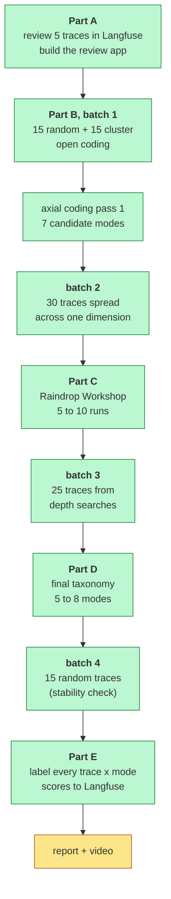
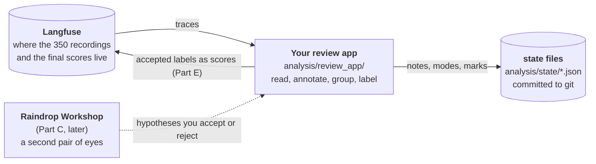
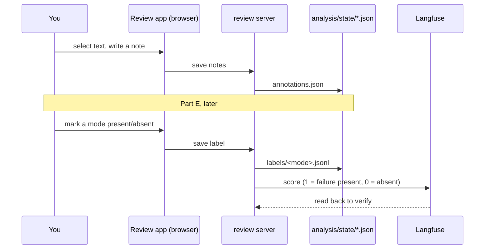
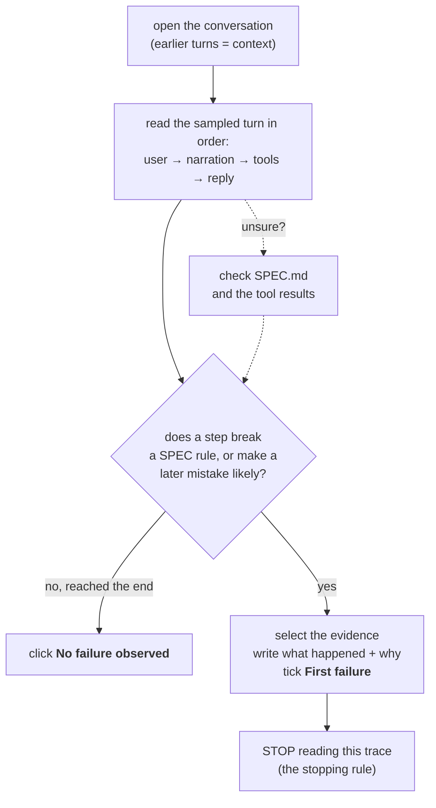
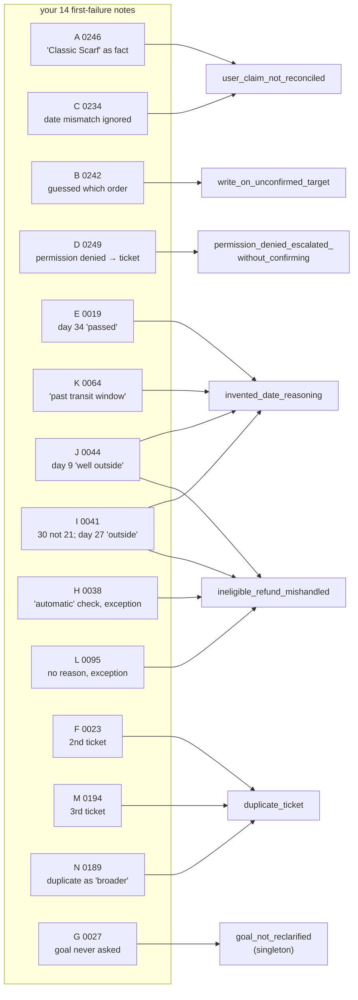

# Homework 4: what was done, and why

A plain-language record of the Homework 4 work: reading the agent's recordings
by hand, writing down every mistake in your own words, and sorting those
mistakes into named groups. It assumes no background in evaluation and explains
each term the first time it appears.

> **This is a living report.** It is updated as the homework progresses. The
> [progress tracker](#4-the-whole-assignment-on-one-page) shows what is done,
> what is in progress, and what is still to do.
>
> *Last updated: 2026-09-20, **Parts D and E complete**: 7 final modes,
> 3 rejected groups, 110 traces reviewed, 770 judgments written and verified in
> Langfuse, 6 new rules in `SPEC.md`, `review_summary.md` and
> `interface_comparison.md` written, everything committed and pushed. **Only
> the video remains.** Homework 5 needs 169 more Fail labels first: Section 18.*

- The assignment itself: [module-2/hw4.md](module-2/hw4.md)
- The method it follows: the [error-discovery skill](https://github.com/ai-evals-course/evals-skills/blob/main/skills/error-discovery/SKILL.md)
- The previous homework: [homework3_report.md](homework3_report.md)
- The rules the agent must follow: [../SPEC.md](../SPEC.md)

**How to read the diagrams.** The `mermaid` diagrams render on GitHub and in
VS Code with a Mermaid preview extension. The coloured pictures are inline SVG;
they render in VS Code's Markdown preview. The plain-text diagrams render
everywhere.

---

## 1. Homework 4 in one sentence

**Read the agent's recordings from Homework 3 like a detective, write down
each mistake in plain words, and group the mistakes into 5 to 8 named "failure
modes"** that a second person could check the same way you did.

```
  Homework 3                 Homework 4                          Homework 5
 ─────────────             ──────────────────────────           ─────────────────
 write an exam,            MARK the exam by hand:               build an automatic
 run the agent,            find the mistakes, name them,        checker ("judge")
 keep 350                  group them into failure modes        for each mode, and
 recordings                                                      test it against
                                                                 your labels
```

Homework 4 does **not** fix the agent. It produces a map of *what goes wrong
and how often in your sample*, which later homeworks turn into automatic checks.

---

## 2. Why read the recordings by hand?

It is tempting to jump straight to an automatic grader. But you cannot grade
for a mistake you have never seen. Reading first is how you *discover* which
mistakes exist.

```
  Guessing the mistakes up front          Reading the recordings first
  ──────────────────────────────          ────────────────────────────
  "the agent probably hallucinates"       "in support-0019 it said a 45-day window
  vague, untestable                        had passed when it was only day 34"
  misses surprises                        finds mistakes nobody predicted
  one person's opinion                    evidence anyone can re-open and check
```

Batch 1 proved the point. The most common mistake found, **the agent inventing
today's date**, was not on anyone's list beforehand. It only showed up by
reading traces one at a time.

---

## 3. Words worth knowing

| Word | Plain meaning | Example from this homework |
| --- | --- | --- |
| **trace** | The recording of **one user message**: what they typed, which tools ran, what the agent replied | trace `8bde52f6…` is turn 4 of `support-0189` |
| **session** (conversation) | All the messages in one chat, in order. A 3-message chat = 3 traces | `support-0205` is 1 session with 6 traces |
| **turn** | One user message and the agent's answer to it | "turn 2 of 3" |
| **narration** | A sentence the agent writes *to itself* before calling a tool. The user never sees it | "I'll look up order 2880 to verify its status…" |
| **open code** | Your own free-text note describing one mistake, with evidence | "Reply says the window has passed, but it is day 34 of 45" |
| **first failure** | The *earliest* step in a trace that breaks a rule or makes a later mistake likely. You stop reading there | the narration in `support-0044` that calls day 9 "well outside" 30 days |
| **no failure observed** | Your mark for a trace that you read and found correct | `support-0087`: the refund was correct |
| **axial coding** | Comparing open codes and grouping the ones that share a cause | 4 notes about invented dates become one group |
| **failure mode** | A named, yes/no-checkable kind of mistake | `duplicate_ticket` |
| **close negative** | A trace that *looks* like it has the mistake but doesn't. It shows where the line is | `support-0201`: user repeats a request, agent points to the existing ticket instead of opening a new one |
| **SPEC requirement** | A numbered rule in `SPEC.md`, like `RESP-3` | RESP-3: "state when information is missing or inconsistent" |
| **pending revision** | A rule you decided `SPEC.md` is missing, written down before a mistake can be counted against it. The five that modes depend on are no longer pending — see Section 12 | #5 became **ESC-6**: "reuse an open ticket for the same issue" |
| **AI suggestion** | A note or mark drafted by Claude that you must **accept or reject** before it counts | 15 so far: 14 accepted, 1 rejected |
| **sample fraction** | How often a mode appeared *in the traces you chose to read*. Not a rate for all traffic | "4 of 30" |

One fact matters everywhere:

- **world date**: the course database pretends today is **2026-07-01**. Every
  "how many days ago" is measured from that date. **The agent is never told
  this date.** It is not in its instructions and no tool returns it. This one
  gap turned out to cause a whole family of mistakes (Section 11).

---

## 4. The whole assignment on one page


```mermaid
flowchart TD
    PA["<b>Part A</b><br/>review 5 traces in Langfuse<br/>build the review app"]
    B1["<b>Part B, batch 1</b><br/>15 random + 15 cluster<br/>open coding"]
    AX1["axial coding pass 1<br/>7 candidate modes"]
    B2["<b>batch 2</b><br/>30 traces spread<br/>across one dimension"]
    PC["<b>Part C</b><br/>Raindrop Workshop<br/>5 to 10 runs"]
    B3["<b>batch 3</b><br/>25 traces from<br/>depth searches"]
    PD["<b>Part D</b><br/>final taxonomy<br/>5 to 8 modes"]
    B4["<b>batch 4</b><br/>15 random traces<br/>(stability check)"]
    PE["<b>Part E</b><br/>label every trace x mode<br/>scores to Langfuse"]
    V["report + video"]

    PA --> B1 --> AX1 --> B2 --> PC --> B3 --> PD --> B4 --> PE --> V

    style PA fill:#bbf7d0,stroke:#15803d
    style B1 fill:#bbf7d0,stroke:#15803d
    style AX1 fill:#bbf7d0,stroke:#15803d
    style B2 fill:#bbf7d0,stroke:#15803d
    style B3 fill:#bbf7d0,stroke:#15803d
    style PC fill:#bbf7d0,stroke:#15803d
    style PD fill:#bbf7d0,stroke:#15803d
    style B4 fill:#bbf7d0,stroke:#15803d
    style PE fill:#bbf7d0,stroke:#15803d
    style V fill:#fde68a,stroke:#b45309
```

Green = done. Yellow = next. White = still to do.

### Progress tracker

| Step | Status | Result |
| --- | --- | --- |
| Part A: review 5 traces in the standard Langfuse view | ✅ done (2026-09-18) | 5 traces, friction notes, 4 open codes, pending revisions #1 to #4 |
| Part A: build the review interface | ✅ done (2026-09-19) | `analysis/review_app/`, merged and pushed |
| Part A: `interface_comparison.md` | ✅ done (2026-09-20) | rewritten in your own words: retained design, changed design, remaining limitation |
| Batch 1: 15 random + 15 cluster traces | ✅ done | 30/30 reviewed: 10 failures, 20 no failure |
| Axial coding, pass 1 | ✅ done | 7 candidate modes |
| Batch 2: 30 traces across one dimension | ✅ done | **role** (10 each): 5 failures, 25 no failure; see Section 9 |
| Axial coding, pass 2 | ✅ done | 5 new failures placed; new candidate `out_of_scope_escalated` (renamed in Part D); 8 candidates (4 solid, 4 thin) |
| Part C: Workshop notes | ✅ done | 8 replayed runs; all 6 hypotheses decided: 1 accepted, 1 revised, 4 reproductions; **0 new modes**; see Section 9d |
| Batch 3: 25 depth-search traces | ✅ done | 25/25 reviewed: 12 failures, 13 no failure (13 search hits did not hold up); see Section 9b |
| Axial coding, pass 3 | ✅ done | `goal_not_reclarified` rejected; permission mode merged into `refusal_mishandled`; new candidate `inconsistent_record_not_flagged`; see Section 11 |
| Part D: final 5 to 8 modes | ✅ done (2026-09-20) | **7 final modes**, 3 rejected groups; 2 searches; renamed 1 mode after the AgentDebug comparison; see Section 11b |
| Batch 4: final 15 random traces | ✅ done | 15/15 reviewed (seed 7): 3 failures, all in existing modes; **0 new modes**; 100 distinct traces; Part D searches later added 7 more, for 107; see Section 9c |
| Part E: labels for every trace x mode | ✅ done (2026-09-20) | 7 modes x 110 traces = **770 judgments**, all written and **verified** in Langfuse; see Section 11c |
| `workshop_notes.md` | ✅ done | all 6 Workshop decisions recorded |
| `review_summary.md` | ✅ done | [analysis/report/review_summary.md](../analysis/report/review_summary.md) |
| Video (max 5 minutes) | ⬜ to do | yours to record |

> **Two notes on reading the older sections.** This report is a record of what
> happened in order, so earlier sections keep the words that were true at the
> time. One mode was **renamed** in Part D — `out_of_scope_escalated` became
> `out_of_scope_not_declined` (why: Section 11b) — and the "pending revisions"
> of Sections 11 and 12 have since been **written into `SPEC.md`** as RESP-6,
> RESP-7, RESP-8, ESC-5 and ESC-6. Nothing earlier was rewritten to match,
> because the trail from observation to category has to stay inspectable.

---

## 5. The three tools, and how they fit


```mermaid
flowchart LR
    LF[("<b>Langfuse</b><br/>where the 350 recordings<br/>and the final scores live")]
    APP["<b>Your review app</b><br/>analysis/review_app/<br/>read, annotate, group, label"]
    ST[("<b>state files</b><br/>analysis/state/*.json<br/>committed to git")]
    WS["<b>Raindrop Workshop</b><br/>(Part C, later)<br/>a second pair of eyes"]

    LF -- "traces" --> APP
    APP -- "notes, modes, marks" --> ST
    APP -- "accepted labels as scores (Part E)" --> LF
    WS -. "hypotheses you accept or reject" .-> APP
```

- **Langfuse** is the official store. It holds all traces and, at the end, your
  yes/no labels as *scores*.
- **Your review app** is where the actual reading happens. The standard Langfuse
  screen was too awkward for this (Section 6), so Homework 4 asks you to build
  your own.
- **State files** are the plain JSON copies of everything you decided. They are
  what gets graded, so they are committed to git.

---

## 6. Part A: what reading traces in Langfuse taught us

Before building anything, you reviewed **5 traces** in the normal Langfuse
screen and wrote down what slowed you down. The full record is in
[../analysis/report/part_a_langfuse_review.md](../analysis/report/part_a_langfuse_review.md).

Two problems came up again and again:

| Friction (your words) | Seen in |
| --- | --- |
| "Can't tell what turn within N turns a trace is… error prone." Turn 2 can't be judged without turn 1 | all 3 multi-turn traces |
| "Need to read text within nested JSON… Not humanly easy to read" | both single-turn traces |

### Why turn order was so hard: one conversation, many traces

The agent's server records **one trace per message**. Langfuse lists them as
separate, unrelated rows, newest first:

<svg xmlns="http://www.w3.org/2000/svg" width="720" height="210" viewBox="0 0 720 210" font-family="system-ui, sans-serif" font-size="13">
  <rect x="0" y="0" width="720" height="210" fill="#ffffff"/>
  <text x="20" y="24" font-weight="700" fill="#1f2937">What Langfuse shows</text>
  <text x="390" y="24" font-weight="700" fill="#1f2937">What actually happened</text>
  <g>
    <rect x="20" y="40" width="300" height="34" rx="6" fill="#f3f4f6" stroke="#9ca3af"/>
    <text x="32" y="62" fill="#374151">trace 26b1c001 · "Sorry, it was Saltbox…"</text>
    <rect x="20" y="82" width="300" height="34" rx="6" fill="#f3f4f6" stroke="#9ca3af"/>
    <text x="32" y="104" fill="#374151">trace 9f051920 · "Hi, I'd like to return…"</text>
    <rect x="20" y="124" width="300" height="34" rx="6" fill="#f3f4f6" stroke="#9ca3af"/>
    <text x="32" y="146" fill="#374151">trace 284f303d · "Refund for order #90…"</text>
    <text x="32" y="184" fill="#6b7280">no session, no turn number, newest first</text>
  </g>
  <g>
    <rect x="390" y="40" width="310" height="140" rx="10" fill="#eff6ff" stroke="#2563eb" stroke-width="2"/>
    <text x="405" y="62" font-weight="700" fill="#1d4ed8">session support-0044</text>
    <rect x="405" y="74" width="280" height="38" rx="6" fill="#ffffff" stroke="#2563eb"/>
    <text x="417" y="97" fill="#1f2937">turn 1 · 284f303d · "Refund for order #90…"</text>
    <rect x="405" y="122" width="280" height="38" rx="6" fill="#ffffff" stroke="#2563eb"/>
    <text x="417" y="145" fill="#1f2937">turn 2 · 26b1c001 · "Sorry, it was Saltbox…"</text>
  </g>
  <path d="M325 60 C 360 60, 360 140, 400 140" fill="none" stroke="#b45309" stroke-width="2" marker-end="url(#a)"/>
  <path d="M325 142 C 360 142, 360 92, 400 92" fill="none" stroke="#b45309" stroke-width="2" marker-end="url(#a)"/>
  <defs><marker id="a" markerWidth="8" markerHeight="8" refX="7" refY="4" orient="auto"><path d="M0,0 L8,4 L0,8 z" fill="#b45309"/></marker></defs>
</svg>

Turn 2 ("Sorry, I had the store wrong…") only makes sense after turn 1. So the
homework requires the review app to **group traces by conversation** and show
them **in time order**.

### The missing session ID, and how it was recovered

The handout says to group by a field called `cartwheel.session_id`. **None of
the 350 traces has it.** The server code has a comment saying it *must* record
the session ID, but it never does (`server/app.py`, the Homework 1 code).

Rather than guess, the review app recovers it from the server's own chat
history file:

```
  .sessions.db (the server's memory of every chat)
  ┌──────────────────────────────────────────────────────────┐
  │ session a0b5…  "Need to issue refund for customer…"  07:57:13 │
  │ session 83893… "Hello, I'd like a refund for #90…"   06:58:10 │
  └──────────────────────────────────────────────────────────┘
               ▲ match the user's words + the time (within 1 second)
               │
  trace 284f303d  user said "Hello, I'd like a refund for #90…"  at 06:58:10
               │
               ▼
  session_map.json:  284f303d → session 83893…
```

- **350 of 350** traces matched.
- Every match was within **1 second**. When the same words were typed in an
  earlier test run, that run was at least **15.5 hours** away, so there was no
  ambiguity.
- The result was **exactly one session per scenario**, which is how the scenario
  runner works, so the matching is trustworthy.
- The map is saved in `analysis/state/session_map.json`, so anyone can reproduce
  the grouping.

### The traces used

Langfuse holds **416** traces. **66** of them came from earlier pilot and
manual runs, not your HW3 final run, so the app hides them.

```
  416 in Langfuse
   ├── 66 hidden   (pilot runs, manual tests)
   └── 350 shown   = your HW3 final run
         └── grouped into 250 conversations
               ├── 190 single-message
               └──  60 multi-message (2 to 6 turns)
```

---

## 7. The review app you built

Everything lives in `analysis/review_app/`. Start it with:

```bash
uv run python -m analysis.review_app.server      # then open http://127.0.0.1:8030
```

### What one screen looks like

```
┌ Cartwheel trace review ─ Review Taxonomy Labels Progress AI suggestions ─ [30/30 reviewed ● 10 failure ● 20 no failure] ┐
├─ Sessions ──────┬────────────────────────────────────────────────────────────┬─ margin notes ──────────┤
│ search…         │ support-0044 · shopper 471 · refund · ambiguous             │                         │
│ Sampled  role▾  │ ▸ System prompt   ▸ Tool schemas   ▸ Expected outcome        │                         │
│                 │                                                              │                         │
│ ● support-0019  │ Turn 1 · trace 284f303d · [initial_uniform]                  │                         │
│ ● support-0023  │  USER   Hello, I'd like a refund for order #90…              │                         │
│ ● support-0044 ◀│  ┊ narration: "…the delivery date appears to be well ───────┼─▶ FIRST FAILURE       │
│   …             │  ┊  outside the standard return window…"   (highlighted)    │   "Order #90 delivered  │
│                 │  ┌ LOOKUP get_order ──────────── not refund-eligible ┐      │    9 days ago…"         │
│                 │  └───────────────────────────────────────────────────┘      │                         │
│                 │  REPLY  "…outside that standard window…"                    │                         │
│                 │ Turn 2 · trace 26b1c001 · [context, not sampled]            │                         │
└─────────────────┴────────────────────────────────────────────────────────────┴─────────────────────────┘
```

### The colour code

Each kind of content has its own colour, so your eye can jump to the part that
matters:

<svg xmlns="http://www.w3.org/2000/svg" width="720" height="150" viewBox="0 0 720 150" font-family="system-ui, sans-serif" font-size="13">
  <rect x="0" y="0" width="720" height="150" fill="#ffffff"/>
  <rect x="20" y="15" width="6" height="30" fill="#2563eb"/><rect x="26" y="15" width="200" height="30" fill="#eef3fe"/>
  <text x="36" y="35" fill="#1d4ed8" font-weight="700">USER</text><text x="90" y="35" fill="#374151">what they typed</text>
  <rect x="250" y="15" width="6" height="30" fill="#6d5f99"/><rect x="256" y="15" width="210" height="30" fill="#f4f2f9"/>
  <text x="266" y="35" fill="#6d5f99" font-weight="700" font-style="italic">NARRATION</text><text x="360" y="35" fill="#374151" font-style="italic">not shown to user</text>
  <rect x="490" y="15" width="6" height="30" fill="#15803d"/><rect x="496" y="15" width="200" height="30" fill="#eef8f1"/>
  <text x="506" y="35" fill="#15803d" font-weight="700">REPLY</text><text x="560" y="35" fill="#374151">what the user sees</text>
  <rect x="20" y="65" width="6" height="30" fill="#b45309"/><rect x="26" y="65" width="200" height="30" fill="#fdf6ec"/>
  <text x="36" y="85" fill="#b45309" font-weight="700">LOOKUP</text><text x="100" y="85" fill="#374151">get_order, find_order</text>
  <rect x="250" y="65" width="6" height="30" fill="#0f766e"/><rect x="256" y="65" width="210" height="30" fill="#ebf7f5"/>
  <text x="266" y="85" fill="#0f766e" font-weight="700">RETRIEVAL</text><text x="350" y="85" fill="#374151">policies, help centre</text>
  <rect x="490" y="65" width="6" height="30" fill="#c2410c"/><rect x="496" y="65" width="200" height="30" fill="#fdf0ea"/>
  <text x="506" y="85" fill="#c2410c" font-weight="700">WRITE</text><text x="560" y="85" fill="#374151">refund, cancel, ticket</text>
  <rect x="20" y="112" width="120" height="22" fill="#fde68a"/><text x="30" y="128" fill="#374151">your highlight</text>
  <rect x="160" y="112" width="160" height="22" fill="#fbeefd" stroke="#a21caf" stroke-dasharray="4 3"/><text x="170" y="128" fill="#a21caf">AI suggestion (dashed)</text>
  <text x="340" y="128" fill="#6b7280">write tools are orange-red because they change real data</text>
</svg>

### The five views

| View | What it is for | Handout requirement it meets |
| --- | --- | --- |
| **Review** | Read one conversation, select text, write a note beside it | complete conversation + tool calls; notes beside the content |
| **Taxonomy** | See your groups (modes), their notes, definitions and revisions | current taxonomy + supporting notes |
| **Labels** | One present/absent decision per trace per mode (Part E) | structured labelling view |
| **Progress** | Counts per batch, what is unreviewed, what is unlabelled, Langfuse sync | progress view |
| **AI suggestions** | Everything Claude drafted, each needing your accept or reject | AI suggestions kept separate |

### How a decision travels


```mermaid
sequenceDiagram
    participant You
    participant App as Review app (browser)
    participant Server as review server
    participant Files as analysis/state/*.json
    participant LF as Langfuse

    You->>App: select text, write a note
    App->>Server: save notes
    Server->>Files: annotations.json
    Note over You,Files: Part E, later
    You->>App: mark a mode present/absent
    App->>Server: save label
    Server->>Files: labels/<mode>.jsonl
    Server->>LF: score (1 = failure present, 0 = absent)
    LF-->>Server: read back to verify
```

### Improvements made while you used it

Using the app on real traces surfaced problems. Each was fixed and tested
before you carried on:

| What you hit | What was wrong | Fix |
| --- | --- | --- |
| "I was not able to select text" | Triple-clicks and drags that overshoot a block were refused | The selection is trimmed to the block instead |
| A reply appeared twice, once as "narration" | A tool call was paired with the wrong step when timestamps overlapped | Tools are paired with the step that asked for them |
| "There should be an indication of how many traces were reviewed" | Only a small count at the bottom of the list | A live counter in the top bar |
| Accepting an AI "first failure" note lost the mark | Accepting always cleared it | The mark is kept |
| A trace ended up with both "no failure" and "failure" | The page had not been reloaded after an update | Accepting a failure now replaces a "no failure" mark |

---

## 8. Part B, batch 1: choosing the first 30 traces

The handout asks for four batches of traces, chosen in different ways, so
the review sees different corners of the data:

```
  Batch 1   15 random  +  15 "cluster representatives"      ✅ done
  Batch 2   30 spread evenly across ONE product dimension   ✅ done (role)
  Batch 3   25 found by searching for candidate modes       ✅ done
  Batch 4   15 random, after the taxonomy is drafted        ✅ done
            ─────────────────────────────────────────────
            100+ distinct traces, none counted twice
```

### Random vs cluster: why both?

- **Random picks** give an honest look at typical traffic.
- **Cluster picks** make sure unusual shapes are seen too. The app describes
  every trace by numbers (how many tools, whether it wrote anything, whether
  permission was denied, how many turns…), groups similar traces into 8
  clusters, and picks the trace closest to the centre of each.

```
      tools used ▲
                 │        ○ ○            ● = picked (closest to a cluster's centre)
                 │      ○ ● ○   cluster 3
                 │        ○
                 │                  ○ ○ ○
                 │   ○ ○           ○ ● ○ ○   cluster 1
                 │  ○ ● ○            ○ ○
                 │   ○  cluster 5
                 └──────────────────────────────▶ turns in the conversation
```

Your 5 Part A traces were kept out of every batch. They count as "pre-batch"
observations, not toward the 100.

### Batch 2: why "role" was chosen (decided before looking at any outcomes)

The handout asks you to pick one **product dimension** and spread 30 traces
evenly across its values, choosing the dimension *before* seeing results.
You chose **role** on 2026-09-19:

```
            batch 1                      batch 2 (planned)
  shopper   █████████████████  17        ██████████  10
  merchant  ███████████        11        ██████████  10
  support   ██                  2        ██████████  10
```

- **It fills batch 1's biggest gap.** Only 2 support traces were read, yet
  support staff can see and act on *any* order (SPEC AUTH-1), so their
  conversations can go wrong differently.
- **It tests a clue fairly.** 9 of the 10 batch-1 failures were shoppers. An
  even split shows whether that says something about shoppers or only about
  how many shopper traces were read.
- **It leaves enough per value.** 3 roles means 10 traces each. Dimensions
  with many values (8 intents, 15 record states) would leave only 2 to 4.
- **Not chosen: difficulty.** It would surface more ambiguous and boundary
  cases, but picking it *because* it finds failures edges towards selecting on
  predicted failure. Hunting for specific modes is batch 3's job.

---

## 9. Open coding: how each trace was read

"Open coding" means reading a trace and describing the first thing that goes
wrong, **in your own words, without naming a category yet**.


```mermaid
flowchart TD
    S["open the conversation<br/>(earlier turns = context)"] --> R["read the sampled turn in order:<br/>user → narration → tools → reply"]
    R --> Q{"does a step break<br/>a SPEC rule, or make a<br/>later mistake likely?"}
    Q -- "no, reached the end" --> NF["click <b>No failure observed</b>"]
    Q -- "yes" --> H["select the evidence<br/>write what happened + why<br/>tick <b>First failure</b>"]
    H --> STOP["STOP reading this trace<br/>(the stopping rule)"]
    R -. "unsure?" .-> SPEC["check SPEC.md<br/>and the tool results"]
    SPEC -.-> Q
```

**The stopping rule** keeps long traces manageable: you record only the
*first* failure. Later mistakes in the same trace can still be labelled in
Part E.

### One trace, walked through: `support-0019`, turn 2

```
 user (turn 2): "oh sorry, it was from Northwind Books…"

 get_order ─────────────▶ delivered 2026-05-28 · refund_eligible: TRUE
 get_policy ────────────▶ Northwind Books: returns within 45 days
                               │
     world date 2026-07-01 ────┤  May 28 → Jul 1 = 34 days
                               ▼
                         34 < 45  ⇒  still inside the window ✅

 reply: "…that 45-day window would normally have passed." ❌
```

The agent was never told today's date, so it guessed, and guessed wrong. It
also ignored the tool that said `refund_eligible: true`. The open code you
wrote named the evidence (day 34 of 45, the tool's flag) and the rule (RESP-3:
don't invent values).

### Batch 1 in numbers

<svg xmlns="http://www.w3.org/2000/svg" width="720" height="230" viewBox="0 0 720 230" font-family="system-ui, sans-serif" font-size="13">
  <rect x="0" y="0" width="720" height="230" fill="#ffffff"/>
  <text x="20" y="22" font-weight="700" fill="#1f2937">Batch 1: 30 traces reviewed</text>
  <rect x="20" y="36" width="200" height="26" fill="#dc2626"/><rect x="220" y="36" width="400" height="26" fill="#16a34a"/>
  <text x="30" y="54" fill="#ffffff" font-weight="700">10 failure</text><text x="230" y="54" fill="#ffffff" font-weight="700">20 no failure</text>
  <text x="20" y="96" font-weight="700" fill="#1f2937">By how the trace was chosen</text>
  <text x="20" y="120" fill="#374151">random (15)</text>
  <rect x="130" y="106" width="140" height="20" fill="#dc2626"/><rect x="270" y="106" width="160" height="20" fill="#16a34a"/>
  <text x="440" y="121" fill="#374151">7 failure · 8 no failure</text>
  <text x="20" y="148" fill="#374151">cluster (15)</text>
  <rect x="130" y="134" width="60" height="20" fill="#dc2626"/><rect x="190" y="134" width="240" height="20" fill="#16a34a"/>
  <text x="440" y="149" fill="#374151">3 failure · 12 no failure</text>
  <text x="20" y="184" font-weight="700" fill="#1f2937">By user role</text>
  <text x="20" y="208" fill="#374151">shopper 17</text><rect x="100" y="194" width="180" height="20" fill="#dc2626"/><rect x="280" y="194" width="160" height="20" fill="#16a34a"/>
  <text x="450" y="209" fill="#374151">9 · 8</text>
  <text x="500" y="208" fill="#374151">merchant 11</text><rect x="580" y="194" width="20" height="20" fill="#dc2626"/><rect x="600" y="194" width="100" height="20" fill="#16a34a"/>
  <text x="500" y="226" fill="#6b7280">1 · 10     support 2: 0 · 2</text>
</svg>

These are **sample fractions**, not rates. The batches were chosen on purpose
to show variety, so "10 of 30" does not mean one in three real conversations
fails. Homework 5 estimates real rates.

Two things stand out, as clues rather than conclusions:
- **9 of the 10 failures came from shoppers.** Batch 2, spread across roles,
  will test whether that is real.
- **Refunds dominate:** 6 of the 10 failures were refund requests.

### The 10 failures found in batch 1

| Trace | Turn | What went wrong (short) |
| --- | --- | --- |
| `support-0019` | 2 | Said a 45-day window had "passed" on day 34 |
| `support-0023` | 2 | Opened a second ticket for the same missing refund |
| `support-0027` | 2 | Never asked what the user actually wanted |
| `support-0038` | 1 | Never checked the store's 21-day window; treated "not eligible" as a failed automatic check; ticket for an "exception" |
| `support-0041` | 1 | Used 30 days instead of the store's 21; called day 27 "outside" 30 |
| `support-0044` | 1 | Called day 9 "well outside" a 30-day window; never checked the store's 7 days |
| `support-0064` | 2 | Called a parcel shipped yesterday "past the 7-day transit window" |
| `support-0095` | 1 | Refused without saying why (83 days, past the window); ticket for an "exception" |
| `support-0189` | 4 | Presented a duplicate ticket as a separate issue |
| `support-0194` | 3 | A third ticket for the same dispute |

### Batch 2 in numbers: did the "shopper" clue hold up?

Batch 1 had 9 of its 10 failures in shopper conversations, but it had also
read far more shopper traces (17) than support ones (2). Batch 2 read exactly
10 of each role:

```
                 batch 1 (unbalanced)            batch 2 (10 per role)
                 failures / traces read          failures / traces read
  shopper        9 / 17   █████████              2 / 10   ██
  merchant       1 / 11   █                      1 / 10   █
  support        0 /  2                          2 / 10   ██
```

**With the sample balanced, failures spread across all three roles.** The
batch-1 skew was mostly a result of *which* traces were read, not a sign that
shoppers are special. This is exactly why the handout asks for a batch spread
across a product dimension. (These are still sample fractions, not rates.)

### The 5 failures found in batch 2

| Trace | Role | What went wrong (short) | Closest mode |
| --- | --- | --- | --- |
| `support-0045` | shopper | User rightly doubted the seller; agent explained the doubt away and never flagged the bad record | `user_claim_not_reconciled` |
| `support-0104` | merchant | 98 days, past the window; never says why; "whether an exception can be made" | `ineligible_refund_mishandled` |
| `support-0186` | support | A legal question it should simply decline; opened a ticket instead | new? unneeded escalation |
| `support-0189` t3 | shopper | Listed two tickets for the same dispute without flagging the duplicate | `duplicate_ticket` |
| `support-0198` | support | Day 24 of a 60-day window called "about 99 days": the agent used the real-world date | `invented_date_reasoning` |

`support-0198` answered a question left open since batch 1: **where do the
invented dates come from?** The agent wrote "Current date 2026-09-14" into a
ticket. That is the real day the recordings were made, not the database's world
date of 2026-07-01. Nothing in the prompt or tools gave it that date.

---

## 9b. Batch 3: depth searches

### What a "depth search" is

Batches 1 and 2 were **breadth**: traces spread across the data (random,
cluster, role-balanced) to discover *what kinds* of mistakes exist. Batch 3 is
**depth**: you now have suspects (the candidate modes), so you deliberately
**dig for more examples of each one**, and for look-alikes that may turn out
fine.

```
  BREADTH (batches 1, 2)                    DEPTH (batch 3)
  ──────────────────────                    ───────────────
  "what goes wrong?"                         "is THIS mistake real, and where is its edge?"
  random / spread-out picks                  targeted searches for one suspected mode
  finds new kinds of mistakes                finds more examples + close negatives
                                             of mistakes you already suspect
```

A **search** is a simple rule over the recordings, for example *"every trace
where a tool returned `permission_denied`"* or *"out-of-scope requests where the
agent called a tool anyway"*. Its results are **hints, not verdicts**:

```
   search rule ──▶ candidate traces ──▶ YOU read each one ──┬─▶ confirmed positive
   (a filter)      (retrieval signal)                       ├─▶ close negative (looked similar, was fine)
                                                            └─▶ false alarm (search hit, not the mode) → rejected
```

The handout insists on this: *"Treat a similarity score, model prediction, or
deterministic filter as a retrieval signal rather than a label. Review every
returned trace yourself."* False alarms are expected, and rejecting them is part
of the record.

**Why depth is needed.** A final mode needs at least 3 confirmed positives. After
batch 2, four candidates had only 1. A random sample might need hundreds of
traces to find two more. A targeted search finds them quickly, or shows that
they are not there, in which case the mode is dropped and recorded as a rejected
group.

### The searches run

All searches ran over the 285 traces not yet reviewed (Part A and batches 1–2
excluded):

| Search rule | Hits | Aimed at |
| --- | --- | --- |
| a tool returned `permission_denied` | 4 | `permission_denied_escalated_without_confirming` |
| refund or cancel after `find_order` returned several orders, with no order number from the user | 6 | `write_on_unconfirmed_target` |
| the same situation but no write | 4 | close negatives for it |
| `out_of_scope` requests (did it call tools?) | 14 | `out_of_scope_escalated` |
| ambiguous or missing-information requests | 41 | `goal_not_reclarified` |
| date claims in the text ("days ago", "window has passed"…) | 49 | `invented_date_reasoning` |
| refund refused as not eligible (exception ticket or not) | 20 | `ineligible_refund_mishandled` |

The 25 picks mix **likely positives and likely look-alikes** from each search, so
the batch is not chosen only because something predicts a failure (another
handout rule).

### Did the hits hold up? (Claude suggested; you reviewed and accepted all 12 failures)

Claude read all 25 and posted a **pending suggestion** for each one. None of
these count until you accept, edit, or reject them in the app.

```
 search                       picks   held up   look-alike (fine)   different failure
 ───────────────────────────  ─────   ───────   ─────────────────   ─────────────────
 permission_denied              4        1              3                   –
 write after multi-match        5        2              3                   –
 multi-match, no write          2        –              1                   1  (support-0005)
 out_of_scope                   5        3              2                   –
 ambiguous / missing info       5        –              4                   1  (support-0212)
 date claim                     2        2              –                   –
 ineligible refund              2        1*             –                   1  (support-0091)
 ───────────────────────────  ─────   ───────   ─────────────────   ─────────────────
 total                         25        9             13                   3
 (* support-0112; support-0091 was picked as a likely look-alike but showed a failure)
```

So **12 suggested failures and 13 no-failure**, only 9 of them for the mode the
search was aimed at. That is the "hints, not verdicts" rule in action.

What this suggests for each candidate mode (to settle in axial pass 3):

| Candidate mode | Before | Suggested new positives | Would be |
| --- | --- | --- | --- |
| `invented_date_reasoning` | 5 | support-0010, support-0036 | 7 |
| `ineligible_refund_mishandled` | 5 | support-0112, support-0091 (wrong store window) | 7 |
| `out_of_scope_escalated` | 1 | support-0008, support-0178, support-0187 | 4 ✓ reaches 3 |
| `write_on_unconfirmed_target` | 1 | support-0043, support-0240 | 3 ✓ reaches 3 |
| `permission_denied_escalated_without_confirming` | 1 | support-0237 | 2 ✗ only 4 such traces exist |
| `goal_not_reclarified` | 1 | none (all 5 ambiguous picks were fine or a different failure) | 1 ✗ drop |
| `duplicate_ticket`, `user_claim_not_reconciled` | 4, 3 | not searched | — |

Two surprises need a placement decision in pass 3:

- **support-0005**: a shipped order can't be cancelled. The agent opened an
  "intercept" ticket instead of stating the rule and the next step (return after
  delivery). Is this `ineligible_refund_mishandled`, widened to *"any action the
  rules forbid"*, or a mode of its own?
- **support-0212**: the order record says it shipped *after* it was delivered.
  The agent did not flag the bad record or escalate. Is this a new *"bad record
  not flagged"* mode? (support-0045 in batch 2 was also a wrong record.)

---

## 9c. Batch 4: do new kinds of mistakes still appear?

After the taxonomy was drafted (pass 3), 15 more traces were drawn **at
random** (`final_uniform`, seed 7), skipping every trace already reviewed.
That brings the sample to **100 distinct traces**.

The question it answers: *if new, unnamed kinds of mistakes keep turning up,
the taxonomy isn't finished yet.*

```
  15 random traces
   ├─ 12 no failure
   └─  3 failures ──┬─ support-0039   → invented_date_reasoning          (existing)
                    ├─ support-0214   → inconsistent_record_not_flagged  (existing candidate)
                    └─ support-0194 t2 → duplicate_ticket                (existing, boundary)
   New kinds of mistake: 0
```

You reviewed and accepted all 15. The 3 failures were placed in the modes
they named, and `support-0047` (flagged a bad price) and `support-0205` turn 4
(pointed to its existing ticket) were added as close negatives.

**Counts after batch 4 (all 100 traces reviewed):**

```
  refusal_mishandled               ██████████  10
  invented_date_reasoning          ████████     8   (+ support-0039)
  duplicate_ticket                 █████        5   (+ support-0194 t2)
  out_of_scope_escalated           ████         4
  user_claim_not_reconciled        ███          3
  write_on_unconfirmed_target      ███          3
  inconsistent_record_not_flagged  ██           2   (+ support-0214)  ⚠ Part D search
```

**What batch 4 tells us:**

- Every failure fitted a mode that already exists. **No new mode appeared**,
  which is the sign that the taxonomy has stabilised.
- The new candidate `inconsistent_record_not_flagged` got a second example by
  pure chance (`support-0214`, the same bad order 8001 as `support-0212`).
- `support-0039` shows the agent writing **"Current date is 2026-09-14"**
  again: the real-world date, as in `support-0198`.

**An inconsistency to settle in Part D.** In Part A, `support-0246` was coded as
a failure because the reply listed the product name the user typed as if it
were order data (`get_order` returns only a `product_id`). Since then, about 9
traces with the same pattern were coded **no failure**, and two more
(`support-0059`, `support-0065`) turn up in batch 4. One of two things must
happen:

- **Narrow the rule.** Repeating the user's product name only counts when it
  conflicts with the record or drives an action. Then `support-0246` becomes a
  close negative.
- **Recode the earlier traces as failures** to match `support-0246`.

Either way, the handout requires rechecking earlier traces when a mode's
definition changes.

---

## 9d. Part C: a second pair of eyes (Raindrop Workshop)

Everything so far came from one method: you reading HW3 recordings. Part C
checks for blind spots with a different tool looking at **new** runs.

```
  scenario runner ──▶ Cartwheel server ──▶ live model (gpt-5.5) + tools
  (8 HW3 scenarios,        │
   replayed fresh)         └─▶ one Workshop "run" per turn ──▶ Workshop (localhost:5899)
                               message, reply, every tool call        │
                               + result, role, scenario               ▼
                                                             Claude inspects the runs
                                                             → workshop_notes.md
                                                               (hypotheses, not labels)
```

**How it was wired, in plain words.** Workshop is installed locally. A small
opt-in hook in the server records each turn: what the user said, every tool
the agent called with its arguments and result, and the reply. It is off
unless `RAINDROP_LOCAL_DEBUGGER` is set, sends nothing to any cloud, and
doesn't touch the Langfuse tracing.

**What 8 fresh runs showed** (details and run IDs in
[workshop_notes.md](../analysis/report/workshop_notes.md)):

| Finding | Mode it points to | **Your decision** |
| --- | --- | --- |
| W1 `support-0221`: told support that Blue Heron "handles" an order whose product belongs to another store, no flag | `inconsistent_record_not_flagged` | ✅ **accepted**, evidence moved to the real trace (below) |
| W2 `support-0114`: called "delivered 2 days ago" a discrepancy when it was exactly right | `invented_date_reasoning` | ✏️ **revised**, not counted as a new example (below) |
| W3 `support-0043`: refunded one of two same-named orders without asking | `write_on_unconfirmed_target` | ✅ reproduction of a failure you already had |
| W4 `support-0237`: ticket straight after `permission_denied` | `refusal_mishandled` | ✅ reproduction |
| W5 `support-0178`: tool call on an out-of-scope request | `out_of_scope_not_declined` | ✅ reproduction |
| W6 `support-0029`: **did** flag order 8001's impossible dates | close negative | ✅ accepted; already found by the Part D search too |

**No behaviour outside the taxonomy appeared, and Part C added no new mode.**
That is a real result: a different tool, looking at fresh runs with a live
model, found only things you had already named.

#### Why W1 and W2 were not simply accepted

Both were checked against the **original HW3 recording** of the same scenario,
and the two came out differently:

```
  W1  support-0221            W2  support-0114
  ─────────────────           ─────────────────
  replay:   FAILED            replay:   FAILED
  original: FAILED  ✔ same    original: PASSED  ✘ different
       │                           │
       ▼                           ▼
  a real trace exists,         only the replay failed, so there is no
  so use THAT as the           Langfuse trace to label in Part E, and
  evidence (it can be          support-0036 already shows the same
  labelled in Part E)          mistake inside the reviewed sample
```

So W1 became a positive backed by a real recording, and W2 was kept only as
evidence that the mode is **intermittent**: the very same scenario, on the very
same data, passed once and failed once. That matters for Homework 5 — a mode
that fires only sometimes is harder for a judge to learn.

---

## 10. AI suggestions: help that you had to approve

For the last 13 traces, you asked Claude to do the first read. Claude posted
its findings as **suggestions**, never directly as your notes:

```
   Claude reads the trace
          │
          ▼
   AI suggestion (dashed purple)  ───── you read it ─────┐
          │                                             │
     ┌────┴─────┐                                   ┌────┴─────┐
     │ ACCEPT   │ becomes your note or mark         │ REJECT   │ kept on record
     │          │ (marked "from AI suggestion")     │          │ with your reason
     └──────────┘                                   └──────────┘
```

| | Count (whole assignment) |
| --- | --- |
| Suggestions made | 92 |
| Accepted | 89 |
| Rejected | **3** |

**The three rejections.** The handout requires at least one. Each of these is a
different *kind* of disagreement, which is worth knowing:

| Rejected | Why | What kind |
| --- | --- | --- |
| `support-0189` t4 | Claude said "no failure"; on a second look the reply calls ticket #191 a "broader charge mismatch" when the user had already said it was the same planner charge | you spotted a failure the AI missed |
| `support-0002` t1 | A search hit that did not hold up — you had already marked it "no failure" yourself | duplicate work, same verdict |
| `support-0222` t1 | A Part D search hit, rejected **on the boundary** — see Section 11b | a genuine line-drawing decision |

The third is the most useful one for the video: it is not a mistake being
corrected, it is you deciding exactly how far a mode reaches.

You then rewrote **7 notes** in your own words. The app keeps each original
wording in the note's history.

---

## 11. Axial coding: from 14 notes to 7 groups

"Axial coding" means laying all your open codes side by side and asking, for
each pair: **would one product change fix both?**

```
     one fix solves both   ─────▶  MERGE them into one group
     they need different fixes  ─▶  keep them SPLIT, even if they look alike
```

You worked through the notes one at a time (A to N below) and named the fix
for each. Notes whose fixes matched became one group:


```mermaid
flowchart LR
    subgraph notes["your 14 first-failure notes"]
      A["A 0246<br/>'Classic Scarf' as fact"]
      C["C 0234<br/>date mismatch ignored"]
      Bn["B 0242<br/>guessed which order"]
      D["D 0249<br/>permission denied → ticket"]
      E["E 0019<br/>day 34 'passed'"]
      K["K 0064<br/>'past transit window'"]
      J["J 0044<br/>day 9 'well outside'"]
      I["I 0041<br/>30 not 21; day 27 'outside'"]
      H["H 0038<br/>'automatic' check, exception"]
      L["L 0095<br/>no reason, exception"]
      F["F 0023<br/>2nd ticket"]
      M["M 0194<br/>3rd ticket"]
      N["N 0189<br/>duplicate as 'broader'"]
      G["G 0027<br/>goal never asked"]
    end
    A & C --> U["user_claim_not_reconciled"]
    Bn --> W["write_on_unconfirmed_target"]
    D --> P["permission_denied_escalated_<br/>without_confirming"]
    E & K & J & I --> DT["invented_date_reasoning"]
    H & L & I & J --> IR["ineligible_refund_mishandled"]
    F & M & N --> DU["duplicate_ticket"]
    G --> GR["goal_not_reclarified<br/>(singleton)"]
```

Notes I and J have **two** problems each, so they support two groups. That is
allowed: a trace can show more than one kind of mistake.

### The 7 candidate modes

| Candidate mode | In plain words | Positives | Close negatives | Rule it comes from |
| --- | --- | --- | --- | --- |
| `invented_date_reasoning` | Claims how much time has passed without knowing today's date | 4 | `-0034`, `-0066` | RESP-3 |
| `ineligible_refund_mishandled` | When a refund isn't allowed, doesn't say so and why, or calls it an "exception" | 4 | `-0034`, `-0154`, `-0025` | RESP-5 |
| `duplicate_ticket` | Opens another ticket for an issue that already has one | 3 | `-0201`, `-0205` | pending revision #5 |
| `user_claim_not_reconciled` | Treats what the user said as fact, or ignores a conflict with the record | 2 | `-0034`, `-0030` | RESP-3 + revision #2 |
| `write_on_unconfirmed_target` | Refunds or cancels an order it guessed | 1 | `-0030`, `-0087` | revision #3 |
| `permission_denied_escalated_without_confirming` | After "access denied", opens a ticket instead of asking to confirm the order number | 1 | `-0046` | revision #4 |
| `goal_not_reclarified` | Never asks what the user wants | 1 | `-0030` | — |

"Candidate" means these are working groups, not final. Each needs **at least 3
positives** to survive (the handout's minimum). Three have only one so far, so
batch 3's searches will look for more. The singleton will be dropped and
recorded as a *rejected group* if nothing else turns up.

### A boundary decision: `support-0025`

The merchant asked for a "short plain answer" and got "No, it's not
refund-eligible" with no reason. Is that `ineligible_refund_mishandled`?

```
  ineligible_refund_mishandled                       NOT this mode
  ────────────────────────────                       ─────────────
  calls it a failed "automatic" check     ◀─ line ─▶  says plainly "not eligible"
  opens an "exception" ticket                         no ticket
  gives a WRONG reason (wrong window,                 omits the reason, and the user
  invented date)                                      asked for brevity  (support-0025)
```

You decided `support-0025` is a **close negative**: accurate and brief, not
misleading. That sentence is now written into the mode's boundary, so a second
reviewer draws the line in the same place.

### Why two date-related groups, not one?

`invented_date_reasoning` and `ineligible_refund_mishandled` overlap in 2
traces, but they need **different fixes**:

| Mode | The fix |
| --- | --- |
| `invented_date_reasoning` | Tell the agent today's date, and forbid time claims without a dated source |
| `ineligible_refund_mishandled` | When `refund_eligible` is false: fetch the store's policy, say "not eligible" and why, no exception tickets |

Fixing one does not fix the other, so they stay split.

---

### Axial coding pass 2 (after batch 2)

The 5 new failures were placed with the same test: *would one product change
fix it together with the notes already in the group?*

| New note | Placed in | Why |
| --- | --- | --- |
| `support-0104` t2 | `ineligible_refund_mishandled` | same fix: explain the reason, no exception ticket |
| `support-0189` t3 | `duplicate_ticket` | same fix: reuse the open ticket |
| `support-0198` | `invented_date_reasoning` | same fix, and the evidence that the agent uses the **real-world** date |
| `support-0045` | `user_claim_not_reconciled` | same fix: verify a disputed detail and state the conflict. The definition now also covers *dismissing a user's doubt without checking* |
| `support-0186` | **new**: `out_of_scope_escalated` | a different fix (SCOPE-2: decline out-of-scope requests, no tools), so a separate group |

**Why `support-0186` was not merged with the "exception" tickets.** Both open
a ticket they shouldn't. But the refund mode's fix is a rule for *refunds that
aren't eligible* (explain why, no exception ticket), and this one's fix is a rule
for *out-of-scope requests*. A single "escalate less" change would stop both
tickets but would not fix the refund mode's misleading "automatic check"
wording, so the groups stay split.

**Where the 8 candidates stand:**

```
  invented_date_reasoning        █████  5   ✅ enough positives
  ineligible_refund_mishandled   █████  5   ✅
  duplicate_ticket               ████   4   ✅
  user_claim_not_reconciled      ███    3   ✅ (just)
  write_on_unconfirmed_target    █      1   ⚠ batch 3 must search for more
  permission_denied_…            █      1   ⚠
  goal_not_reclarified           █      1   ⚠
  out_of_scope_escalated         █      1   ⚠
```

Each final mode needs at least 3 positives. **Batch 3's depth searches target
the four thin ones.** Any that stay below 3 are dropped and recorded as
*rejected groups*.

### Axial coding pass 3 (after batch 3)

You accepted all 12 failure suggestions from batch 3, then all four parts of
this proposal.

**1. Placements.** Each fit an existing definition as written.

| New notes | Placed in |
| --- | --- |
| `support-0010`, `support-0036` | `invented_date_reasoning` |
| `support-0008`, `support-0178`, `support-0187` | `out_of_scope_escalated` |
| `support-0043`, `support-0240` | `write_on_unconfirmed_target` |
| `support-0112`, `support-0091`, `support-0237`, `support-0005` | `refusal_mishandled` (see 3) |

**2. A rejected group: `goal_not_reclarified`.** It had one example after
batch 1, and its own boundary note said *drop it if batches 2–3 find no more*.
They found none: all 5 depth picks for unclear requests were fine or a
different failure. It is kept in the Taxonomy with status **rejected**, so the
decision stays on record.

**3. A taxonomy revision: two groups become one.**

```
  BEFORE                                          AFTER
  ──────                                          ─────
  ineligible_refund_mishandled   (7) ─┐
  permission_denied_…            (2) ─┼──▶  refusal_mishandled  (10)
  support-0005 (shipped order)   (1) ─┘     "the rules say no, and the agent
                                             doesn't say no clearly, or opens
                                             a ticket no policy provides"
```

Why merge:

- The permission group could never reach 3 examples. Only **4** traces in all
  350 had a `permission_denied`, and 2 were fine.
- One product change fixes all three: a **refusal rule**. *When a tool or record
  says no, say so, give the rule and the next step, and open a ticket only when
  an escalation rule lists the case.*

The old permission group is kept with status **rejected** and a note saying
"merged into `refusal_mishandled`".

**4. A new candidate: `inconsistent_record_not_flagged`.** In `support-0212`
the order record says it **shipped after it was delivered**. The agent treated
the record as normal. It should have said the dates don't make sense and
escalated (RESP-3). No existing group's fix covers this, so it is a new
candidate with **1** example. Eight data-quality scenarios have not been reviewed yet:

- 4 with reversed dates (`support-0029`, `-0213`, `-0214`, `-0215`);
- 4 with a store mismatch (`support-0046`, `-0220`, `-0221`, `-0222`).

Part D's search will test the candidate on those.

**Where the modes stand now:**

```
  refusal_mishandled               ██████████  10  ✅
  invented_date_reasoning          ███████      7  ✅
  duplicate_ticket                 ████         4  ✅
  out_of_scope_escalated           ████         4  ✅
  user_claim_not_reconciled        ███          3  ✅
  write_on_unconfirmed_target      ███          3  ✅
  inconsistent_record_not_flagged  █            1  ⚠ Part D search
  ─ rejected: goal_not_reclarified; permission_denied_… (merged)
```

That is 6 modes with at least 3 examples each, plus 1 to test. The handout
asks for 5 to 8.

---

## 11b. Part D: making the taxonomy final

Part D turns working groups into a finished taxonomy. Every mode has to earn
eight things, and until it has all eight it stays a *candidate*:

```
  a snake_case name          a boundary vs its nearest neighbour
  a binary definition        an evaluator type (code check or LLM judge)
  3+ positives               a rule it comes from (a SPEC identifier)
  3+ close negatives         the human notes it grew out of
```

### The gap check

Laying the seven candidates against that list showed where the work was:

```
  mode                              pos  neg  evaluator  rule
  ────────────────────────────────  ───  ───  ─────────  ────────────────
  refusal_mishandled                 10    7  MISSING    half-written
  invented_date_reasoning             8    4  ok         ok
  duplicate_ticket                    5    4  ok         not written yet
  out_of_scope_escalated              4    3  ok         ok
  user_claim_not_reconciled           3    4  ok         not written yet
  write_on_unconfirmed_target         3    7  ok         not written yet
  inconsistent_record_not_flagged     2 ⚠  3  MISSING    ok
```

Two modes had no evaluator type, four pointed at rules that had never been
written into `SPEC.md`, and one was a single example short.

### Searching for the missing example

The thin mode was `inconsistent_record_not_flagged` — records that contradict
themselves. Rather than guess, a **deterministic filter** read all 250
conversations and flagged every order record whose own fields disagree:

```
  ordered_at  >  shipped_at     ?          order's store  ≠  product's store ?
  shipped_at  >  delivered_at   ?          status says delivered, no date    ?
```

That is a *retrieval signal*, not a verdict: it says "look here", and you still
read every trace. It returned **11** traces, 4 already placed. You read the
other 7 and accepted all of them — one positive, six close negatives.

### Why the search had to be run twice

The handout asks you to repeat a search after changing a definition, and this
is a good illustration of why. The first filter could only notice a
store mismatch **if the agent itself had looked the product up**. So it was
blind to exactly the traces where *not looking* was the mistake.

The second run compared each order against the product catalogue directly, and
immediately found traces the first pass could never have seen.

### The boundary, drawn on one bad order

Order 8003 is recorded under Blue Heron Ceramics, but its product belongs to
Golden Hour Coffee. Four conversations touch it, and they do **not** all get the
same verdict:

<svg viewBox="0 0 720 300" xmlns="http://www.w3.org/2000/svg" role="img" aria-label="Four conversations about order 8003 and their verdicts">
  <rect x="270" y="8" width="180" height="40" rx="6" fill="#fee2e2" stroke="#b91c1c" stroke-width="1.5"/>
  <text x="360" y="26" text-anchor="middle" font-family="sans-serif" font-size="12.5" font-weight="700" fill="#7f1d1d">order 8003 is broken</text>
  <text x="360" y="40" text-anchor="middle" font-family="sans-serif" font-size="10.5" fill="#7f1d1d">store 1, but product 553 is store 14</text>

  <path d="M360 48 L120 78 M360 48 L300 78 M360 48 L480 78 M360 48 L640 78" stroke="#94a3b8" stroke-width="1.2" fill="none"/>

  <g font-family="sans-serif">
    <rect x="20" y="80" width="185" height="118" rx="6" fill="#dcfce7" stroke="#15803d" stroke-width="1.5"/>
    <text x="30" y="98" font-size="11" font-weight="700" fill="#14532d">support-0220 (merchant)</text>
    <text x="30" y="114" font-size="10" fill="#14532d">"we don't sell a Jam Trio"</text>
    <text x="30" y="132" font-size="10" fill="#166534">→ checked the catalogue</text>
    <text x="30" y="147" font-size="10" fill="#166534">→ flagged it, escalated</text>
    <text x="30" y="172" font-size="11.5" font-weight="700" fill="#15803d">CLOSE NEGATIVE</text>
    <text x="30" y="188" font-size="9.5" fill="#166534">did the right thing</text>

    <rect x="215" y="80" width="185" height="118" rx="6" fill="#fee2e2" stroke="#b91c1c" stroke-width="1.5"/>
    <text x="225" y="98" font-size="11" font-weight="700" fill="#7f1d1d">support-0221 (support)</text>
    <text x="225" y="114" font-size="10" fill="#7f1d1d">"which store handles this?"</text>
    <text x="225" y="132" font-size="10" fill="#991b1b">→ one lookup, no check</text>
    <text x="225" y="147" font-size="10" fill="#991b1b">→ "Blue Heron handles it"</text>
    <text x="225" y="172" font-size="11.5" font-weight="700" fill="#b91c1c">POSITIVE</text>
    <text x="225" y="188" font-size="9.5" fill="#991b1b">the answer given IS the broken field</text>

    <rect x="410" y="80" width="185" height="118" rx="6" fill="#fef3c7" stroke="#b45309" stroke-width="1.5" stroke-dasharray="5 3"/>
    <text x="420" y="98" font-size="11" font-weight="700" fill="#78350f">support-0222 (shopper)</text>
    <text x="420" y="114" font-size="10" fill="#78350f">"refund for order 8003"</text>
    <text x="420" y="132" font-size="10" fill="#92400e">→ one lookup, no check</text>
    <text x="420" y="147" font-size="10" fill="#92400e">→ escalated on eligibility</text>
    <text x="420" y="172" font-size="11.5" font-weight="700" fill="#b45309">REJECTED</text>
    <text x="420" y="188" font-size="9.5" fill="#92400e">suggested, and you said no</text>

    <rect x="605" y="80" width="100" height="118" rx="6" fill="#fee2e2" stroke="#b91c1c" stroke-width="1.5"/>
    <text x="615" y="98" font-size="11" font-weight="700" fill="#7f1d1d">support-0045</text>
    <text x="615" y="114" font-size="10" fill="#7f1d1d">"that doesn't</text>
    <text x="615" y="127" font-size="10" fill="#7f1d1d">sound right?"</text>
    <text x="615" y="147" font-size="10" fill="#991b1b">→ dismissed it</text>
    <text x="615" y="172" font-size="11.5" font-weight="700" fill="#b91c1c">POSITIVE</text>
    <text x="615" y="188" font-size="9.5" fill="#991b1b">in 2 modes</text>
  </g>

  <rect x="20" y="218" width="685" height="70" rx="6" fill="#f8fafc" stroke="#cbd5e1" stroke-width="1.2"/>
  <text x="32" y="238" font-family="sans-serif" font-size="11.5" font-weight="700" fill="#0f172a">The line you drew</text>
  <text x="32" y="256" font-family="sans-serif" font-size="10.5" fill="#334155">The agent owes a second lookup when the question TURNS ON the broken relationship.</text>
  <text x="32" y="272" font-family="sans-serif" font-size="10.5" fill="#334155">"Which store handles this?" is such a question. "Please refund this" is not — and the reply never named a store.</text>
</svg>

`support-0221` and `support-0222` look almost identical: same broken order,
same single lookup, same silence about the mismatch. The difference is what was
**asked**. That is why rejecting `support-0222` is worth more than accepting it
would have been — it fixes the edge of the mode in a way another reviewer can
apply.

### A group considered and turned down

The catalogue also has three broken **products**: a negative price, a blank
title, and two listings with the same name. Sixteen conversations run into
them. Should that be an eighth mode?

```
  16 traces surface a broken product record
   │
   ├── 4 are inside your reviewed sample ──▶ you read all 4, found NO failure
   │                                          (3 now serve as close negatives)
   ├── 11 handled it well (named the blank title, called -$5.00 an error)
   └──  1 looks like a real miss (support-0223), and it is unreviewed
```

**Rejected.** The handout allows a new mode only when your own traces and notes
support it, and one unreviewed trace is not that. It is recorded as a rejected
group so the decision is inspectable, and flagged as the candidate to revisit
if Homework 5 needs an eighth mode.

### Checking against a published taxonomy

The handout asks you to compare with **AgentErrorTaxonomy** (arXiv 2509.25370)
*after* your own taxonomy is stable — late, so you don't copy someone else's
categories while coding. The two are organised on different axes:

| | Organised by | Answers |
| --- | --- | --- |
| AgentErrorTaxonomy | which part of the agent broke (memory, reflection, planning, action, system) | *why did it fail?* — for debugging |
| Yours | which product rule broke | *did it break a rule?* — for evaluation |

Three things came out of the comparison:

**1. A name that lied (fixed).** Checking `out_of_scope_escalated` against their
"misalignment" idea exposed that only **1 of its 4 examples actually
escalates**:

```
  support-0186   escalate_to_human                    ✔ escalated
  support-0008   search_help_center                   ✘ no ticket
  support-0178   list_my_orders                       ✘ no ticket
  support-0187   search_help_center, get_policy       ✘ no ticket
```

The definition was always right ("opens a ticket **or calls tools** instead of
declining"), but a reviewer reading the *name* would mislabel three of four.
Renamed to **`out_of_scope_not_declined`**.

**2 and 3. Two gaps, both declined.** Their taxonomy has *parameter error* and
*inefficient plan*; yours has neither.

| Their category | Seen in Cartwheel? | Why it is not a mode |
| --- | --- | --- |
| Parameter error | Yes, twice (`search_products` given `"3"`, then `"553"`) | You had already judged it a tool-contract ambiguity; the agent recovered; no rule is broken |
| Inefficient plan | Yes — and it is their **biggest** category (48 of 199) | Cartwheel's SPEC has no efficiency requirement, and the user-visible answer was right |

Declining both is the point of the exercise: the comparison is a checklist, not
a shopping list.

### The finished taxonomy

```
  refusal_mishandled               ██████████  10 positives   ✅
  invented_date_reasoning          ████████     8             ✅
  duplicate_ticket                 █████        5             ✅
  inconsistent_record_not_flagged  █████        5             ✅  (was 2)
  out_of_scope_not_declined        ████         4             ✅  (renamed)
  user_claim_not_reconciled        ███          3             ✅
  write_on_unconfirmed_target      ███          3             ✅

  rejected groups: goal_not_reclarified · permission_denied_… (merged)
                   product_record_defect_not_flagged (new, Part D)
```

**7 final modes**, inside the handout's 5-to-8. Every one has a binary
definition, 3+ positives, 3+ close negatives, a boundary, an evaluator type and
a rule in `SPEC.md`.

### What each mode means, in plain words

Every mode is a **yes/no question** you ask about one trace. Here is each one
stated as that question, with a real example of the agent failing it and a real
example of the agent passing it.

---

**1. `refusal_mishandled` — "the answer was no, and the agent fumbled saying so"**

> Did the agent fail to give a clear "no" with the reason, when a rule or a
> tool result forbade what the user asked for?

The refund isn't eligible, the order already shipped, or this user isn't
allowed to see that order. The agent has to say so plainly, name the rule, and
say what happens next. Instead it waffles, blames a failed "automatic check",
or opens a ticket for an "exception" that no policy actually offers.

```
  ✘ FAILS   support-0038: order 554 is outside Meridian's 21-day window.
            Agent calls it "not auto-eligible", opens ticket #163 for an
            "exception", and never says the window has closed.

  ✔ PASSES  support-0034: "Order 908 is not eligible" — names the window,
            cites the policy, offers no imaginary exception.
```

The fumble matters more than it sounds: a user told "a human may approve an
exception" waits for something that is never coming.

---

**2. `invented_date_reasoning` — "the agent did maths on a date it made up"**

> Did the agent claim how much time has passed, without any source for what
> today is, and get it wrong or act on it?

The agent has no clock. Nothing in its instructions says what today's date is,
so when it needs one it invents one — and in two traces it used **2026-09-14**,
the day the recordings were made, rather than **2026-07-01**, when the
scenarios are set.

This shows up in two opposite shapes, which is why it is easy to miss:

```
  shape (a)  "that window has passed"        ← when it hasn't
  shape (b)  "your dates don't match ours"   ← when they match perfectly
```

```
  ✘ FAILS   support-0036: user says "delivered like 8 days ago". The record
            says 8 days ago. The agent calls it a discrepancy and escalates.

  ✔ PASSES  support-0114 (original): same setup, agent makes no date claim.
```

This is the mode that produced **RESP-9** (Section 12).

---

**3. `duplicate_ticket` — "the agent opened a second ticket for the same thing"**

> Was a ticket for this exact issue already open in the conversation, and the
> agent opened another anyway?

The user repeats themselves, adds nothing new, and the agent files a fresh
ticket instead of pointing at the one already running.

```
  ✘ FAILS   support-0023: ticket #155 opened in turn 1. In turn 2 the user
            says "I'm saying the same thing again". Agent opens #156 — and
            even writes "#155 was created for this same issue" into it.

  ✔ PASSES  support-0201: refers back to the ticket already open.
```

This is the cheapest mode to check automatically — count the tickets — which
is why its evaluator type is a **code check**, not an LLM judge.

---

**4. `inconsistent_record_not_flagged` — "the record was broken and the agent read it out anyway"**

> Did the agent state a fact from a record that contradicts itself, without
> mentioning that the record is broken?

Three orders in the database are deliberately corrupt: one shipped *after* it
was delivered, one is "delivered" with no delivery date, one sits under the
wrong store. The agent is supposed to notice and escalate, not recite.

```
  ✘ FAILS   support-0214: order 8001 shows delivery on June 23 and shipping
            on June 25. Agent calculates a return deadline from June 23 as
            though nothing were wrong.

  ✔ PASSES  support-0213: same record — "those dates don't line up" — and
            opens a ticket to get it fixed.
```

The boundary here is the subtle one, drawn in the picture above: the agent owes
a second lookup only when the question **turns on** the broken relationship.

---

**5. `out_of_scope_not_declined` — "not our job, and the agent didn't just say so"**

> For a request Cartwheel doesn't handle at all, did the agent do something
> other than decline briefly?

Legal advice, tax advice, someone else's Amazon parcel. The correct answer is
one or two sentences: no, and here's what I *can* help with. Anything else —
searching, listing orders, opening a ticket — is the failure.

```
  ✘ FAILS   support-0178: user asks about an Amazon order. Agent calls
            list_my_orders and reads out Cartwheel orders instead.

  ✔ PASSES  support-0018: declines a legal-risk question in two sentences,
            calls no tools, says what it can do instead.
```

Note the name: this mode was called `out_of_scope_escalated` until Part D,
until it turned out **3 of its 4 examples never escalate at all** — they just
call a tool they shouldn't.

---

**6. `user_claim_not_reconciled` — "the agent took the user's word for it"**

> Did the agent repeat something the user said as if the system had confirmed
> it, or carry on without mentioning that the two disagree?

Users say things like "the Classic Scarf" or "it arrived today". Those are
claims, not facts. The agent must either check them or label them as
user-reported — and if the record disagrees, say so before acting.

```
  ✘ FAILS   support-0246: the user calls it "the Classic Scarf". get_order
            returns only product_id 591 — no name. The reply prints
            "Item: Classic Scarf" in a list of verified order fields, so the
            user's own guess comes back looking like confirmed record data.

  ✔ PASSES  support-0242: the product name the merchant used is checked
            against the catalogue before it appears in the reply.
```

This is the only mode with **no automatic shortcut** — deciding it always
needs a person to read the conversation.

---

**7. `write_on_unconfirmed_target` — "the agent guessed which order to touch"**

> Did the agent refund or cancel an order it picked itself, when the user
> hadn't said which one and the lookups didn't narrow it to exactly one?

Money moves here, so guessing is the expensive failure.

```
  ✘ FAILS   support-0242: merchant says "refund a customer's Compact Trowel
            Set order" — no order number, no amount. Agent picks order #753
            from five fuzzy matches and refunds $57.

  ✔ PASSES  support-0030: multiple listings match, so the agent lists them
            and asks which one instead of choosing.
```

---

### How to tell the near-neighbours apart

Three pairs look alike until you ask *what fix would prevent it*:

```
  user_claim_not_reconciled   vs   write_on_unconfirmed_target
  ──────────────────────────       ───────────────────────────
  the user SAID something          the user said NOTHING useful
  and the agent didn't check it    and the agent picked for them

  invented_date_reasoning     vs   refusal_mishandled
  ───────────────────────          ──────────────────
  about the DATE MATHS             about the REFUSAL
  (a correct refusal can still invent a date, and the reverse)

  inconsistent_record_…       vs   user_claim_not_reconciled
  ─────────────────────            ─────────────────────────
  the RECORD contradicts itself    the USER contradicts the record
```

`support-0045` is the trace that sits in **both** of the last pair: the user
doubted the store, the agent brushed the doubt aside, *and* the record really
was broken. A trace is allowed to carry more than one mode.

### The review set grew to 107

Seven traces found by the Part D searches were accepted and added as a new
batch, `depth_partd`. Without them, two of `inconsistent_record_not_flagged`'s
positives would sit outside the sample and never get a label in Part E.

| Batch | Traces |
| --- | --- |
| initial_uniform | 15 |
| initial_cluster | 15 |
| dimension (role) | 30 |
| depth | 25 |
| final_uniform | 15 |
| **depth_partd** | **7** |
| **total** | **107** |

## 11c. Part E: labelling every trace against every mode

Parts A to D found the failures and named them. Part E asks a different
question, and asks it exhaustively:

> For **every** trace and **every** mode: is this failure present, yes or no?

7 modes x 110 traces = **770 separate judgments**. Not one of them may be left
blank.

### Why every pair, when you already know where the failures are?

Because open coding used a **stopping rule**: you read until the first failure,
wrote it down, and moved on. That was deliberate — it keeps long traces
manageable — but it means a trace with an early failure was never checked for
the *other* six modes.

```
  OPEN CODING (Part B)              STRUCTURED LABELLING (Part E)
  ──────────────────                ─────────────────────────────
  read until the 1st failure        ask all 7 questions of all 110 traces
  write it in your own words        answer present / absent, no blanks
  stop                              a trace may carry more than one mode

  finds the failures                measures how often each one occurs
```

### How 770 judgments got made without 770 clicks

Most of the answers were already implied by work you had already done. The job
was to make them explicit, not to decide them again:

```
  770 judgments
   │
   ├─ 80  ── your taxonomy already said so ────────── the confirmed positives
   │                                                  and close negatives
   │
   ├─ 429 ── your "no failure observed" marks ─────── you read those 70 traces
   │                                                  end to end and found
   │                                                  nothing, so all 7 modes
   │                                                  are absent
   │
   ├─ 171 ── a rule you approved ──────────────────── e.g. no refund call in
   │                                                  the turn, so "refunded
   │                                                  the wrong order" cannot
   │                                                  have happened
   │
   └─ 90  ── genuinely open ───────────────────────── read and decided by you
                                                      in the review app
```

**The rules only ever rule a failure OUT, never in.** That is the safety
property that makes them acceptable:

```
  no issue_refund call in the turn   ──▶  ABSENT, certainly
  issue_refund WAS called            ──▶  goes to you; the rule stays silent
```

A wrong rule can therefore hide a real failure, but it can never invent one.
Each of the 770 rows records which of the four routes produced it, so any of
them can be audited or reversed.

### The 90 you decided yourself

They were not handed over as a flat list. Each came with the evidence already
gathered — the timing phrases in the reply, the dates the tools returned, which
trigger had fired — and a confidence tag, sorted hardest-first:

```
  [01-40]  LOW — read it    ████████████████  open the trace, read it properly
  [41-50]  MEDIUM           ████              glance at the reply
  [51-90]  HIGH             ████████████████  skim, then tick
```

They landed in the three modes that a computer genuinely cannot settle:
`user_claim_not_reconciled` (38), `refusal_mishandled` (26),
`invented_date_reasoning` (23), plus 3 stragglers.

### Where the judgments went

Each one is stored twice — once in the repository, once in Langfuse:

```
   your decision
        │
        ├──────────────▶  analysis/state/labels/<mode>.jsonl
        │                 one line per trace, with the evidence and which
        │                 route produced it
        │
        └──────────────▶  Langfuse score on that trace
                          name = the mode, value = 1 present / 0 absent,
                          comment = the evidence
```

Score ids are computed from the trace id and the mode, so re-running the sync
overwrites rather than duplicates. All 770 were **verified**, meaning each was
read back out of Langfuse and checked against the local file — not merely sent.

### The results

```
  refusal_mishandled               ██████████  10 of 110    9.1%
  invented_date_reasoning          ████████     8 of 110    7.3%
  user_claim_not_reconciled        ██████       6 of 110    5.5%
  duplicate_ticket                 █████        5 of 110    4.5%
  inconsistent_record_not_flagged  █████        5 of 110    4.5%
  out_of_scope_not_declined        ████         4 of 110    3.6%
  write_on_unconfirmed_target      ███          3 of 110    2.7%
```

And how many modes each trace carries:

```
  no failure at all   ████████████████████████████████████  72 traces
  exactly one mode    █████████████████                     35 traces
  two modes           █                                      3 traces
```

**These are sample fractions, not prevalence.** The sample was deliberately
steered toward failures — clustered, stratified by role, and searched
repeatedly for specific modes. Saying "9.1% of Cartwheel conversations mishandle
a refusal" would be wrong. Homework 5 estimates the real rate against the full
trace store.

### Two corrections made along the way

Part E is also where two earlier judgments were revisited. Both are written up
in [review_summary.md](../analysis/report/review_summary.md) section 7:

1. **A positive was withdrawn.** `support-0234` had been counted as a failure
   on the grounds that "delivered today" clashed with a record showing
   2026-07-01 — but that *is* the date the scenarios are set on, so the two
   agree. The same date-anchoring mistake the taxonomy names in
   `invented_date_reasoning`, this time made while reviewing.

2. **A boundary was set, and 12 traces re-examined.** Losing that positive
   triggered a search, which found 12 traces where the reply prints the user's
   own product name as though the system had confirmed it. Rather than rule on
   them one by one, you set the rule once:

```
   the unchecked name only reached the chat reply   ──▶  not a failure   (8)
   it reached a refund, a cancellation or a ticket  ──▶  a failure       (4)
```

   The line is now written into the mode's boundary, so another reviewer draws
   it in the same place.

---

## 12. Rules the SPEC was missing — now written

Sometimes a mistake broke no written rule, because the rule didn't exist yet.
The handout is strict about the order here:

```
  see the mistake  ──▶  write the RULE down  ──▶  only then count it as a failure
                        (in SPEC.md)
```

Doing it the other way round would mean inventing a standard to justify a
label you had already decided on. In Part D the five rules the modes depend on
were written into [`SPEC.md`](../SPEC.md), each recorded in a new
**Section 7, revision history**, naming the note it came from:

| New rule | In plain words | Came from | Mode that needs it |
| --- | --- | --- | --- |
| **RESP-6** | Don't present what the user told you as verified order data | `support-0246` | `user_claim_not_reconciled` |
| **RESP-7** | Before a refund or cancel, if the order or amount isn't pinned to one candidate, ask | `support-0242` | `write_on_unconfirmed_target` |
| **RESP-8** | When `refund_eligible` is false, say it's not eligible and why; no invented "exception" path | order 554, ticket #163 | `refusal_mishandled` |
| **ESC-5** | After `permission_denied`, say so and ask to confirm the order number before opening a ticket | `support-0249` | `refusal_mishandled` |
| **ESC-6** | If a ticket for the same issue is already open, refer to it instead of opening another | ticket #155/#156 | `duplicate_ticket` |
| **RESP-9** | The session context states today's date; time elapsed may only be computed from it and from dates the tools return | `support-0198`, order 81 | `invented_date_reasoning` |

**Important:** editing `SPEC.md` does not change the running agent. The rules
live in the prompt, the tool code and the permission checks; the document is
the source they are written from. So none of the failures you found have
quietly disappeared — the recordings are exactly as they were.

**RESP-9 is different from the rest: it needs a code change, not just wording.**
Every scenario is set on **2026-07-01**, but nothing tells the agent that. The
block the server injects at the top of every conversation says only:

```
  ## Session context (injected by the server; never taken from chat)
  - User role: shopper
  - User id: 1
  - Store id: none          ←  no date anywhere
```

With no date to work from, the agent supplies one. In two traces it wrote
**"Current date 2026-09-14"** into a ticket — the day the Homework 3
recordings were actually made — and told the user an order was outside a
window it was comfortably inside:

```
  2026-05-04          2026-07-01                       2026-09-14
  delivered           the scenario's "today"           the date the agent used
      │                     │                                │
      ├─────── 58 days ─────┤                                │
      │                  INSIDE the 60-day dispute window     │
      ├──────────────────── 133 days ─────────────────────────┤
                         what the agent thought → "outside the window"  ✘
```

So the first half of RESP-9 ("the session context states the current date") is a
change to the prompt template and the server that fills it. **That change is
not part of Homework 4** — the rule is written now so the failures you found
have something to cite, and `SPEC.md` says so plainly.

**One draft still left unwritten.** A rule was drafted for disputes outside the
window ("say it's likely ineligible, cite the policy, still escalate"), but no
mode depends on it, so it stays recorded as pending rather than added.

---

## 13. Who decided what

```
  YOU decided                                  CLAUDE did (with your approval)
  ───────────                                  ───────────────────────────────
  every first-failure / no-failure mark        built and fixed the review app
  the wording of every open code               drew the batch-1 sample (seeded, reproducible)
  accepting or rejecting all 15 suggestions    drafted 15 suggestions for you to judge
  rejecting the support-0189 suggestion        proposed fixes and groups for A–N
  merging A with C                             wrote the draft mode definitions
  support-0025 as a close negative             recovered the session IDs
  accepting the 7 candidate modes              kept this report up to date

  ── Part D ───────────────────────────        ── Part D ──────────────────────
  all 6 Workshop verdicts (W1–W6)              ran both searches, proposed hits
  all 8 search hits, one REJECTED              drafted the binary definitions
  support-0045 belongs to two modes            wrote the 5 rules into SPEC.md
  turning down the 8th mode                    found the misleading mode name
  the rename to out_of_scope_not_declined      checked every mode's 8 requirements
  growing the sample to 107
```

The pattern holds throughout: **Claude retrieves and drafts, you decide.** No
trace entered the taxonomy without you reading it first.

---

## 14. Mistakes along the way, and what each taught

| What happened | Lesson |
| --- | --- |
| Langfuse (local, in Docker) was down on day 1 | The HW3 export has the same trace IDs, so design work continued from it, and the app was then checked against live Langfuse |
| No trace had a session ID | Check a data assumption before building on it. The ID was recovered and saved, not guessed |
| The review server "wouldn't start": port already in use | The old server had been paused with **Ctrl+Z**, not stopped. Stop servers with **Ctrl+C** |
| Files "missing" from VS Code | Claude works in a separate copy (a git *worktree*); changes appear only after a `git merge` |
| An accepted suggestion lost its "first failure" mark | Reload the page after merging an update, before clicking |
| Some notes were pasted from chat | Open codes must be your own words; 7 were rewritten |

---

## 15. Checks, and which used a live model

| Check | How | Live model? |
| --- | --- | --- |
| Review app unit tests (11) | `uv run pytest tests/test_review_app.py` | no |
| Session recovery: 350/350 matched, 1 session per scenario | script against `.sessions.db` | no |
| Review app driven in a headless browser (selection, suggestions, counter) | Playwright on a copy of your state | no |
| App loaded 416 traces from Langfuse, hid 66, grouped 350 | live Langfuse, read-only | no model; Langfuse only |
| 770 scores written to Langfuse | app sync, deterministic score ids | no |
| Scores verified, not just sent | 12 sampled and read back by id (12/12 match); 0 local-vs-ledger disagreements across all 770 | no |
| Workshop hook tests (3) + full suite: 169 passed, 1 unrelated failure | `uv run pytest` | no |
| Part C: 8 HW3 scenarios replayed into Workshop | scenario runner → local server | **yes**: 11 turns with `gpt-5.5` |

**Only Part C has called the language model** (11 turns, listed in
[workshop_notes.md](../analysis/report/workshop_notes.md)). Everything else
reads recordings that Homework 3 already made.

---

## 16. Where the work lives

```
cartwheel-homeworks/
├── analysis/
│   ├── review_app/              ← your review app (server, UI, sampler)
│   ├── state/
│   │   ├── session_map.json     ← recovered session IDs
│   │   ├── sample_manifest.json ← which traces are in which batch
│   │   ├── annotations.json     ← your open codes and marks
│   │   ├── suggestions.json     ← AI suggestions + your decisions
│   │   ├── patterns.json        ← the taxonomy: 7 final modes + 3 rejected
│   │   ├── labels/              ← 7 files, 770 judgments, one per trace x mode
│   │   └── label_sync.json      ← proof each score reached Langfuse
│   └── report/
│       ├── part_a_langfuse_review.md
│       ├── workshop_notes.md        ← Part C, all 6 decisions recorded
│       ├── review_summary.md        ← the Part D + E write-up
│       └── interface_comparison.md   ← Part A write-up, in your words
├── homework/
│   └── homework4_report.md      ← this file
├── SPEC.md                      ← now has RESP-6/7/8, ESC-5/6 + revision history
└── tests/test_review_app.py
```

Branch: `homework_4`, pushed to GitHub.

---

## 17. What is left

**Done in Part D** (was the whole middle of this list):

- [x] **Part C**: your accept / revise / reject decision recorded for all of W1–W6
- [x] **Part D**: 7 final modes, each with a binary definition, 3+ positives, 3+ close
      negatives, a boundary, an evaluator type and a rule in `SPEC.md`
- [x] **Part D**: the five missing rules written into `SPEC.md` (RESP-6/7/8, ESC-5/6)
- [x] **Part D**: search for more examples of one mode, then repeated after the
      definition changed — 8 hits reviewed, 1 rejected on the boundary
- [x] **Part D**: compared with the AgentErrorTaxonomy → 1 rename, 2 gaps declined
- [x] **Part D**: an 8th mode considered and turned down, on the evidence
- [x] Review set grown to 107 traces (new batch `depth_partd`), then to **110**
      when the 3 Part A traces were added in Part E

**Done in Part E:**

- [x] All **770** judgments (7 modes × 110 traces) recorded — no pair left blank
- [x] Every judgment written to `analysis/state/labels/` **and** to Langfuse as a
      score, all 770 **verified** by reading them back
- [x] [`analysis/report/review_summary.md`](../analysis/report/review_summary.md)
      written: sample composition, fractions per mode, stability, the taxonomy
      revision, the SPEC revisions and the rejected suggestion

**Still to do:**

- [x] `interface_comparison.md` rewritten in your own words
- [x] Committed and pushed (`4e89601` on `homework_4`)
- [ ] Optional: reword any mode definition in the Taxonomy tab that still reads
      as Claude's drafting
- [ ] **Video (max 5 minutes)** — the only thing left for Homework 4

### What the video needs, and where it now lives

The handout asks for seven specific things. All but the last are ready:

| The video must explain | Where it is |
| --- | --- |
| One interface decision made after seeing traces | Section 7 (grouping turns into one conversation) |
| One Workshop suggestion and your decision | Section 9d — W1 accepted, or W2 revised |
| Two failure modes + a supporting trace each | Section 11b table |
| One taxonomy revision or rejected group | the merge into `refusal_mishandled`, or the 8th mode turned down |
| One rejected search suggestion + the boundary | `support-0222` — the SVG in Section 11b is the picture of it |
| One relationship between a mode and `SPEC.md` | Section 12 — e.g. `duplicate_ticket` → ESC-6, a rule that did not exist until you found the failure |
| New modes in the final 15 traces | **zero** — Section 9c |

---

## 18. Before Homework 5 starts

Homework 4 is finished. Homework 5 has an entry requirement that Homework 4
does not meet yet, and it is worth seeing now rather than discovering later.

To split and validate an LLM judge, Homework 5 needs **at least 30 Pass and 30
Fail labels for each mode**. Pass labels are plentiful. Fail labels are not:

```
                                     Fail   Pass    short by
  refusal_mishandled               ██  10    100      -20
  invented_date_reasoning          █    8    102      -22
  user_claim_not_reconciled        █    6    104      -24
  duplicate_ticket                 █    5    105      -25
  inconsistent_record_not_flagged  █    5    105      -25
  out_of_scope_not_declined        █    4    106      -26
  write_on_unconfirmed_target      █    3    107      -27
                                                     ─────
                                                      169
```

The handout's instruction is to **generate synthetic scenarios targeting each
thin mode**, run them, and label the results — the Homework 3 machinery again,
aimed at seven specific targets.

Two of the seven are harder than the arithmetic suggests:

**`inconsistent_record_not_flagged` needs new seed data, not new scenarios.**
All five of its failures come from three deliberately corrupted orders, and the
database contains exactly **one** store-mismatch order. No number of scenarios
will produce 25 more failures from three broken records:

```
  orders 8001, 8002, 8003  ──▶  14 traces  ──▶  5 failures
       (all there is)                            (all there can be)
```

`seed/adversarial.py` would have to produce more corrupt orders first.

**`invented_date_reasoning` is intermittent.** `support-0114` passed in Module 1
and failed when replayed on identical data, so scenarios aimed at this mode will
only fail some of the time. Expect to generate well beyond 22 to land 22.

**Worth checking the Homework 5 handout first.** If it scopes the judge to a
single mode rather than all seven, the cheapest and best-understood target is
`refusal_mishandled`: the smallest gap at 20, the largest set of existing
examples, and a definition already stated as a clear pass/fail rule.
