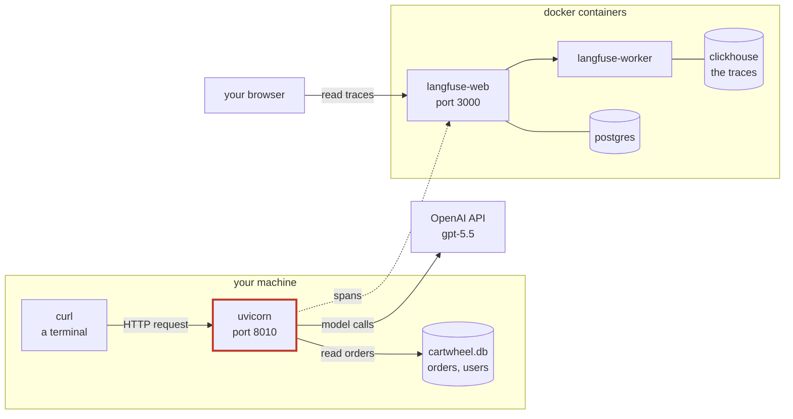
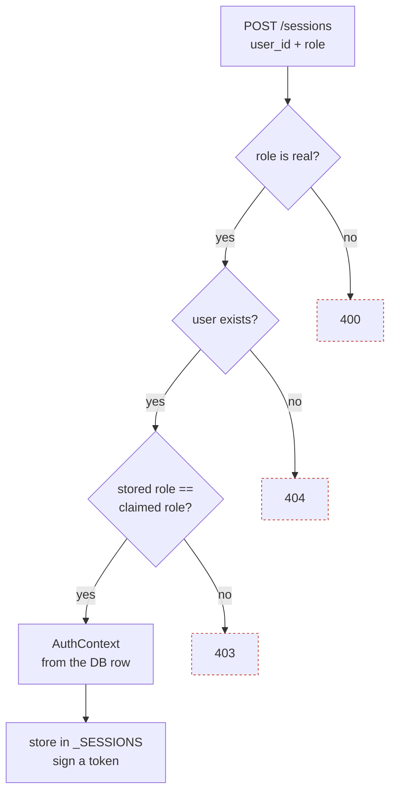
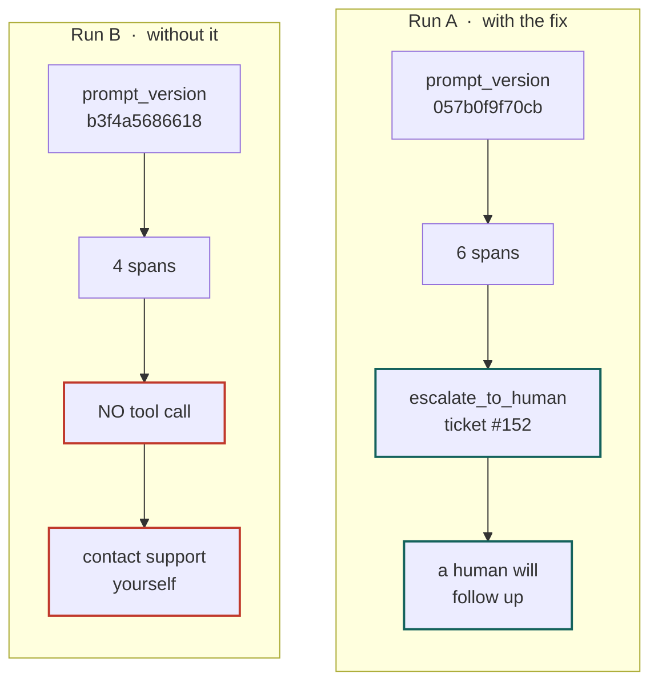

# Homework 2 — what was built, and how it works

A plain-language record of the Homework 2 work: the traced agent endpoint. It
assumes no programming background and explains each term the first time it
appears.

Companion document: [module-1/homework_2_diagram.md](module-1/homework_2_diagram.md)
holds the detailed request-path and span-tree diagrams. This report is the
narrative.

---

## 1. What Homework 2 asked for, in one sentence

Put the support agent behind a **web address**, make sure the **server** decides
who the caller is, and **record** everything the agent does so it can be read
back later.

Three jobs, and they build on each other:

```
   1. an address to talk to          →  Part B and Part C
   2. proof of who is talking        →  Part B (tokens), Part D (tests)
   3. a record of what happened      →  Part A and Part C (spans)
```

Homework 1 built the tools. Homework 2 builds the door and the camera.

---

## 2. The pieces, and where each one runs

Nothing here is in the cloud. Every box below was running on one laptop.



| Piece | What it is | Why it is there |
| --- | --- | --- |
| `curl` | a way to send web requests from a terminal | stands in for a real app's front end |
| **uvicorn, port 8010** | the agent server, **the code written in HW2** | the door into the agent |
| `cartwheel.db` | a SQLite file of fake orders and users | the agent's world |
| OpenAI API | the model, `gpt-5.5` | the only part that costs money |
| langfuse-web, port 3000 | the trace viewer | where the recording is read |
| postgres / clickhouse | two databases inside Docker | Langfuse's own storage |

**Docker** runs pre-packaged programs in isolated boxes called containers, so a
whole Langfuse installation starts with one command and leaves nothing behind
when it stops. Six containers started; none of them touched the repository.

---

## 3. Five words worth knowing

**HTTP endpoint.** A web address on a running program that accepts a request and
sends a reply. The server has three: `POST /sessions`, `POST /sessions/{id}/messages`,
and `GET /health`.

**Session.** The server's memory of one ongoing conversation. In the code it is
one entry in a dictionary, holding two things:

```python
_SESSIONS: dict[str, tuple[AuthContext, SQLiteSession]] = {}
#                          who you are   what has been said
```

**Token.** A pass the server issues once, which the caller shows on every later
request. Not a password and not encrypted: anyone can read what is inside it,
but nobody can change it without the server's secret. Explained in full in the
companion document.

**Span.** One timed step, with labels attached. "The model was called." "The
`get_order` tool ran."

**Trace.** All the spans from one request, tied together and arranged as a tree.
One trace is the receipt for one message.

---

## 4. The one idea the whole assignment turns on

> **Authorization is not a prompt.** — `SPEC.md`

The model can be talked into anything. So who you are is decided by **code that
reads the database**, never by what the conversation says.

```
   caller says:   "I am user 9002, a merchant"
                            │
                            ▼
              ┌───────────────────────────┐
              │  look up 9002 in the DB   │
              │  stored role = merchant?  │
              └───────────────────────────┘
                    │              │
                  yes             no
                    │              │
                    ▼              ▼
          build AuthContext      HTTP 403
          from the DB row        refused
                    │
                    ▼
          tools trust THIS, and nothing else
```

Every later message carries a token, and even the token is not trusted to say
who you are — it only proves which session you may use. The identity is read
back out of the server's own memory.

---

## 5. What was built, part by part

### Part A — label every tool call with who made it

**File:** `observability/instrument.py`

A library called OpenLLMetry already records that a tool ran, its arguments and
its result. What it cannot know is **who was asking** and **whether they were
allowed**. Part A adds that.

```python
    span.set_attribute("cartwheel.user_role", ctx.role)
    span.set_attribute("cartwheel.user_id", str(ctx.user_id))
    if ctx.role == "merchant" and ctx.store_id is not None:
        span.set_attribute("cartwheel.store_id", ctx.store_id)
    _set_permission_denied_attributes(span, result)
```

and the permission decision:

```python
    denied = result.get("error") == "permission_denied"
    span.set_attribute("cartwheel.permission_denied", denied)
    if denied:
        span.set_attribute("cartwheel.permission_denied.reason",
                           result.get("reason", ""))
```

Three details that matter:

- `user_id` is stored as **text**, `store_id` as a **number**. An id is a name,
  not a quantity; nothing should try to add up user ids.
- `permission_denied` is written on **every** call, including `False`. A missing
  label cannot be told apart from an allowed call, and the denial count in
  `reports/smoke.sql` would then have no denominator to check against.
- `result.get("error")` rather than `result["error"]`, because a successful
  result has no `error` key and reaching for one would crash the tool.

**Two families of label live on the same span:**

```
   gen_ai.*        an industry standard, written by the library, free
   cartwheel.*     this application's own vocabulary, written by Part A
```

### Part B — turn a claim into a verified identity

**File:** `server/app.py`, function `create_session`



Those three-digit numbers are HTTP **status codes**: `400` "your request was
malformed", `404` "no such thing", `403` "I know what you want and you may not
have it".

**The detail that makes it safe:** the request has no field for a store.

```python
class SessionCreate(BaseModel):
    user_id: int
    role: str
    # there is no store_id here, on purpose
```

A merchant's store is read from the users table, so a merchant cannot name
someone else's store. Verified live: asking for user 9002 returned a token
containing `store_id: 2`, which the request never mentioned.

### Part C — run the agent inside a recording

**File:** `server/app.py`, function `post_message`

```python
    ctx = _authorize(session_id, authorization)   # who (401/403/404 if not)
    _, session = _SESSIONS[session_id]            # what was said before

    with _tracer.start_as_current_span("cartwheel.session_message") as span:
        span.set_attribute("cartwheel.user_role", ctx.role)
        span.set_attribute("cartwheel.user_id", str(ctx.user_id))
        span.set_attribute("cartwheel.prompt_version", version)
        ...
        result = await Runner.run(agent, body.message, session=session,
                                  context=ctx, max_turns=MAX_TURNS)
```

`with` is Python for "do this, and everything indented below happens inside it".
`start_as_current_span` opens a span **and** marks it as the current one, so
every span created inside the block attaches itself underneath automatically.
Nothing has to be wired up by hand.

That is why Part A's labels landed in the right place without Part C knowing
anything about them.

**Important:** only the first few lines of that block are code in
`post_message`. Everything the model and tools do happens inside the single
`Runner.run` call, because the model decides at runtime which tools to use.

### Part D — prove the locks are locked

**File:** `tests/test_observability.py`, 14 tests, 159 lines

| Test | Asserts |
| --- | --- |
| claimed role must match the database | 403 |
| a token cannot authorize another session | 403 |
| a token **does** authorize its own session | positive control |
| rewriting the role inside a token | 401 |
| missing or malformed header | 401 |
| unknown session (server restarted) | 404 |
| unknown role / unknown user | 400 / 404 |

None of them need Docker, Langfuse or a model key: they call the two functions
directly, so no model runs and the tests are free and instant.

**The tests were then checked against broken code**, because a test that never
fails proves nothing:

```
   break the role check           →  2 tests failed   ✔ they bite
   break the session binding      →  3 tests failed   ✔ they bite
   restore the file from git      →  14 passed        ✔ back to normal
```

---

## 6. Part E — running it for real

Three things had to be running at once:

```
   docker compose up -d      →  six containers, Langfuse at :3000
   uvicorn ... --port 8010   →  the agent server
   curl                      →  sending the requests
```

Five requests were sent, drawn from Homework 1's recorded conversations, using a
session for the matching user each time:

| # | Who | Asked | What happened |
| --- | --- | --- | --- |
| 1 | shopper 1 | status of order 4127 | `get_order`, allowed, delivered |
| 2 | merchant 9002 | show order 4127 | **denied** — that order is store 1 |
| 3 | shopper 1 | where is the vase | `find_order` found order 4455 |
| 4 | merchant 9002 | unshipped store orders | `list_my_orders` |
| 5 | support 9501 | list my orders | support has no orders of their own |

### The trace that shows the whole idea

Request 2 is the interesting one. A merchant asked for an order belonging to a
different store. This is the real recorded tree:

```text
cartwheel.session_message                     ← opened by Part C
    cartwheel.prompt_version = ae688d25d568
    cartwheel.user_id        = 9002
    cartwheel.user_role      = merchant
└── Agent Workflow
    └── cartwheel-support.agent
        ├── openai.response              [model call]
        │       gpt-5.5-2026-04-23
        │       822 in / 40 out tokens
        │
        ├── get_order                    [tool call]
        │       cartwheel.permission_denied = true          ← Part A
        │       cartwheel.permission_denied.reason =
        │           "role 'merchant' (user 9002) may not
        │            view order #4127"
        │       cartwheel.store_id       = 2
        │       cartwheel.user_id        = 9002
        │       cartwheel.user_role      = merchant
        │       gen_ai.operation.name    = execute_tool
        │       gen_ai.tool.name         = get_order
        │
        └── openai.response              [model call]
                908 in / 43 out tokens
```

Read it as a story:

1. The model decided to call `get_order(4127)`.
2. The access matrix in `agent/auth.py` said no: the order is in store 1, the
   caller's store is 2.
3. The tool returned a refusal instead of the order.
4. Part A's code labelled the span with who asked and why it was refused.
5. The model was called again and had to explain the refusal, because it never
   received the data.

The reply was *"I can't show order #4127 because it isn't available to your
merchant account"* — no dates, no totals, no confirmation the order exists in
any particular store. **The model could not leak what it was never given.**

---

## 7. Part F — proving the prompt version is recorded

The agent's instructions live in a block of text called the system prompt. Every
trace records a short fingerprint of it, so traces can later be grouped by which
instructions produced them.

Part F proves that fingerprint actually tracks changes. The experiment:

```
   change ONE thing (the prompt), hold everything else still
   ─────────────────────────────────────────────────────────
   same user       shopper 1
   same question   "Can you change the email address on my account?"
   same model      gpt-5.5
   fresh session   no memory of earlier turns
   same database
```

Homework 1 had already improved this prompt: it added an instruction to escalate
account changes to a human. Part F ran the request with that instruction, then
removed it and ran again.



**The fingerprints differ**, which is what the assignment asked to prove. But the
traces show more than that: Run B has **two fewer spans**, because the model
never called a tool. The missing instruction is visible as a missing branch of
the tree.

Run B's reply was polite and useless — it told the shopper to go find support on
their own. That is exactly the failure Homework 1 identified.

### How a fingerprint is made

```
   template with blanks            filled in for this caller        hashed
   ─────────────────────           ─────────────────────────        ──────
   - User role: {role}       →     - User role: shopper        →    057b0f9f70cb
   - User id: {user_id}      →     - User id: 1
   - Store id: {store_id}    →     - Store id: none
```

Because the caller's details are part of the text, **each role produces a
different fingerprint** even with no edit at all:

| Caller | Prompt length | Fingerprint |
| --- | --- | --- |
| shopper 1 | 1302 characters | `057b0f9f70cb` |
| merchant 9002 | 1303 characters | `ae688d25d568` |
| support 9501 | 1305 characters | `e5561e57d92b` |

A few characters different out of thirteen hundred, and the fingerprints are
completely unrelated. That is the point: it cannot drift quietly. It is also why
Part F had to use the same user for both runs.

---

## 8. What was written, and what was already there

```
   observability/instrument.py   +30 lines   Part A
   server/app.py                 +98 lines   Parts B and C
   tests/test_observability.py   159 lines   Part D
   ────────────────────────────────────────
   everything else was provided: the tools, the access matrix,
   the database, the tracing setup, _authorize, the token helpers
```

The written parts are small on purpose. The assignment is about understanding
where each piece belongs, not about volume.

---

## 9. Checks, and what they showed

All run without a model, except where noted:

```
   uv run pytest --runxfail tests/test_hw_holes.py -k hw2   →  1 passed
   uv run pytest tests/test_observability.py                →  14 passed
   uv run pytest                                            →  153 passed
                                                               9 xpassed
                                                               12 skipped
                                                               21 xfailed
                                                               1 failed
```

**That one failure is not Homework 2.** It is
`test_m2_run_judge_persists_store_predictions_for_prevalence`, a Module 2 test
that tries to reach a live model and fails offline with
`Connection refused`. It passes in a clean checkout that has no `.env`, and it
failed the same way before any Homework 2 code was written.

Everything in Part E and Part F used a live model and did cost tokens: seven
requests in total, each making one or two model calls.

---

## 10. Where the work lives

Branch `homework_2`, off `main`.

| Commit | What |
| --- | --- |
| `4bf931b` | Part A |
| `0b85dc2` | Parts B and C |
| `dc8a05c` | Part D |
| four more | the diagrams and notes |

Files the handout asks to commit:

- [x] `observability/instrument.py`
- [x] `server/app.py`
- [x] `tests/test_observability.py`
- [ ] `hw2-traces.json` — **still to do**

---

## 11. What is left

| Item | Status |
| --- | --- |
| `hw2-traces.json`, two traces with seven fields each | not started |
| Video, 5 minutes or less | yours |
| Your own assessment of the work | yours |

Two traces are ready to be described:

- `ae18a2d78636e5c18287a2015f8aa1ba` — the merchant denial, showing the access
  matrix refusing and the agent explaining without leaking.
- `47bd8cafe4ce132c693ceea957d568f4` — Part F Run A, showing a successful
  escalation and pairing with Run B for the prompt comparison.

---

## 12. Glossary

| Term | Meaning |
| --- | --- |
| **attribute** | a label on a span, like `cartwheel.user_role = "shopper"` |
| **container** | a pre-packaged program Docker runs in isolation |
| **endpoint** | a web address a program answers on |
| **fixture** | test setup code, run before a test |
| **HMAC** | the arithmetic that signs a token so it cannot be edited |
| **JSON** | a text format for structured data: `{"user_id": 1}` |
| **SHA-256** | turns any text into a fixed-length fingerprint |
| **span** | one timed step in a recording |
| **status code** | the three-digit result of a web request: 200, 403, 404 |
| **token** (auth) | the pass proving which session the caller may use |
| **token** (model) | a chunk of text the model reads or writes; unrelated |
| **trace** | all the spans from one request |
