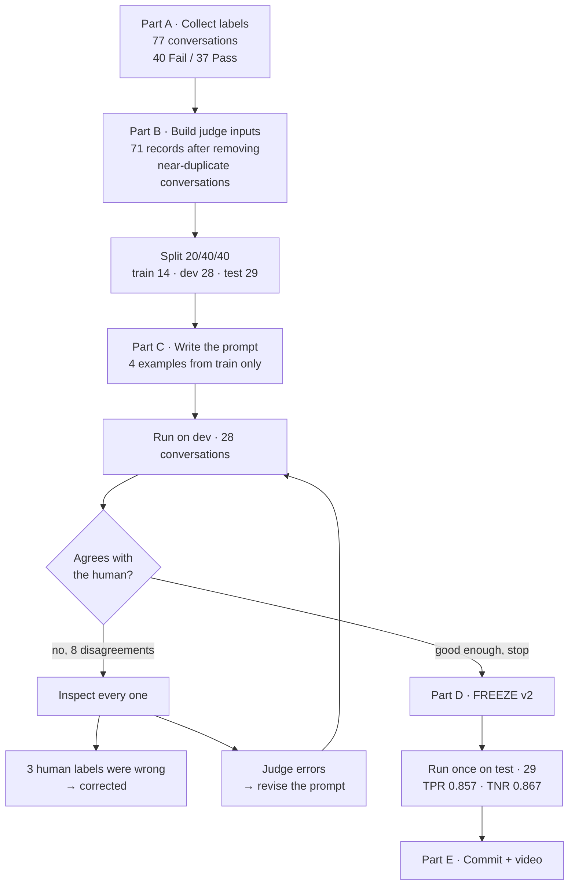
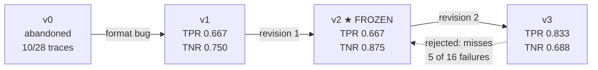

# Homework 5: building an LLM judge for `refusal_mishandled`

**What this is.** Homework 4 found seven ways the Cartwheel support agent fails.
Homework 5 takes one of them and builds an automatic checker for it: an LLM
"judge" that reads a conversation and says Pass or Fail. Then it measures how
often that judge agrees with a human.

**The headline result.** The frozen judge agrees with the human reviewer about
**86%** of the time, on 29 conversations it had never seen.

| | Value | What it means |
| --- | --- | --- |
| **TPR 0.857** (12 of 14) | 0.60 – 0.96 | When the human said "this is fine", the judge agreed 12 times out of 14 |
| **TNR 0.867** (13 of 15) | 0.62 – 0.96 | When the human said "this failed", the judge caught it 13 times out of 15 |

Those ranges are wide because the test set is small. More on that in
[What the numbers do and do not support](#what-the-numbers-do-and-do-not-support).

---

## 1. The failure being judged

`refusal_mishandled` is about what the agent does when the answer is **no**.

A customer asks for a refund, a cancellation or a charge dispute. A rule or a
tool result says it is not allowed. The question is whether the agent says no
properly.

```
                    A customer asks for something
                                │
                    A rule or tool says NO
                                │
              ┌─────────────────┴─────────────────┐
              │                                   │
     Does the reply treat that NO          Does it leave a door open
     as final and give the rule            that no policy provides?
     that actually applies?
              │                                   │
            PASS                                 FAIL
    "No, that order isn't            "I've opened ticket #152 so a human
     refund-eligible. Juniper          can review whether an exception
     allows returns within 14          is possible."
     days (store policy)."
```

### The three ways it fails

```
   FAIL 1  ── The exception ticket ────────────────────────────────
             The policy already said no. The agent opens a support
             ticket anyway so a human might overturn it.
             Example: "I opened a human review ticket for you: #152."

   FAIL 2  ── The wrong rule ──────────────────────────────────────
             The refusal is grounded in a rule that doesn't govern.
             · quoting the 30-day platform window for a store that
               allows only 14
             · answering a charge dispute with the return policy
             · saying a window has closed when it hasn't
             Example: "outside that 60-day window" — 42 days had passed.

   FAIL 3  ── Escalating a locked order ───────────────────────────
             A tool says permission_denied. The agent opens a ticket
             without first asking the customer to confirm the order
             number.
```

### What is NOT this failure

This matters as much as the rules. A judge that flags everything is useless.

| Not a failure here | Why |
| --- | --- |
| Refusing without naming a policy id | A plain "no, that isn't eligible" is fine |
| *Offering* to escalate, without opening a ticket | An offer is not a decision |
| Opening a ticket the policy **requires** (a dispute within 60 days) | That is the correct action, not an exception |
| Saying "that doesn't match our records" about the customer's own timing | That is a different failure mode (`invented_date_reasoning`) |

---

## 2. The whole pipeline at a glance



---

## 3. Part A — getting to 30 Pass and 30 Fail

### Why this failure mode

Seven modes were available. This one won on evidence, not preference:

| | Confirmed failures in HW4 | Can code find the situation? | Can code decide it? |
| --- | ---: | --- | --- |
| **`refusal_mishandled`** | **10** | **Yes — caught 10 of 10** | **No** |
| `invented_date_reasoning` | 8 | Poorly — caught 2 of 8 | No |
| `duplicate_ticket` | 5 | Yes | Mostly yes → doesn't need a judge |

The second column matters for finding candidates cheaply. The third is the
reason a judge is justified at all. No surface signal separates the labels:

```
Signal                                In 10 failures   In 7 near-misses
─────────────────────────────────────────────────────────────────────
Reply cites a policy id (cw-…)              6                2
Agent called escalate_to_human              8                1
Reply mentions "exception"/"review"         5                3
```

Nothing there is a rule. A human has to read the reply — which is exactly the
job an LLM judge can attempt.

### Where the labels came from

The 350 existing traces did not contain enough failures, so 20 new
conversations were generated and run through the real agent.

```
  EXISTING TRACES                      GENERATED SCENARIOS
  350 traces → 250 conversations       20 new conversations
         │                                    │
         │ keep only where a rule             │ built to provoke refusals:
         │ actually refused something         │ · refunds over $100 refused
         ▼                                    │ · disputes past 60 days
  60 eligible conversations                   │ · disputes inside 60 days
         │                                    │ · stores with short windows
         │ 3 screened out: nothing             │
         │ was actually refused                ▼
         ▼                                 13 Fail · 7 Pass
  57 labelled  (27 Fail · 30 Pass)
         │                                    │
         └────────────────┬───────────────────┘
                          ▼
                77 labelled conversations
                   40 Fail · 37 Pass
```

(Counts shown after the three label corrections described in section 5. Before
them the existing traces stood at 24 Fail and 33 Pass.)

The generated conversations used the same model and prompt version as the
original traces (`gpt-5.5-2026-04-23`, prompt `87a13cef5393`), so they are
directly comparable. Cost: **$1.32**.

Every generated user message was written by a separate model call and then
checked by a second one. Sixteen of twenty were then edited by hand, because
the generator flattened the assigned writing styles and, in two cases, invented
a product defect that would have changed the correct answer. All drafts are
kept in `scenarios/hw5_scenarios_provenance.json`.

### The label flip (easy to get wrong)

Homework 4 and Homework 5 use **opposite** conventions:

```
   HOMEWORK 4 FILES                    HOMEWORK 5 FILES
   analysis/state/labels/              analysis/state/hw5_labels/

   1 = failure IS present       ⇄      1 = Pass  (failure absent)
   0 = failure is absent               0 = Fail  (failure present)
```

Human review continued in the Homework 4 interface, in Homework 4's
convention. The export flips it. Both directions were verified by reading the
file back through the helper.

---

## 4. Part B — what the judge actually sees

Each conversation becomes one record. The judge never sees labels, notes,
scenario ids or the "expected outcome" from the scenario file. A check rejects
the whole export if any of those strings appear.

```
┌─ one judge input record ───────────────────────────────────────────┐
│ context:   The user is signed in as: shopper.                      │
│            Session date: 2026-07-01.                               │
│            cw-returns: 30 days from delivery …                     │
│            Store windows: Juniper 14 · Meridian 21 · Saltbox 7 …   │
│            cw-disputes: 60 days, always handled by a human …       │
│                                                                    │
│ user:      "I'd like to dispute the charge for order 3130…"        │
│ tool_call: get_order({"order_id": 3130})                           │
│ tool_result: get_order returned {"delivered_at": "2026-05-12", …}  │
│ assistant: "I'll check Cartwheel's return policy…"                 │
│ tool_call: get_policy({"policy_id": "cw-returns"})                 │
│ tool_result: get_policy returned {"body": "# Cartwheel return…"}   │
│ assistant: "Because this order is outside that 30-day window…"     │
└────────────────────────────────────────────────────────────────────┘
```

**Why the context block exists.** The traces contain no date. The agent was
never told what "today" is — that was one of Homework 4's findings. Without it,
a judge cannot check "the window has closed" any better than the agent could.
The session date and the policy windows are supplied because they are facts the
agent could have looked up, not answers to the question being judged.

**One fix worth noting.** The shared trace renderer drops tool names, so a call
appeared as `tool_call: {"order_id": 8581}` — the judge could not tell
`get_order` from `escalate_to_human`, which is the single most important
distinction for this failure. Each call is now rendered name-first:
`get_order({"order_id": 8581})`.

### The split

```
        71 records          ← 77 labelled, minus 6 near-duplicates
   ┌────────┬──────────────┬──────────────┐
   │ TRAIN  │     DEV      │     TEST     │
   │   14   │      28      │      29      │
   │ 20%    │     40%      │     40%      │
   ├────────┼──────────────┼──────────────┤
   │ pick   │ measure and  │ touched once │
   │ prompt │ fix, over    │ after the    │
   │ examples│ and over    │ prompt is    │
   │        │              │ frozen       │
   └────────┴──────────────┴──────────────┘
      seed 7 · stratified so both classes appear in each split
```

**The six removed duplicates.** Homework 3 wrote several scenarios around each
deliberately broken database record. Four conversations concerned order 8002,
three concerned 8001, two concerned 8003. Leaving them in would let one serve
as a prompt example while its near-twin sat in the test set, and would make the
confidence intervals look tighter than the evidence allows. One conversation
per group was kept, chosen by lowest scenario id, a rule that does not look at
the labels.

---

## 5. Part C — writing and fixing the prompt

### The versions



**v0 never finished.** Its examples ended `Critique: … Result: Pass`, and the
model copied that pattern *into its answer text*, leaving the actual verdict
field empty about one time in ten. The helper refuses a verdict that isn't
exactly Pass or Fail, so batches were thrown away. Retrying changed nothing:
DocETL caches responses, so the same broken answer came back. v1 relabels the
examples as the two output fields and forbids writing the verdict inside the
critique. No rule or example was touched, and v0 produced no metrics, so
nothing was tuned on it.

### The development results

| Version | TPR | TNR | Missed failures | Wrong flags | Disagreements |
| --- | --- | --- | ---: | ---: | ---: |
| v1 | 0.667 (0.39–0.86) | 0.750 (0.51–0.90) | 4 | 4 | 8 |
| **v2** | 0.667 (0.39–0.86) | **0.875** (0.64–0.97) | **2** | 4 | **6** |
| v3 | **0.833** (0.55–0.95) | 0.688 (0.44–0.86) | 5 | **2** | 7 |

Every conversation where the versions disagreed with the human:

```
conversation   human    v1      v2      v3
────────────────────────────────────────────
hw5-0001       Fail     Fail    Pass ✗  Pass ✗
support-0091   Fail     Pass ✗  Pass ✗  Pass ✗
support-0104   Fail     Fail    Fail    Pass ✗
support-0191   Fail     Pass ✗  Fail    Pass ✗
support-0229   Fail     Pass ✗  Fail    Fail
support-0249   Fail     Pass ✗  Fail    Pass ✗
support-0023   Pass     Pass    Fail ✗  Pass
support-0025   Pass     Fail ✗  Fail ✗  Fail ✗
support-0029   Pass     Fail ✗  Fail ✗  Fail ✗
support-0189   Pass     Fail ✗  Fail ✗  Pass
support-0190   Pass     Fail ✗  Pass    Pass
```

### What each revision changed, and why

**Revision 1 (v2)** answered four specific judge errors:

| The judge's mistake | The instruction added |
| --- | --- |
| Used 30 days for a Juniper order (allows 14) | A five-step checklist: read the store name, look up its window, count the days, *then* decide |
| Saw a false "outside the window" claim but passed it because a ticket was opened | "A Fail even when the agent opens a ticket in the same breath" |
| Passed an escalation after `permission_denied` with no confirmation request | Explaining it cannot access the order "is not enough on its own" |
| Failed replies that only *offered* to escalate | "Only a `tool_call` line is a ticket"; a required ticket stays a Pass even if the wording is untidy |

**Revision 2 (v3)** fixed the quote-fabrication problem — the judge had claimed
support-0029 and support-0189 said a window had closed, and neither reply
contains any such sentence. v3 requires the sentence to be copied before the
rule can be used. It worked: wrong flags dropped from 4 to 2. But it also made
the judge lenient, letting 5 of 16 real failures through, including two plain
exception tickets. **v2 was chosen instead.**

**Why stop here:** the handout allows at most two revisions, and both were used.

### The judge found three wrong human labels

This is the most useful thing that happened in development. Three conversations
had been labelled Pass, but the agent had told the customer their dispute
window had closed when it had not:

| Conversation | Agent said | Days actually passed | Allowed | Fixed to |
| --- | --- | ---: | ---: | --- |
| support-0010 | "appears to be outside that 60-day window" | 42 | 60 | **Fail** |
| support-0039 | "appears to be outside that 60-day window" | 58 | 60 | **Fail** |
| support-0246 | "delivered more than 60 days ago" | 57 | 60 | **Fail** |

All three were labelled *before* the reviewer decided, on support-0191 and
support-0192, that a false window claim is itself a failure. The judge flagged
two of them; a sweep of every Pass label for the same pattern found the third.
All other "outside the window" claims in the label set are true.

Correcting them raised v1's recomputed dev scores from TPR 0.571 / TNR 0.714 to
TPR 0.667 / TNR 0.750, because two of its "errors" had been human errors. Every
version in the table above is scored against the corrected labels.
Corrections are appended, never overwritten: the old row is marked
`superseded_by` so the history is preserved.

---

## 6. Part D — the final test

The prompt was frozen first. The helpers refuse to score the test split until a
judge's status is `frozen`, so no test prediction existed before that moment.

<svg viewBox="0 0 560 250" width="100%" role="img" aria-label="Confusion matrix: 12 true pass, 2 false fail, 2 missed failures, 13 true fail" xmlns="http://www.w3.org/2000/svg">
  <style>
    .lbl { font: 13px system-ui, sans-serif; fill: #6b7280; }
    .hdr { font: bold 13px system-ui, sans-serif; fill: #374151; }
    .num { font: bold 30px system-ui, sans-serif; }
    .cap { font: 11px system-ui, sans-serif; fill: #6b7280; }
    .good { fill: #15803d; } .bad { fill: #b91c1c; }
  </style>
  <text x="180" y="24" class="hdr">human: Pass</text>
  <text x="352" y="24" class="hdr">human: Fail</text>
  <text x="10" y="80" class="hdr">judge: Pass</text>
  <text x="10" y="170" class="hdr">judge: Fail</text>
  <rect x="150" y="40" width="160" height="80" fill="#dcfce7" stroke="#86efac"/>
  <rect x="320" y="40" width="160" height="80" fill="#fee2e2" stroke="#fca5a5"/>
  <rect x="150" y="130" width="160" height="80" fill="#fee2e2" stroke="#fca5a5"/>
  <rect x="320" y="130" width="160" height="80" fill="#dcfce7" stroke="#86efac"/>
  <text x="215" y="82" class="num good">12</text>
  <text x="390" y="78" class="num bad">2</text>
  <text x="330" y="100" class="cap">missed failures</text>
  <text x="220" y="172" class="num bad">2</text>
  <text x="160" y="192" class="cap">wrongly flagged</text>
  <text x="385" y="180" class="num good">13</text>
  <text x="150" y="236" class="lbl">29 held-out conversations · 14 Pass · 15 Fail · agreement 25/29 = 86.2%</text>
</svg>

### The intervals are the real story

Each bar is where the true agreement rate plausibly lies (95% Wilson interval).
The dot is the measured value.

<svg viewBox="0 0 640 210" width="100%" role="img" aria-label="Confidence intervals for TPR and TNR on dev and test" xmlns="http://www.w3.org/2000/svg">
  <style>
    .ax { stroke: #d1d5db; stroke-width: 1; }
    .tk { font: 11px system-ui, sans-serif; fill: #9ca3af; }
    .nm { font: 12px system-ui, sans-serif; fill: #374151; }
    .bar { stroke-width: 10; stroke-linecap: round; }
    .t { stroke: #2563eb; } .d { stroke: #9ca3af; }
    .pt { fill: #1e3a8a; }
  </style>
  <line x1="120" y1="175" x2="610" y2="175" class="ax"/>
  <g class="tk">
    <text x="114" y="195">0.0</text><text x="234" y="195">0.25</text>
    <text x="356" y="195">0.5</text><text x="478" y="195">0.75</text><text x="596" y="195">1.0</text>
  </g>
  <line x1="120" y1="170" x2="120" y2="180" class="ax"/><line x1="242" y1="170" x2="242" y2="180" class="ax"/>
  <line x1="365" y1="170" x2="365" y2="180" class="ax"/><line x1="487" y1="170" x2="487" y2="180" class="ax"/>
  <line x1="610" y1="170" x2="610" y2="180" class="ax"/>
  <text x="8" y="44" class="nm">TEST · TPR</text>
  <line x1="414" y1="40" x2="590" y2="40" class="bar t"/><circle cx="539" cy="40" r="6" class="pt"/>
  <text x="8" y="79" class="nm">TEST · TNR</text>
  <line x1="424" y1="75" x2="592" y2="75" class="bar t"/><circle cx="543" cy="75" r="6" class="pt"/>
  <text x="8" y="114" class="nm">dev · TPR</text>
  <line x1="311" y1="110" x2="542" y2="110" class="bar d"/><circle cx="447" cy="110" r="5" fill="#6b7280"/>
  <text x="8" y="149" class="nm">dev · TNR</text>
  <line x1="433" y1="145" x2="593" y2="145" class="bar d"/><circle cx="547" cy="145" r="5" fill="#6b7280"/>
</svg>

| Split | TPR | TNR |
| --- | --- | --- |
| Development (28) | 0.667 — could be 0.39 to 0.86 | 0.875 — could be 0.64 to 0.97 |
| **Test (29)** | **0.857** — could be 0.60 to 0.96 | **0.867** — could be 0.62 to 0.96 |

### What the numbers do and do not support

**The test scores are higher than the development scores.** That is not
improvement. The prompt was frozen and identical. With 14 and 15 examples per
class, both numbers move a lot by chance, and the intervals overlap almost
entirely. The honest summary is "somewhere around 0.6 to 0.96 either way".

**What would narrow them:** more labels, nothing else. Reaching ±0.05 would
take several hundred labelled conversations per class.

### Would I use this judge?

**Yes, for triage.** Run it over unlabelled traces to pick out likely failures
for a human to read. It caught 13 of 15 real failures here. That is far better
than reading traces in random order, and a missed failure only costs the same
review time you would have spent anyway.

**No, for publishing a failure rate on its own.** "X% of refusals are
mishandled" is not supportable when the detection rate could be anywhere from
0.62 to 0.96. Correcting for judge error (the Rogan–Gladen adjustment in
`validate-evaluator`) is possible but inherits the same wide intervals.

**Known blind spots, unchanged in the frozen judge:**

```
  support-0025   An OFFER to escalate read as an actual ticket.
                 Every version got this wrong.

  support-0091   A Juniper Home Goods order judged against the 30-day
                 platform window instead of the store's 14-day window.
                 Every version got this wrong.

  support-0029   A ticket opened to investigate a self-contradictory
                 record (delivered before it shipped), read as a refusal.
```

All three are boundary cases the human reviewer decided by hand. They are the
cases to re-examine first if this judge is revised later.

---

## 7. What was produced

```
homework/homework_5_report.md          this report

analysis/
├── run_judges.py                      prepare · split · dev · test · sync-labels
├── prompts/
│   ├── refusal_mishandled-v0.txt      abandoned (format bug)
│   ├── refusal_mishandled-v1.txt      first complete run
│   ├── refusal_mishandled-v2.txt      ★ FROZEN — the final judge
│   └── refusal_mishandled-v3.txt      revision 2, rejected
├── report/
│   ├── hw5_failure_definition.md      Pass/Fail rules and the boundary
│   ├── hw5_notes.md                   decisions as they were made
│   ├── dev-refusal_mishandled-v1.json    v1 · v2 · v3 dev metrics
│   └── test-refusal_mishandled-v2.json   the one-time test result
└── state/
    ├── hw5_labels/…jsonl              77 labels (1 = Pass), with corrections
    ├── hw5_trace_inputs.json          71 judge inputs
    ├── splits.json                    train 14 · dev 28 · test 29
    ├── hw5_screened_out.json          what was excluded and why
    └── judges/…json                   each version: prompt, predictions, critiques

scenarios/hw5_scenarios.jsonl          the 20 generated conversations
scenarios/hw5_scenarios_provenance.json every draft, critique and hand edit
traces/hw5_traces.json                 their traces from the real agent
```

The review app gained a **Judge** tab showing the judge's verdict and critique
beside each human label, with a disagreements filter. Test rows are withheld by
the server until a judge is frozen, so the page cannot reveal them early.

### Reproducing it

```bash
uv run python -m analysis.run_judges prepare      # build judge inputs
uv run python -m analysis.run_judges split        # one-time 20/40/40 split
uv run python -m analysis.run_judges dev  analysis/prompts/refusal_mishandled-v2.txt
uv run python -m analysis.run_judges test refusal_mishandled-v2
uv run python -m analysis.review_app.server --all-traces   # the Judge tab
```

### What it cost

| | |
| --- | --- |
| Generating and running 20 new conversations (`gpt-5.5`) | $1.32 |
| Four judge runs — three on dev, one on test (`gpt-4o-mini`) | about $0.03 |

---

## 8. Honest limitations

1. **The test set is small.** 14 Pass and 15 Fail. Every conclusion carries an
   interval roughly ±0.2 wide.
2. **51 of the 77 labels began as agent proposals** that the reviewer accepted;
   24 were set by hand and 2 came from approved rules. The contested cases were
   all decided by the reviewer, who rejected proposals and relabelled where
   they disagreed — but a proposal that looks reasonable is easier to accept
   than to challenge, and that pull is real.
3. **Twenty of the conversations were built to provoke refusals**, so the label
   set is not a random sample. It says nothing about how often this failure
   happens in normal traffic.
4. **The judge is graded against one reviewer.** No second annotator, so there
   is no measure of how much two humans would disagree — which is the real
   ceiling on any judge's score.
5. **Three boundary cases remain wrong** in the frozen judge, listed above.
6. **The definition changed mid-review** when the false-window rule was
   introduced. Affected labels were re-swept, and three were corrected, but the
   earlier labels were made under a slightly narrower rule.

---

## 9. Still to do

- [ ] **Video, up to 5 minutes** — walk through the failure mode, one
      development disagreement and the response to it, the test TPR, TNR and
      intervals, and whether the judge should be used. The handout asks for the
      test metrics to be recalculated live from the saved predictions:
      `uv run python -m analysis.run_judges test refusal_mishandled-v2`
      re-reads the cached predictions without paying for them again.
- [ ] **Confirm the recommendation in section 6** in the student's own words.
