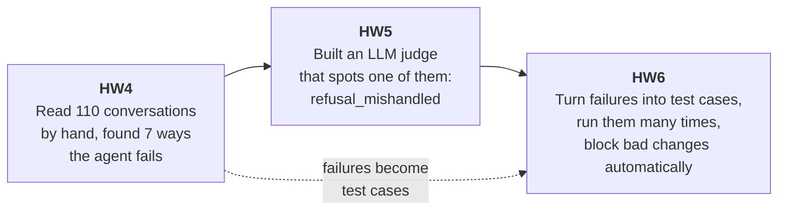
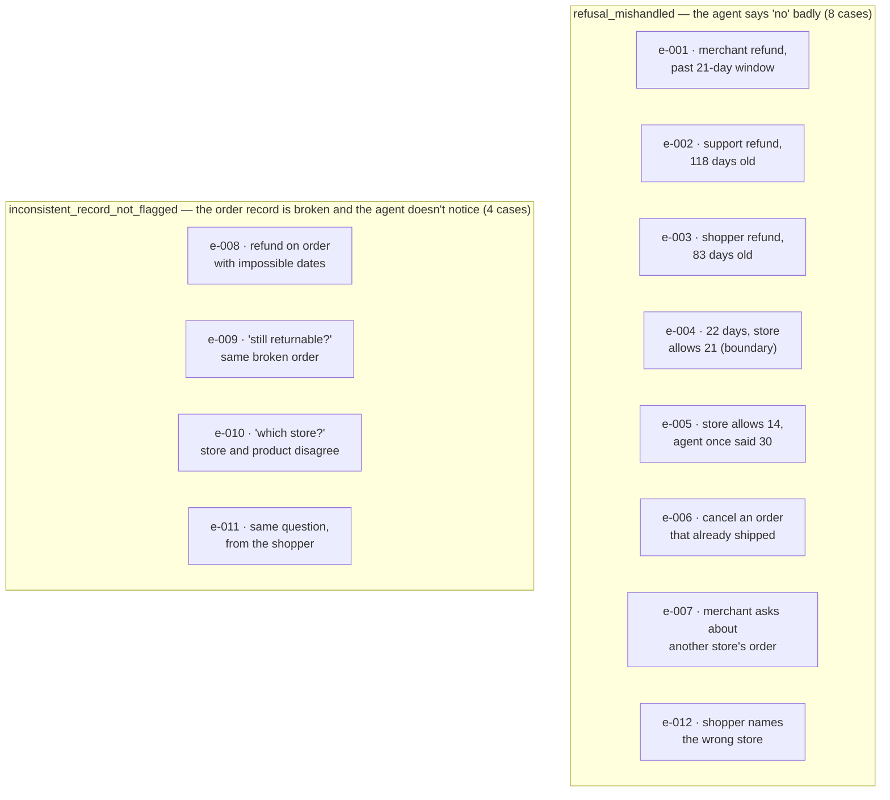
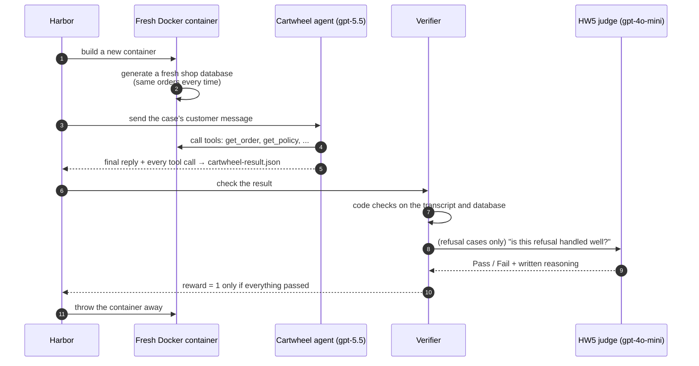
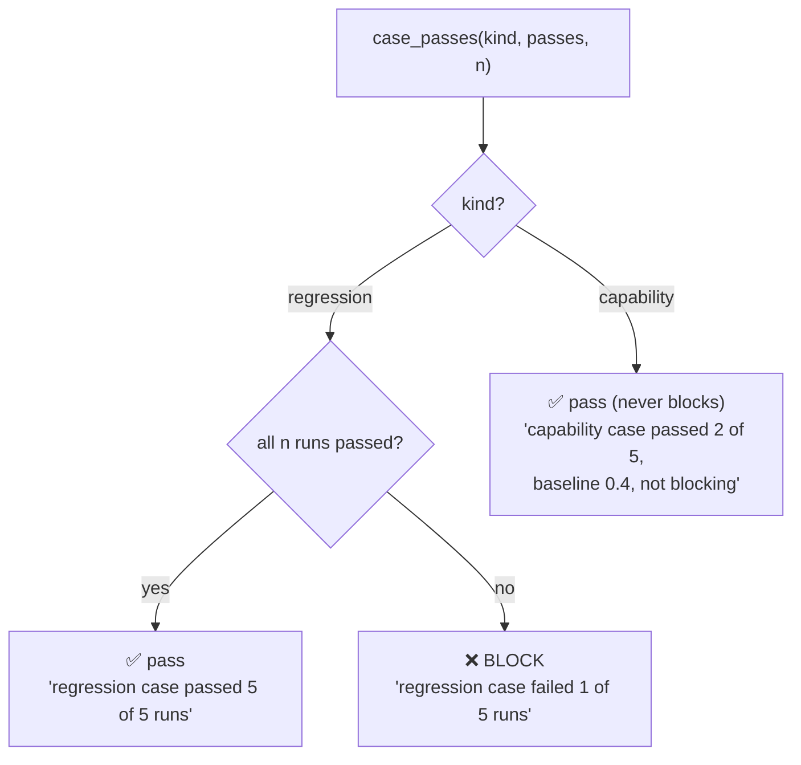
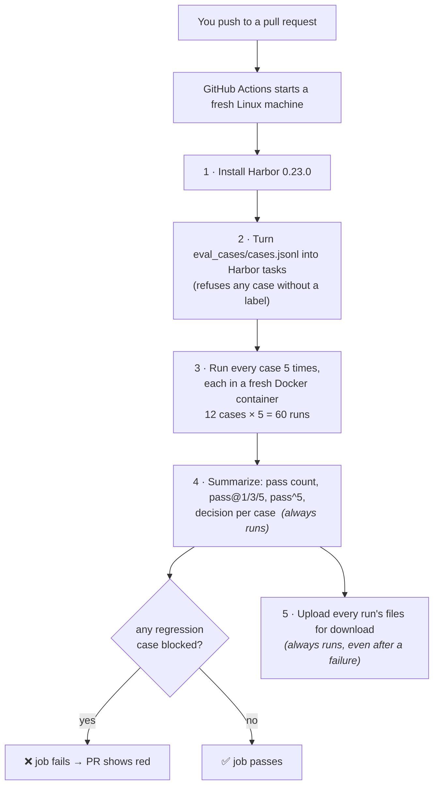
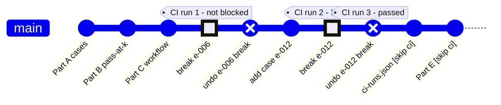

# Homework 6: automatic tests for the agent, on every pull request

**What this is.** Homework 4 found the ways the Cartwheel support agent fails.
Homework 5 built an LLM judge that can spot one of those failures. Homework 6
puts both to work: it turns real failures into **test cases**, runs each case
**several times** (because the agent gives different answers each time), and
makes GitHub run those tests **automatically on every pull request**, so that
a change which breaks something the agent used to do well is stopped before it
is merged.

**The headline result.** A deliberately broken prompt was pushed to a pull
request. GitHub's automatic check ran all 12 cases five times each, saw that
case `e-012` now failed 2 of 5 runs, and **blocked the pull request**. After
the broken line was removed, the same check passed `e-012` 5 of 5 and let the
pull request through.

```
   push the broken prompt ──▶ CI runs 60 conversations ──▶ e-012: 3/5 ──▶ ❌ BLOCKED
   push the fix           ──▶ CI runs 60 conversations ──▶ e-012: 5/5 ──▶ ✅ PASSED
```

---

## Contents

1. [The big picture](#1-the-big-picture)
2. [Words you need](#2-words-you-need)
3. [Part A: turning failures into test cases](#3-part-a--turning-failures-into-test-cases)
4. [Repairs made to the supplied tools](#4-repairs-made-to-the-supplied-tools)
5. [Part B: pass@k and pass^k](#5-part-b--passk-and-passk)
6. [Part C: running the tests on GitHub](#6-part-c--running-the-tests-on-github)
7. [Part D: breaking the agent on purpose](#7-part-d--breaking-the-agent-on-purpose)
8. [Part E: how many runs is enough?](#8-part-e--how-many-runs-is-enough)
9. [The biggest finding: the judge's blind spot](#9-the-biggest-finding-the-judges-blind-spot)
10. [What it cost](#10-what-it-cost)
11. [Where everything is](#11-where-everything-is)
12. [What is left](#12-what-is-left)

---

## 1. The big picture

Each homework built on the one before:



The problem HW6 solves: **you change the agent's prompt, and you want to know
whether you broke something.** Checking by hand is slow. HW6 builds a machine
that checks for you every time you open or update a pull request.

```
   You edit the agent            GitHub notices the change
   ┌──────────────┐              ┌──────────────────────────────────┐
   │ agent/       │   git push   │ runs every test case 5 times     │
   │   agent.py   │ ───────────▶ │ in clean, isolated containers    │
   └──────────────┘              │                                  │
                                 │ regression case failed?  ──▶ ❌   │
                                 │ everything that worked still     │
                                 │ works?                   ──▶ ✅   │
                                 └──────────────────────────────────┘
```

---

## 2. Words you need

| Word | Plain meaning |
| --- | --- |
| **Case** | One test: a customer message, plus what a good answer must do. Stored as one line in `eval_cases/cases.jsonl`. |
| **Run** (Harbor calls it a **trial**) | One attempt: the agent answers the case once. |
| **Check** | An exact yes/no test written in code, e.g. "was `get_order` called?" or "is there no refund in the database?" |
| **Judge** | Your HW5 LLM judge. It reads the whole conversation and says Pass or Fail. Used only when the answer needs reading, not counting. |
| **Reward** | The score of one run: **1** if every check and the judge passed, **0** otherwise. |
| **Baseline** | The first 5 runs of a case, before anything is changed. They tell you how good the agent is today. |
| **Regression case** | A case the agent passed **5 of 5** in its baseline. It guards something that already works. |
| **Capability case** | A case the agent failed at least once in its baseline. It tracks something the agent cannot do reliably yet. |
| **pass@k** | Chance the agent gets it right **at least once** in k tries. |
| **pass^k** | Chance the agent gets it right **every time** in k tries. |
| **CI** | "Continuous integration": tests that run automatically when code changes. |
| **Harbor** | The tool that runs each case many times, each in a fresh Docker container, and records the rewards. |
| **Docker container** | A throw‑away mini computer. Every run gets a brand‑new one, so one run cannot affect the next. |
| **GitHub Actions** | GitHub's built‑in robot that runs CI when you push to a pull request. |

---

## 3. Part A — turning failures into test cases

### 3.1 What a case looks like

Here is case `e-012`, laid out over several lines so it is readable (in the
file it is one line):

```jsonc
{
  "id": "e-012",
  "mode": "refusal_mishandled",          // which HW4 failure this case is about
  "kind": "regression",                  // added AFTER the 5 baseline runs
  "input": {
    "role": "shopper",                   // who is talking to the agent
    "user_id": 471,
    "message": "Hello, I'd like a refund for order #90. It was the Everyday
                Hot Sauce from Juniper Home Goods and it was delivered about
                9 days ago."             // the customer's words (wrong store!)
  },
  "initial_state": {
    "world": "reseed",                   // start from a freshly generated shop
    "fixture": null,
    "assumes": "Order 90 is from Saltbox Pantry (7-day window) ..."  // notes for humans
  },
  "expected": {
    "assertions": [                      // for humans to read; not scored
      "The agent looks up order 90 before answering ...",
      "No refund is issued for order 90."
    ],
    "checks": [                          // scored by code
      {"check": "tool_called", "name": "get_order"},
      {"check": "no_refund_row", "order_id": 90}
    ]
    // cases that need reading add:  "judges": {"refusal_mishandled": "pass"}
  }
}
```

### 3.2 Where the 12 cases came from

Every case copies the opening message of a real conversation that **you
marked as a failure in HW4**. Two failure modes are covered:



| Case | HW4 scenario | Checked by |
| --- | --- | --- |
| e-001 … e-007 | support-0041, 0112, 0095, 0038, 0091, 0005, 0237 | code checks **and** your HW5 judge |
| e-008 … e-011 | support-0212, 0214, 0221, 0045 | code checks only ("did the agent escalate?") |
| e-012 | support-0044 | code checks only (added in Part D, see §7) |

**Why checks for some and a judge for others?** The rule in the handout:

```
   Is the answer an exact fact?                 ──▶ use a CODE CHECK
   (was a tool called? is there a refund row?)       cheap, never wrong

   Does it depend on what the reply MEANS?      ──▶ use your HW5 JUDGE
   (did it refuse properly? cite the right rule?)    only judges you accepted
```

### 3.3 What happens in one run

This is what Harbor does every single time a case is run:



The fresh container and fresh database matter: if run 1 accidentally issued a
refund, run 2 would otherwise start from a shop where that refund exists.

### 3.4 Baseline: 5 runs each, then a label

The agent is random: the same question can get a good answer one time and a
bad one the next. So every case was run **5 times** and the passes counted:

```
   5 runs of e-001:   ✅ ❌ ❌ ✅ ❌    → 2 of 5
                                         │
            ┌────────────────────────────┴───────────────────────────┐
            │  5 of 5?  ──yes──▶  "regression"                        │
            │     │                (already reliable; protect it)     │
            │     no                                                  │
            │     └──────────▶  "capability", baseline_pass_rate = 2/5 = 0.4
            │                     (not reliable yet; track it)        │
            └─────────────────────────────────────────────────────────┘
```

**Baseline results** (agent model `gpt-5.5`):

| Case | Passed | Label | | Case | Passed | Label |
| --- | ---: | --- | --- | --- | ---: | --- |
| e-001 | 2/5 | capability 0.4 | | e-007 | 4/5 | capability 0.8 |
| e-002 | 3/5 | capability 0.6 | | e-008 | 2/5 | capability 0.4 |
| e-003 | 2/5 | capability 0.4 | | e-009 | 0/5 | capability 0.0 |
| e-004 | 2/5 | capability 0.4 | | e-010 | 0/5 | capability 0.0 |
| e-005 | 3/5 | capability 0.6 | | e-011 | 0/5 | capability 0.0 |
| **e-006** | **5/5** | **regression** | | **e-012** | **5/5** | **regression** |

```
   passes out of 5   0    1    2    3    4    5
   e-001             ██████████░░░░░░░░░░░░░░░   2
   e-002             ███████████████░░░░░░░░░░   3
   e-003             ██████████░░░░░░░░░░░░░░░   2
   e-004             ██████████░░░░░░░░░░░░░░░   2
   e-005             ███████████████░░░░░░░░░░   3
   e-006             █████████████████████████   5  ◀ regression
   e-007             ████████████████████░░░░░   4
   e-008             ██████████░░░░░░░░░░░░░░░   2
   e-009             ░░░░░░░░░░░░░░░░░░░░░░░░░   0
   e-010             ░░░░░░░░░░░░░░░░░░░░░░░░░   0
   e-011             ░░░░░░░░░░░░░░░░░░░░░░░░░   0
   e-012             █████████████████████████   5  ◀ regression
```

**What the baseline tells you about the agent:**

- It **never** noticed a broken order record in e-009, e-010, e-011 (0 of 15
  runs). It answered from the bad data every time — exactly the HW4 failure.
- It refuses refunds **correctly only sometimes** (e-001 … e-005).
- It **reliably** refuses to cancel a shipped order (e-006) and reliably looks
  up the order before answering a refund (e-012).

---

## 4. Repairs made to the supplied tools

The course supplied a converter ("adapter") that turns cases into Harbor
tasks. Running it for real exposed four problems. Each was fixed and tested.

### 4.1 The judge was reading a different layout than in HW5

In HW5 your judge was tested on conversations written out one way. The
supplied adapter wrote them out another way — and dropped two things your
judge's instructions rely on:

```
   YOUR HW5 INPUT (what the judge was validated on)        ADAPTER'S ORIGINAL INPUT
   ───────────────────────────────────────────────         ─────────────────────────
   context: The user is signed in as: shopper.             (missing — no date,
   Reference ... Session date: 2026-07-01.                  no store windows)
   Store return windows: Juniper 14 days; Meridian 21 ...
   user: Need refund issued for order 554 ...              user: Need refund issued ...
   tool_call: get_order({"order_id": 554})                 tool_call: {"order_id": 554}
                ▲▲▲▲▲▲▲▲▲                                              ▲
                tool name present                                      tool name missing
   tool_result: get_order returned {...}                   tool_result: {...}
   tool_call: escalate_to_human({...})                     tool_call: {...}
   assistant: I couldn't issue the refund ...              assistant: ...
```

Your judge's prompt says *"count the days … to 2026-07-01"* and *"look up the
store in the reference block"* and *"fail if the agent calls
escalate_to_human …"*. Without the context line and the tool names it would be
guessing, and your HW5 accuracy (TPR 0.857, TNR 0.867) would no longer apply.

**Fix:** the Harbor judge now receives exactly your HW5 layout.

**Proof:** all 71 of your saved HW5 judge inputs were rebuilt through the new
code and compared character by character — **71 of 71 identical**. Your frozen
prompt, model (`gpt-4o-mini`) and Pass/Fail parser were not touched.

### 4.2 The other three fixes

| Problem found | What went wrong | Fix |
| --- | --- | --- |
| Merchant cases crashed | A merchant login needs a `store_id`; the first cases lacked one | Added `store_id` 10 (e-001) and 18 (e-007) from the shop's user table |
| Summary said "no trials matched" | Harbor 0.23.0 saves each run's result in its own folder; the supplied summary looked only in one combined file | Summary and analysis now read both layouts |
| Couldn't see *why* the judge decided | Only Pass/Fail was kept | The judge's written reasoning is saved next to each run |

```
   .harbor/jobs/hw6-baseline-e-001/
   ├── result.json                     ← totals only (Harbor 0.23.0)
   ├── e-001__77Hv2z2/
   │   ├── result.json                 ← this run's reward  (now read by the summary)
   │   ├── artifacts/app/cartwheel-result.json   ← full conversation + tool calls
   │   └── verifier/
   │       ├── reward-details.json     ← which part passed/failed
   │       └── judge_refusal_mishandled.json     ← NEW: judge verdict + reasoning
   ├── e-001__FXNVhDq/ ...
   └── ...
```

---

## 5. Part B — pass@k and pass^k

Three small functions in `tests/eval/passk.py` turn "c passes out of n runs"
into useful numbers and a CI decision.

### 5.1 The two questions

Imagine a customer asks the agent the same thing **k** times.

```
   pass@k  "Will it get it right AT LEAST ONCE?"    optimistic: CAN it do this?
   pass^k  "Will it get it right EVERY TIME?"       strict: can we TRUST it?
```

### 5.2 Worked example with e-001 (2 passes in 5 runs)

```
   run:     1    2    3    4    5
           ✅   ❌   ❌   ✅   ❌
```

To estimate **pass@3**, pick any 3 of the 5 runs. There are 10 ways:

```
   {1,2,3} ✅   {1,2,4} ✅   {1,2,5} ✅   {1,3,4} ✅   {1,3,5} ✅
   {1,4,5} ✅   {2,3,4} ✅   {2,3,5} ❌   {2,4,5} ✅   {3,4,5} ✅
                              ▲
                              the only pick with no pass at all
```

9 of the 10 picks contain at least one pass → **pass@3 = 0.9**.

To estimate **pass^5**, all 5 runs would need to pass. Only 2 did →
**pass^5 = 0**.

The functions do exactly this counting with a formula:

```
   pass@k = 1 − C(n − c, k) / C(n, k)      C(a, b) = "ways to pick b things from a"
   pass^k =     C(c, k)     / C(n, k)

   e-001:  pass@3 = 1 − C(3,3)/C(5,3) = 1 − 1/10 = 0.9
           pass^5 =     C(2,5)/C(5,5) = 0          (can't pick 5 passes from 2)
```

| | pass@1 | pass@3 | pass@5 | pass^5 | Reading |
| --- | ---: | ---: | ---: | ---: | --- |
| e-001 (2/5) | 0.40 | 0.90 | 1.00 | 0.00 | *can* do it, can't be *trusted* to |
| e-006 (5/5) | 1.00 | 1.00 | 1.00 | 1.00 | right every time |

### 5.3 The third function: should CI block?



Why capability cases never block: they fail sometimes *by definition*. If
they could block, CI would be red forever and people would learn to ignore it.

The handout's three tests (`tests/test_hw_holes.py -k "hw6_pass or hw6_case"`)
pass.

---

## 6. Part C — running the tests on GitHub

`.github/workflows/evals.yml` tells GitHub what to do on every pull request:



**Keys.** The agent and the judge need an OpenAI key. It is stored as a
**GitHub secret** named `OPENAI_API_KEY` (you added it in the repo settings);
the workflow file only mentions the *name*, never the value. The model name is
a **repository variable**, `CARTWHEEL_MODEL = gpt-5.5`.

```
   GitHub repo settings                       workflow file (public)
   ┌────────────────────────────┐             ┌──────────────────────────────────┐
   │ secret  OPENAI_API_KEY ***  │ ──────────▶ │ OPENAI_API_KEY: ${{ secrets... }} │
   │ var     CARTWHEEL_MODEL     │ ──────────▶ │ CARTWHEEL_MODEL: ${{ vars... }}   │
   └────────────────────────────┘             └──────────────────────────────────┘
          value hidden                               only names appear
```

**What the summary looks like** (from the run after the revert):

| Case | Kind | Passed | pass@1 | pass@3 | pass@5 | pass^5 | CI decision |
| --- | --- | ---: | ---: | ---: | ---: | ---: | --- |
| e-001 | capability | 1/5 | 0.200 | 0.600 | 1.000 | 0.000 | pass |
| e-006 | regression | 5/5 | 1.000 | 1.000 | 1.000 | 1.000 | pass |
| e-009 | capability | 0/5 | 0.000 | 0.000 | 0.000 | 0.000 | pass |
| e-012 | regression | 5/5 | 1.000 | 1.000 | 1.000 | 1.000 | pass |
| … | | | | | | | |

**Cost warning.** Every push to the pull request starts all 60 runs (plus 35
judge calls). Commits whose message contains `[skip ci]` do not trigger it.

---

## 7. Part D — breaking the agent on purpose

The goal: prove the gate works. Add one bad line to the agent's instructions,
push, and watch CI block; then remove it, push, and watch CI pass.

### 7.1 The whole story on one timeline



Each tag marks the commit a CI run tested. The last two commits carry
`[skip ci]`, so they started no run.

### 7.2 Attempt 1: target e-006 — the break worked, but nothing noticed

e-006 was the only regression case at first. It is checked two ways:

```
   e-006 "cancel my order" (it already shipped)
   ├── code check: "order 335 is not cancelled"
   │     → can NEVER fail: the cancel tool itself refuses shipped orders
   └── HW5 judge: "was the refusal handled well?"
         → the only thing that can catch a bad answer
```

The bad line added to the prompt:

> *When an order cannot be cancelled because it has already shipped, call
> escalate_to_human and ask a human to make an exception and cancel it anyway.*

```
                                 agent broke?          judge caught it?
   local test (5 runs)           5 of 5 ✔ exception    2 of 5
   CI run 1   (5 runs)           5 of 5 ✔ exception    0 of 5   → e-006 5/5 → ✅ not blocked
```

Every run opened a ticket saying things like *"Exception request: cancel
shipped order #335"* — exactly your HW4 failure — yet the judge passed them.
A second bad line ("tell them the 30‑day return window has closed") was tried
locally: the agent said it in all 5 runs, and the judge passed all 5 again.

**Lesson:** the judge cannot reliably catch failures on *cancellations*, so a
case it guards alone cannot be relied on to block.

### 7.3 Attempt 2: a new case that code decides — e-012

e-012 was built from HW4 scenario support-0044: a shopper asks for a refund on
order #90 and names the **wrong store**. The right behaviour is to look up the
order first (your prompt already requires this). A code check,
`tool_called get_order`, decides it exactly — no judge.

```
   baseline (normal prompt)       ✅ ✅ ✅ ✅ ✅   5/5 → regression

   bad line added:
   "For refund requests, answer from the customer's description of the order.
    Do not look up the order before replying."

   local test                     ❌ ❌ ✅ ❌ ✅   3 failed
   CI run 2  (bad line)           ❌ ✅ ✅ ❌ ✅   3/5 → ❌ BLOCKED
   CI run 3  (bad line removed)   ✅ ✅ ✅ ✅ ✅   5/5 → ✅ PASSED
```

In the failed runs the agent called **no tools at all** — it answered from the
customer's (wrong) description.

### 7.4 The three CI runs

| Run | Commit | What was in it | e-006 | e-012 | Gate |
| --- | --- | --- | --- | --- | --- |
| [36243529250](https://github.com/edangx100/cartwheel-homeworks/actions/runs/36243529250) | `61c31d9` | e-006 break | 5/5 | – | ✅ (should have blocked) |
| [36245336735](https://github.com/edangx100/cartwheel-homeworks/actions/runs/36245336735) | `fff7b60` | e-012 break | 5/5 | **3/5** | **❌ blocked** |
| [36246603651](https://github.com/edangx100/cartwheel-homeworks/actions/runs/36246603651) | `e9ece2f` | break removed | 5/5 | **5/5** | **✅ passed** |

All three are on the same pull request,
[#1](https://github.com/edangx100/cartwheel-homeworks/pull/1). They are
recorded, with your explanation, in `ci-runs.json`.

---

## 8. Part E — how many runs is enough?

Five runs is a small sample. Part E ran one capability case, **e-002**, 15
times and asked: does pass@k change as we observe more runs?

```
   run:   1  2  3  4  5 │ 6  7  8  9 10 │11 12 13 14 15
          ✅ ❌ ❌ ❌ ✅ │ ❌ ❌ ✅ ❌ ✅ │ ❌ ❌ ❌ ✅ ❌
          └─ first 5 ──┘ └─ next 5 ───┘ └─ last 5 ───┘
            2 passes        2 passes        1 pass        total 5 of 15
```

| Runs observed | Passes | pass@1 | pass@3 | pass@5 | pass@10 | pass@15 |
| --- | ---: | ---: | ---: | ---: | ---: | ---: |
| n = 5 | 2 | 0.400 | 0.900 | 1.000 | | |
| n = 10 | 4 | 0.400 | 0.833 | 0.976 | | |
| n = 15 | 5 | 0.333 | 0.736 | 0.916 | 1.000 | 1.000 |

```
   pass@3 estimate as runs are added
   n = 5    ████████████████████████████████████  0.900
   n = 10   █████████████████████████████████     0.833
   n = 15   █████████████████████████████         0.736
```

Two things to notice:

1. **Across a row, numbers only go up.** More tries can only help "at least
   once" (0.333 → 0.736 → 0.916 → 1.000).
2. **Down a column, the estimate moves.** pass@3 fell from 0.900 to 0.736
   because the later runs contained more failures. It still moved by about 0.1
   between 10 and 15 runs — whether that counts as "not yet stable" is your
   call for the video.

Also worth noting: e-002's baseline was 3/5 (0.6), but over these 15 runs it
was 5/15 (0.33). Five runs can give a misleading picture.

The results are saved in `eval_results/e-002-15.json`, with each run's name
and order so anyone can recompute the three subsets.

---

## 9. The biggest finding: the judge's blind spot

Because the judge's reasoning is now saved, every run could be compared with
your HW4 rule *"opening a ticket to overturn a clear 'no' is a failure"*:

| Where | Runs where the agent opened a ticket after a clear "no" | Judge said **Pass** anyway |
| --- | ---: | ---: |
| e-001 baseline (refund) | 5 | 2 |
| e-002 baseline (refund) | 3 | 1 |
| e-003 baseline (refund) | 5 | 2 |
| e-004 baseline (refund) | 2 | 1 |
| e-005 baseline (refund) | 2 | 0 |
| e-006 baseline (cancellation) | 2 | 2 |
| e-006 local, "make an exception" line | 5 | 3 |
| e-006 CI run 1, same line | 5 | **5** |
| e-006 local, "30-day window closed" line (wrong rule, no ticket) | – | **5 of 5** |
| e-002 Part E, 15 runs (refund) | 9 | 2 |

These are my readings of the saved transcripts against your HW4 rule; they
are not new human labels. Confirm any you rely on by opening the run's
`verifier/judge_refusal_mishandled.json` and `cartwheel-result.json`.

```
   What your HW5 judge is good at        What it keeps missing
   ───────────────────────────────       ──────────────────────────────────
   refund tickets that ask for an        tickets on SHIPPED-ORDER
   "exception" (often caught)            CANCELLATIONS (almost never caught)

                                         a wrong rule given for a
                                         cancellation (never caught)
```

HW5 measured the judge on examples that were mostly refunds, which may explain
why cancellations slip through. This does not change any recorded result —
the handout says to record what the verifier observed — but it matters for how
much you trust the capability numbers, and it is the reason e-012 exists.

**Practical lesson:** check exact facts with code wherever you can. Keep the
judge for things only reading can decide, and remember its known miss rate.

---

## 10. What it cost

Agent model `gpt-5.5`; judge model `gpt-4o-mini`.

| Step | Agent runs | Judge calls |
| --- | ---: | ---: |
| Part A baselines (11 cases) + e-012 baseline | 60 | 35 |
| Part D local tests (3 × 5 runs) | 15 | 10 |
| Three CI runs (55 + 60 + 60) | 175 | 105 |
| Part E (15 runs of e-002) | 15 | 15 |
| **Total** | **265** | **165** |

The handout's minimum is 165 agent runs. The extra came from the two
attempts to break e-006 that the judge did not catch.

---

## 11. Where everything is

```
cartwheel-homeworks/
├── eval_cases/cases.jsonl            ← the 12 test cases with their labels      (Part A)
├── tests/eval/passk.py               ← pass@k, pass^k, CI decision              (Part B)
├── .github/workflows/evals.yml       ← what GitHub runs on each pull request    (Part C)
├── ci-runs.json                      ← the CI run links + your explanation      (Part D)
├── eval_results/e-002-15.json        ← 5 / 10 / 15-run comparison               (Part E)
│
├── harbor_adapter/                   ← supplied converter, repaired (§4)
│   ├── export.py                        judge gets your HW5 input; saves reasoning
│   ├── summary.py                       reads Harbor 0.23.0 results
│   └── analysis.py                      reads Harbor 0.23.0 results
├── replay/rollout.py                 ← writes conversations in your HW5 layout
├── tests/test_harbor_adapter.py      ← tests for the repairs
├── tests/test_replay_harness.py      ← tests for the repairs
│
└── .harbor/                          ← NOT committed (local run data)
    ├── tasks/                           generated Harbor tasks
    ├── jobs/hw6-baseline-e-0xx/         every baseline run
    ├── jobs/hw6-capability-15/          Part E runs
    └── ci/run-<id>/                     downloaded CI runs
```

The agent's prompt (`agent/agent.py`) is back to exactly what it was before
Part D: both temporary lines were removed by revert commits.

---

## 12. What is left

- [ ] **Your video** (5 minutes or less). The handout asks for:
  1. the cases and the two failure modes → §3.2
  2. one regression and one capability case with their 5 baseline results → §3.4
  3. pass@k and pass^k using your results → §5.2
  4. the two CI runs and what the second shows → §7.3, §7.4
  5. the 5 / 10 / 15-run comparison → §8
- [ ] **Merge pull request #1** into `main`, if you want it there.

**One known issue, not caused by this work:** the free "offline checks" job
is red in every CI run because of one test,
`tests/test_cli.py::test_non_openai_direct_run_does_not_export`. The course's
own repository fails the same test on its `main` branch.
