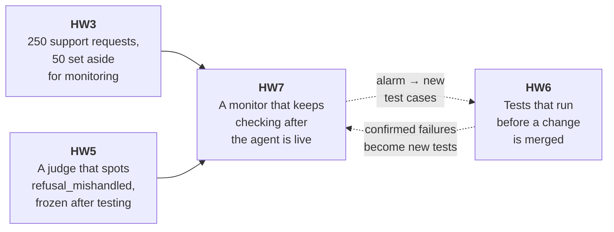
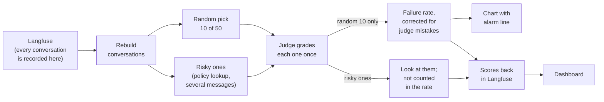
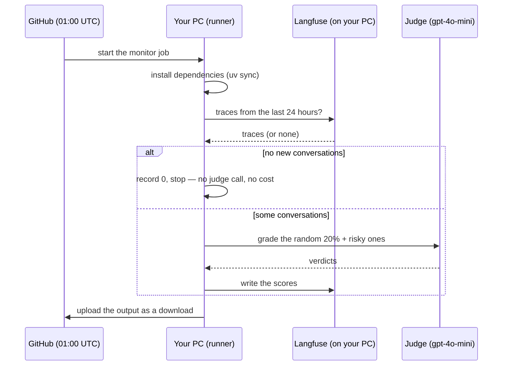
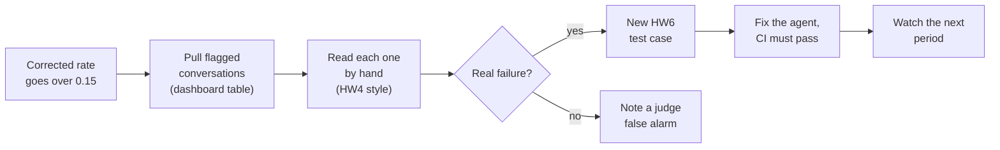

# Homework 7: watching the agent after it goes live

**What this is.** Homework 6 tests the agent *before* a change is merged.
Homework 7 keeps watching it *afterwards*. Every day a small robot picks a
random handful of real conversations, has your Homework 5 judge grade them,
corrects the grade for the judge's known mistakes, and draws the result on a
chart with an alarm line. If the failure rate climbs above the line, you go
and look.

Cartwheel has no real users, so two complete runs of the same 50 support
requests stand in for "last week" and "this week".

**The headline result.** The same agent answered the same 50 requests twice,
13 days apart. The judge flagged 2 of 10 random conversations in the first
run and 1 of 10 in the second. After correcting for the judge's mistakes,
the estimated failure rate was **0.08, then 0.00**. Both are under the
**0.15 alarm line**, but the ranges of likely values are wide (up to 0.49 and
0.28), so 10 conversations per run is too few to call a real change.

```
   before (Sep 14)  2 of 10 flagged ──▶ corrected 0.08  range 0.00–0.49   under the alarm
   after  (Sep 27)  1 of 10 flagged ──▶ corrected 0.00  range 0.00–0.28   under the alarm
                                                   alarm line = 0.15
```

---

## Contents

1. [The big picture](#1-the-big-picture)
2. [Words you need](#2-words-you-need)
3. [Your choices, made before any grading](#3-your-choices-made-before-any-grading)
4. [Part A: two comparable runs](#4-part-a--two-comparable-runs)
5. [Part B: picking which conversations to grade](#5-part-b--picking-which-conversations-to-grade)
6. [Part C: from judge flags to a failure rate](#6-part-c--from-judge-flags-to-a-failure-rate)
7. [Scores in Langfuse and the dashboard](#7-scores-in-langfuse-and-the-dashboard)
8. [Part D: the daily robot on GitHub](#8-part-d--the-daily-robot-on-github)
9. [Part E: your answers](#9-part-e--your-answers)
10. [Problems we hit, and how each was fixed](#10-problems-we-hit-and-how-each-was-fixed)
11. [What it cost](#11-what-it-cost)
12. [Where everything is](#12-where-everything-is)
13. [What is left](#13-what-is-left)

---

## 1. The big picture

Each homework built on the one before:



HW6 and HW7 guard different moments:

```
   ── write a change ──▶ ── HW6: tests on the pull request ──▶ ── merged, live ──▶ ── HW7: daily monitor ──▶
                            "did this change break                               "is the live agent still
                             something we know about?"                            behaving, on real traffic?"
```

The monitor, from start to finish:



---

## 2. Words you need

| Word | Plain meaning |
| --- | --- |
| **Scenario** | One support request from HW3, such as "can I return this?". Some have follow-up messages. |
| **Trace** | Langfuse's record of **one** user message and everything the agent did to answer it. A request with 3 messages makes 3 traces. |
| **Conversation** | All the traces of one scenario, joined back together in order. The judge reads the whole conversation. |
| **Period** | One stretch of time being measured. Here: the HW3 run ("before") and the new run ("after"). |
| **Judge** | Your frozen HW5 LLM judge, `refusal_mishandled-v2`. It reads a conversation and says Pass or Fail. |
| **Flag** | The judge said Fail. Stored as **1**; a pass is **0**. |
| **Random sample** | Conversations picked by chance. The only fair basis for "what fraction fail". |
| **Risk group** | Conversations picked *because* they are more likely to fail. Good for finding problems; unfair for measuring a rate. |
| **Raw rate** | Flags ÷ conversations graded, taken at face value. |
| **Corrected rate** | The raw rate adjusted for the judge's known mistakes (the Rogan-Gladen correction). |
| **Range (interval)** | The span of values the true rate plausibly lies in, given how little data there is. |
| **Threshold (alarm line)** | The corrected rate that should start an investigation: **0.15**. |
| **Score** | A number Langfuse stores next to a trace, such as a judge verdict. The dashboard charts these. |
| **Self-hosted runner** | Your own PC doing GitHub's work, because only your PC can reach your Langfuse. |
| **`[skip ci]`** | Text in a commit message that tells GitHub not to start the push-triggered tests, which would cost money. |

---

## 3. Your choices, made before any grading

These were fixed first, so the results could not influence them:

| Choice | What you picked | Why |
| --- | --- | --- |
| Judge | `refusal_mishandled-v2` on `gpt-4o-mini` | The one you built, tested and froze in HW5 |
| Cartwheel model | `gpt-5.5` | The model HW3 used, so the runs are comparable |
| Risk groups | **looked up a policy**, **several messages** | In your HW5 labels, 35 of 40 failures involved a policy lookup. Pushy follow-ups are the natural test of a refusal. "Wrote to the database" was left out: refusals almost never refund or cancel (1 of 77 labelled conversations). |
| Alarm line | **0.15** | Above the roughly 10% seen in HW4, below where the 10-conversation sample gets very coarse |
| Random pick | 20%, fixed seed | The same 10 requests are picked in both runs, so the comparison is like for like |

---

## 4. Part A — two comparable runs

### 4.1 One agent, two runs, 13 days apart

```
 Sep 14                                                          Sep 27
 ──●──────────────────────────────────────────────────────────────●──────▶
   │                                                              │
   BEFORE: the HW3 run                                            AFTER: a fresh run for HW7
   06:43–07:58 UTC                                                11:18–11:30 UTC
   (250 requests; the 50 monitoring                               (only the 50 monitoring requests,
    ones are picked out)                                           about 10 minutes)
```

| | Before | After |
| --- | --- | --- |
| Requests finished | 50 of 50 | 50 of 50 |
| Traces in Langfuse | 64 | 64 |
| Conversations rebuilt | 50 | 50 |
| Model on every call | `gpt-5.5-2026-04-23` | `gpt-5.5-2026-04-23` |
| Any retries mixed in? | No | No |

### 4.2 Why 50 requests make 64 traces

```
 40 single-message requests    ▢ ▢ ▢ ▢ ▢ ... (40)          → 40 traces
  7 requests with 2 messages   ▢▢ ▢▢ ▢▢ ... (7)            → 14 traces
  2 requests with 3 messages   ▢▢▢ ▢▢▢                     →  6 traces
  1 request  with 4 messages   ▢▢▢▢                        →  4 traces
                                                             ─────────
                                                             64 traces
```

The monitor joins each request's traces back into one conversation:

```
 request support-00xx (3 messages)
  ├─ trace 1: user message 1 → tools → reply
  ├─ trace 2: user message 2 → tools → reply
  └─ trace 3: user message 3 → tools → reply   ◀── the conversation takes this ID;
           │                                       its score is attached here
           ▼
   one conversation → the judge reads all of it → one verdict
```

### 4.3 What changed between the runs? The agent did not.

| Checked | Result |
| --- | --- |
| Agent instructions (system prompt version) | `87a13cef5393` in both |
| Model version | `gpt-5.5-2026-04-23` in both |
| Agent code (`agent/agent.py`) | identical; both HW6 test bugs had been removed |
| Agent libraries | same versions (openai-agents 0.17.7, openai 2.44.0, litellm 1.91.0) |
| Store data and policies | reset to the same starting point before each run |

Only background details changed: the date, a session label added to each
trace (for Part D), a switched-off debugging tool from HW4, and HW6 testing
code that isn't used to answer requests.

So **any difference between the runs is chance**. The model does not give
the same answer twice, even to the same request. For example, 14
conversations looked up a policy in the first run and 15 in the second.

### 4.4 Checks the monitor refuses to skip

```
 fetch one period from Langfuse
   │
   ├─ all 50 requests present?                      no ──▶ ✋ stop
   ├─ exactly one trace per message? (no retries)   no ──▶ ✋ stop
   ├─ every model call is gpt-5.5?                  no ──▶ ✋ stop
   └─ grader text leaks the answer?                yes ──▶ ✋ stop
   │
   ▼
 50 conversations, ready to grade
```

---

## 5. Part B — picking which conversations to grade

### 5.1 Two ways to pick, kept apart

```
 The 50 conversations of one run (numbers from the before run)
 ┌──────────────────────────────────────────────────────────┐
 │ ● ● ● ● ● ● ● ● ● ●   ● ● ● ● ● ● ● ● ● ●   ● ● ● ● ● ●   │
 │ ● ● ● ● ● ● ● ● ● ●   ● ● ● ● ● ● ● ● ● ●   ● ● ● ●       │
 └──────────────────────────────────────────────────────────┘
          │                                      │
   pick 10 by chance                     pick every risky one
          │                                      │
          ▼                                      ▼
 ┌──────────────────┐                 ┌───────────────────────────┐
 │ RANDOM 10        │                 │ RISKY                     │
 │ fair picture of  │                 │ looked up a policy: 14    │
 │ all 50           │                 │ several messages:   10    │
 │                  │                 │ (20 in total; some are in │
 │ → the failure    │                 │  both groups)             │
 │   rate           │                 │ → where to look           │
 └──────────────────┘                 └───────────────────────────┘
          │                                      │
          └──────────────┬───────────────────────┘
                         ▼
          grade each conversation once (27 here:
          3 conversations were in both piles)
```

### 5.2 Why only the random 10 count

Imagine checking a school's exam results by looking only at students who
skipped class. You would find many failures, but that doesn't tell you the
school's overall failure rate. The risky groups are like that: chosen
*because* they fail more, so counting them would make the agent look worse
than it is. We grade them to **find** problems, and keep them **out of the
rate**.

### 5.3 How many were graded

| | Before | After |
| --- | --- | --- |
| Random pick | 10 | 10 |
| Risky conversations | 20 | 21 |
| In both piles | 3 | 3 |
| **Judge calls** (each conversation graded once) | **27** | **28** |

### 5.4 The judge sees exactly what it saw in HW5

The frozen judge was only tested on one format, so the monitor rebuilds that
format exactly:

```
 context:   who the user is, today's date (2026-07-01), the store rules
 user:      "I want to return my blender..."
 tool_call: get_order({"order_id": 4127})
 tool_result: get_order returned {...}
 assistant: "Your order was delivered on..."
 ... every later message, in order ...
```

This was proved directly: 5 conversations appear in both HW5 and this
monitor, and for all 5 the text given to the judge is **identical, character
for character**.

---

## 6. Part C — from judge flags to a failure rate

### 6.1 The judge makes mistakes, and we know how often

In HW5 you tested the judge on 29 conversations a person had already
labelled:

```
                        judge says FAIL     judge says PASS
                       ┌──────────────────┬──────────────────┐
  really a failure (15)│  13  caught ✅   │   2  missed ❌    │   catches 87% of failures
                       ├──────────────────┼──────────────────┤
  really fine     (14) │   2  false alarm❌│  12  correct ✅   │   passes 86% of good ones
                       └──────────────────┴──────────────────┘
```

| Name in the code | Plain meaning | Value |
| --- | --- | --- |
| failure sensitivity | share of real failures the judge catches | 13 ÷ 15 = **0.8667** |
| pass specificity | share of good conversations the judge passes | 12 ÷ 14 = **0.8571** |

### 6.2 Correcting the raw rate

Because the judge raises some false alarms, its raw flag rate overstates the
truth. The correction removes the expected false alarms and scales up for the
missed failures:

```
                raw + 0.8571 − 1            raw − 0.1429
  corrected = ───────────────────────  =  ──────────────
               0.8667 + 0.8571 − 1            0.7238

  before:  (0.20 − 0.1429) ÷ 0.7238 = 0.0789
  after:   (0.10 − 0.1429) ÷ 0.7238 = −0.06  → can't be negative → 0.00
```

With 10 conversations the rate moves in big steps, so the alarm has a simple
meaning:

```
 flagged of 10:    0      1      2      3      4
 corrected:      0.00   0.00   0.08   0.22   0.36
                                   ▲
                 ──────────────────┼────── alarm line 0.15
                                   │
                  under the alarm  │  over the alarm
                                   │
                   → the alarm goes off at 3 or more flags out of 10
```

### 6.3 The range of likely values

The computer re-ran the whole calculation **20,000 times** on reshuffled
copies of the data (the 10 verdicts, and the judge's 29 test results), and
kept the middle 95% of the answers. That is the range.

```
            0.00  0.05  0.10  0.15  0.20  0.25  0.30  0.35  0.40  0.45  0.50
                              ┊ alarm
 before     ├●════════════════┊═══════════════════════════════════════════┤   0.08  (0.00–0.49)
 after      ●═════════════════┊════════════════════┤                          0.00  (0.00–0.28)
                              ┊
            ● = corrected rate     ══ = range of likely values
```

Both ranges start at 0, both cross the alarm line, and they overlap almost
completely. With only 10 conversations, **one** flag moves the estimate by
about 0.08.

### 6.4 The results

| | Before | After |
| --- | --- | --- |
| Random conversations flagged | 2 of 10 | 1 of 10 |
| Raw rate | 0.20 | 0.10 |
| **Corrected rate** | **0.0789** | **0.0000** |
| Range (95%) | 0.00 – 0.49 | 0.00 – 0.28 |
| Over the 0.15 alarm? | No | No |

The chart the monitor draws (`monitoring/prevalence.svg`):


### 6.5 What the risky groups showed

| Conversations | Before | After |
| --- | --- | --- |
| Random 10 (the normal rate) | 2 of 10 (20%) | 1 of 10 (10%) |
| Agent looked up a policy | 5 of 14 (36%) | 3 of 15 (20%) |
| User sent more than one message | 1 of 10 (10%) | 0 of 10 (0%) |
| Any risky conversation | 6 of 20 (30%) | 3 of 21 (14%) |

```
 flagged conversations found, both runs together

 random 10 only   ███                        3
 risky groups     █████████                  9   (including the same 3)
```

Policy lookups were flagged about twice as often as the random pick, and
the risky groups turned up 6 more conversations worth reading.

---

## 7. Scores in Langfuse and the dashboard

### 7.1 What gets saved

Every verdict is stored in Langfuse **next to its conversation**, so you can
click from a chart straight to the conversation behind it.

| Score name | What it is | How many |
| --- | --- | --- |
| `refusal_mishandled_verdict` | judge verdict on a random-pick conversation (1 = failure) | 20 (10 per run) |
| `refusal_mishandled_risk_verdict` | judge verdict on a risky conversation | 41 (20 + 21) |
| `refusal_mishandled_corrected_prevalence` | the corrected rate for a run, with its range in the comment | 2 (one per run) |

A conversation in both piles gets **both** scores, and only the first kind
counts toward the rate.

### 7.2 Running twice doesn't create duplicates

Each score has a fixed ID, worked out from the failure mode and the
conversation. Sending the same ID again **updates** the score instead of
adding a copy.

```
 first run of "after"   ──▶ score ID a1b2… (example)  value 1   (created)
 second run of "after"  ──▶ score ID a1b2… (same)     value 1   (updated, not duplicated)
```

We proved it by grading the "after" run twice: the totals stayed at
**20, 41 and 2**, and the judge gave the **same verdict on all 28**
conversations both times.

### 7.3 Dating the scores by conversation

Langfuse dates a score by **when it is saved**. Both runs were graded on
Sep 27, so at first the dashboard showed them as one point. We changed the
monitor to date each score by **its conversation**, and rewrote the 63
existing scores:

```
 before the fix                          after the fix
 ─────────────────────────────           ─────────────────────────────
 Sep 14        Sep 27                    Sep 14        Sep 27
   ·             ● (both runs              ● before      ● after
                    mixed together)
```

### 7.4 Your dashboard (three charts)

```
 ┌───────────────────────────────┐ ┌───────────────────────────────┐
 │ Random-pick verdict over time │ │ Risky verdict over time       │
 │  score: …_verdict             │ │  score: …_risk_verdict        │
 │  average per day              │ │  average per day              │
 │   ●                           │ │   ●                           │
 │        ╲                      │ │        ╲                      │
 │         ●                     │ │         ●                     │
 │  Sep 14      Sep 27           │ │  Sep 14      Sep 27           │
 └───────────────────────────────┘ └───────────────────────────────┘
 ┌─────────────────────────────────────────────────────────────────┐
 │ Flagged traces  (score name ends with "verdict" AND value = 1)  │
 │  Trace ID                                       Count           │
 │  Total                                            12            │
 │  9 rows; 3 of them show 2 = flagged by both kinds of score      │
 └─────────────────────────────────────────────────────────────────┘
```

---

## 8. Part D — the daily robot on GitHub

### 8.1 What happens every day



### 8.2 Why it runs on your PC

```
  GitHub's own computers ──✖──▶ http://localhost:3000   (your Langfuse is only on your PC)

  GitHub ──"do this job"──▶ runner on your PC ──▶ http://localhost:3000   ✅
```

The runner is a small program you installed in `~/maven/actions-runner` and
start with `./run.sh`. It only takes jobs while that window is open.

### 8.3 Safety measures

| Risk | Protection |
| --- | --- |
| Your repo is public, so a stranger's pull request could try to run code on your PC | **Settings → Actions → General:** approval required for all outside contributors |
| API keys leaking | Stored as **GitHub secrets**. They were copied from `.env` straight to GitHub by command and never displayed. |
| The daily run overwriting the two graded runs | The monitor **skips** traces inside the two periods |
| A push starting the paid HW6 tests | Every commit message carries **`[skip ci]`**. GitHub started 0 test runs for all of them. |

### 8.4 The test run

Started by hand on 2026-09-28 (run **36365745304**). Every step passed on
runner `PC1`. It found **0 new conversations**, so it made **no judge calls**
and cost nothing. That is exactly the "empty day" case the handout asks for.

```
 ✅ Set up job
 ✅ checkout
 ✅ setup uv
 ✅ uv sync
 ✅ Sample, judge, correct and score the last 24 hours   → "0 conversations; the judge was not called"
 ✅ Upload the monitoring output                          → monitor-output-36365745304
```

---

## 9. Part E — your answers

You wrote the answers to the four questions in `monitoring/README.md`. In
short:

| Question | Your answer, in one line |
| --- | --- |
| 1. Did the estimate move? | 0.079 → 0.00, but that was one conversation, and the agent didn't change, so it isn't an improvement. |
| 2. Do the ranges support a conclusion? | No: they overlap, both include 0 and the alarm line, and 10 conversations is too few. |
| 3. What did the risky groups show? | Failures cluster in policy lookups; multi-message chats were rarely flagged; 9 conversations to read instead of 3. |
| 4. What if the alarm goes off? | Pull the flagged conversations, confirm them by hand, turn confirmed failures into HW6 test cases, fix the agent, keep monitoring. |



---

## 10. Problems we hit, and how each was fixed

| # | Problem | What we did |
| --- | --- | --- |
| 1 | **OpenAI key had been invalidated.** It blocked both the judge and Cartwheel. | Caught by a one-call check before any paid run. You put a new key in `.env`. Nothing was charged. |
| 2 | **Langfuse wouldn't start**, because Docker wanted to download MinIO from a site that refused. | Gave your existing MinIO image the name the setup file expects (`docker tag`). No download needed, and all data was kept. |
| 3 | **Traces had no session ID**, which the daily run needs to group conversations. Your server's own instructions required it. | Added one line in `server/app.py` **before** the new run, so every "after" trace carries it. The agent's behaviour is unchanged. |
| 4 | **Langfuse rejected the per-run score**: it only accepts a score attached to something. | Attached the per-run scores to a session called `cartwheel-monitor`. Resent the "before" scores from the saved results, with no extra judge calls. |
| 5 | **The daily run could overwrite the graded runs**, because the "after" run was still inside the last 24 hours. | The daily run skips anything inside a configured period. Tested offline with 3 cases. |
| 6 | **Both runs appeared on one date** in the dashboard. | Scores now use the conversation's date. The 63 old scores were deleted and rewritten. A test on one throwaway score came first, and showed a plain rewrite would **not** change the date. |
| 7 | **Langfuse deletes scores slowly**, one every 2 minutes, and paused while the PC slept. | A background job waited until all 63 were gone, then rewrote them, so a queued delete couldn't remove a fresh copy. It took about 4 hours, including a 2-hour pause. |

---

## 11. What it cost

| Item | Calls | Cost |
| --- | --- | --- |
| Check that the judge model works | 1 `gpt-4o-mini` call | under $0.01 |
| New run of the 50 requests (Part A) | 50 requests, 64 traces, `gpt-5.5` | **$2.04** (from Langfuse) |
| Judge: before (27) + after (28) + after again (28) | 83 `gpt-4o-mini` calls | about **$0.05** |
| Resending and redating scores | 0 model calls | $0 |
| GitHub Actions (self-hosted runner) and the test run | 0 model calls | $0 |
| Pushes (`[skip ci]`) | 0 test runs started | $0 |
| **Total** | | **about $2.10** |

Going forward, the daily run costs **$0** on days with no Cartwheel traffic,
and roughly **$0.0005 per conversation graded** when there is some.

---

## 12. Where everything is

```
 cartwheel-homeworks/
 ├─ monitoring/
 │   ├─ config.json          your choices + the two time windows
 │   ├─ run.py               the monitor (fetch → check → rebuild → pick → grade → correct → save)
 │   ├─ sample.py            random pick + risky groups           (HW7 function)
 │   ├─ correct.py           corrected rate + range              (HW7 function)
 │   ├─ write_scores.py      score records + sending to Langfuse (HW7 function)
 │   ├─ history.jsonl        one line per run: counts, rates, ranges
 │   ├─ prevalence.svg       the chart with the alarm line
 │   ├─ README.md            facts + your four answers
 │   └─ output/              per-run working files (not committed)
 ├─ scenarios/
 │   ├─ monitoring_scenarios.jsonl   the 50 requests (from HW3)
 │   └─ hw7-after-results.jsonl      the new run: 50 of 50 completed
 ├─ server/app.py            + one line: session ID on each trace
 ├─ .github/workflows/monitor.yml    the daily robot
 └─ homework/homework_7_report.md    this report
```

| Where | What |
| --- | --- |
| http://localhost:3000 (sign in as `student@example.com`) | Langfuse: traces, scores, your dashboard |
| GitHub → Actions → **monitor** | the daily runs, and run 36365745304 |
| GitHub → Settings → Actions → Runners | your runner `PC1` |

Commits on `homework_7`:

| Commit | Part |
| --- | --- |
| `b9098e4` | A + B: two periods, picking, the monitor |
| `faf26b4` | C: corrected rate, scores, history, chart |
| `84e9696` | D: daily workflow, skipping graded periods |
| `c61bddd` | D: scores dated by conversation |
| `431e744` | E: README facts |
| `cf2466d` | E: your answers |

---

## 13. What is left

| Item | Status |
| --- | --- |
| Push `homework_7` | ✅ done (`cf2466d`) |
| Merge into `main` (with `[skip ci]`) | ⏳ waiting for your go-ahead |
| This report committed | ⏳ with your go-ahead |
| **Video, 5 minutes or less** | ⏳ **yours** |

A video plan that covers every item the handout asks for:

| # | Show | Where |
| --- | --- | --- |
| 1 | The two periods, same 50 requests, same model | `monitoring/config.json`, and this report's section 4 table |
| 2 | The random pick and the risky groups | `monitoring/README.md` → "The two runs" and "Risky conversations" |
| 3 | Raw and corrected rates with ranges | `monitoring/prevalence.svg` and `monitoring/history.jsonl` |
| 4 | The Langfuse dashboard | http://localhost:3000 → Dashboards → `homework_7_dashboard` |
| 5 | One successful workflow run | GitHub → Actions → monitor → run 36365745304 |
| 6 | What you would do after a threshold crossing | your answer 4 (section 9 flowchart) |

**Before recording:** start Docker Desktop, then Langfuse
(`docker compose -f observability/docker-compose.yml up -d`). If you want a
run started by the **schedule**, rather than by hand, keep `./run.sh` open
past 01:00 UTC.
