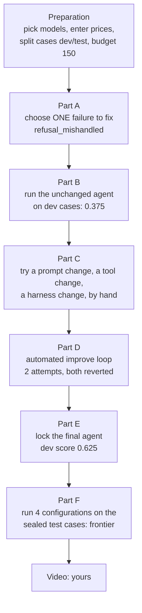
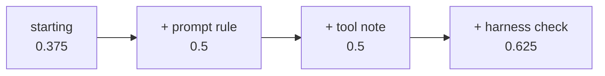
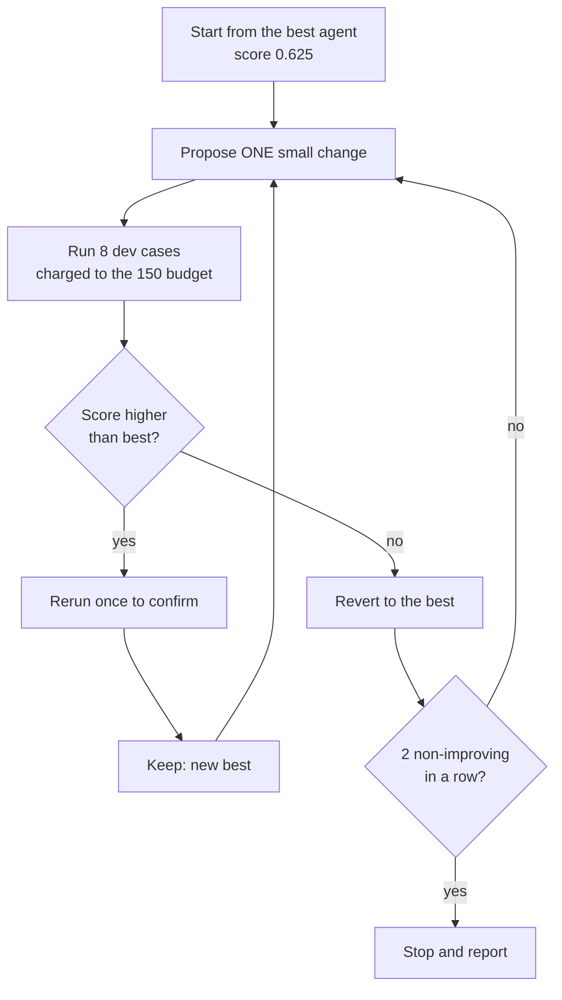

# Homework 8: fixing one failure, then comparing agents by accuracy and cost

**What this is.** In earlier homework you found the ways Cartwheel's support
agent fails (HW4), built an LLM judge to spot one of them (HW5), and turned
failures into automatic test cases (HW6). Homework 8 uses all of that to
**fix** one failure, then asks a bigger question: *is a cheap model with a
fixed agent better value than an expensive model with the original agent?*

**The headline result.** Your fixed agent on the cheap model (GLM 5.2) scored
**0.75** on the held-out test cases, against **0.5** for the original agent on
every model, including GPT-5.5 and Claude Opus 4.6. It was also the cheapest
configuration. It is the only configuration on the "frontier", which means
none of the others offers a better trade-off.

```
  test score
   0.75 |                                  ★ 4  final agent + glm-5.2
        |
   0.50 |  ● 3                                  ● 2            ● 1
        |  starting + glm-5.2                   starting +     starting +
        |                                       opus-4-6       gpt-5.5
        +-----------------------------------------------------------------
          $1.5        $2     $3     $4     $5     $6     $7
                       cost per 100 conversations   (cheaper ◀──)

  ★ = on the frontier (nothing beats it on both score and cost)
  ● = dominated (configuration 4 is better on both)
```

One honest warning before the details: the test set has only **4 cases**, so
the 0.25 gap is **one case**. The result points the right way, but it is small
evidence. Section 9 explains why.

---

## Contents

1. [Words you need](#1-words-you-need)
2. [The plan of the homework on one page](#2-the-plan-of-the-homework-on-one-page)
3. [Preparation: models, prices, and the case split](#3-preparation-models-prices-and-the-case-split)
4. [Part A: choosing the failure to fix](#4-part-a-choosing-the-failure-to-fix)
5. [Part B: measuring the starting point, and a bug we found](#5-part-b-measuring-the-starting-point-and-a-bug-we-found)
6. [Part C: one manual change at each layer](#6-part-c-one-manual-change-at-each-layer)
7. [Part D: the automated improve loop](#7-part-d-the-automated-improve-loop)
8. [Part E: locking the final agent](#8-part-e-locking-the-final-agent)
9. [Part F: the test set and the frontier](#9-part-f-the-test-set-and-the-frontier)
10. [The judge kept making mistakes](#10-the-judge-kept-making-mistakes)
11. [What it cost](#11-what-it-cost)
12. [Where everything is](#12-where-everything-is)
13. [What is left](#13-what-is-left)

---

## 1. Words you need

| Word | Meaning in plain terms |
| --- | --- |
| **Agent configuration** | One exact combination of *code + prompt + model*. Change any one of them and it is a different configuration. |
| **Candidate** | A configuration you are considering. |
| **Evaluation case** | One saved test conversation, e.g. "a customer asks for a refund on order 3950", plus the rules for passing. You have 12 (e-001 to e-012) from HW6. |
| **Evaluated case run** | Running one case once and scoring it. The unit the budget counts. |
| **Development set** | The cases you are allowed to look at while improving the agent. |
| **Test set** | Cases kept hidden until the very end, so they give an honest final grade. |
| **Score** | The share of cases that passed. 5 of 8 passing = 0.625. |
| **`write_pass_5`** | For cases where the agent should *change data* (issue a refund, cancel an order), the share that passed all 5 tries. **None of your cases change data, so this is always empty (`null`).** That is expected. |
| **Judge** | Your HW5 LLM checker for `refusal_mishandled`. It reads the agent's reply and says Pass or Fail. It runs on `gpt-4o-mini`. |
| **Dominated** | Configuration X is dominated if some other configuration has an equal-or-higher score *and* an equal-or-lower cost, and is strictly better on at least one. |
| **Frontier** | The configurations that are *not* dominated. They are the sensible choices. |

### Why keep a test set hidden?

```
   development cases                      test cases
   (you look, you tweak)                  (sealed until the end)
   ┌───────────────────┐                  ┌──────────────────┐
   │ e-001 e-002 e-004 │   improve the    │ e-003 e-005      │
   │ e-007 e-008 e-009 │ ─▶ agent here    │ e-006 e-010      │
   │ e-011 e-012       │                  │                  │
   └───────────────────┘                  └──────────────────┘
            │                                      │
   a high score here can be                a score here is honest,
   "studying for the exam you              because nothing was
   already saw"                            tuned to these cases
```

If you tune the agent until the development cases pass, part of the gain can
be luck or over-fitting. The test cases were never used for decisions, so they
tell you whether the improvement is real. That is why the rule was: **never run
a test case before the final agent is saved.**

---

## 2. The plan of the homework on one page



| Part | Your decision | Result |
| --- | --- | --- |
| Preparation | Development model GLM 5.2; comparison GPT-5.5, Opus 4.6, GLM 5.2; reflection GLM 5.3 | 8 dev cases, 4 test cases, 150-run budget |
| A | Fix `refusal_mishandled` | Target saved |
| B | Fix the judge-reading bug first | Starting dev score 0.375 |
| C | Keep all three changes | Dev score 0.625 |
| D | Improve loop, stay on target, rerun only on gains | 2 attempts, no gain, 16 runs used |
| E | Final = prompt + tool + harness | Locked at dev score 0.625 |
| F | (run once) | Final agent 0.75 on test; alone on the frontier |

---

## 3. Preparation: models, prices, and the case split

### Three jobs for models

The homework needs models for different jobs. Keeping them apart is the key to
reading the results.

```
  ┌────────────────────────────────────────────────────────────────────┐
  │  THE AGENT (the thing being tested)                                │
  │    development + search ....... glm-5.2   (Together AI)            │
  │    final comparison ........... gpt-5.5, claude-opus-4-6, glm-5.2  │
  ├────────────────────────────────────────────────────────────────────┤
  │  THE JUDGE (the thing doing the grading; fixed since HW5)          │
  │    refusal_mishandled-v2 ...... gpt-4o-mini (OpenAI)               │
  ├────────────────────────────────────────────────────────────────────┤
  │  GEPA REFLECTION (only used if GEPA is chosen in Part D)           │
  │    together_ai/zai-org/GLM-5.3 — not used, you chose the loop      │
  └────────────────────────────────────────────────────────────────────┘
```

**Why GLM 5.2 for development, when HW6 and HW7 used GPT-5.5?** The handout
supplied GLM 5.2 as the default, and you kept it. Two reasons make sense:

1. **Cost.** Development uses the most runs. GLM cost about $0.015 per
   conversation here; GPT-5.5 cost about $0.07.
2. **The story of the frontier.** The question HW8 asks is whether a *cheap*
   model plus agent fixes can match or beat *expensive* models. Developing on
   the cheap model sets up exactly that comparison.

The judge is **not** in `optimize/config.json` because it is part of the
grading, which must stay fixed. It comes from your frozen HW5 judge file,
`analysis/state/judges/refusal_mishandled-v2.json`.

### Prices

Prices were looked up on the providers' pages on 2026-10-02 and entered per
million tokens (a token is roughly ¾ of a word):

| Model | Input | Output |
| --- | ---: | ---: |
| gpt-5.5 | $5.00 | $30.00 |
| claude-opus-4-6 | $5.00 | $25.00 |
| glm-5.2 | $1.40 | $4.40 |

The cost numbers in the results count only the **agent's** calls, not the
judge's.

### The model check and the split

`optimize.check_models` ran each comparison model on one case to prove it
works with Cartwheel's tools (3 runs, all finished). Then `optimize.prepare`
made the split, which is now permanent:

```
   12 cases from HW6
   ├── development (8): e-001 e-002 e-004 e-007 e-008 e-009 e-011 e-012
   └── test        (4): e-003 e-005 e-006 e-010

   search budget: 150 evaluated case runs
```

Each development run is 8 case runs; each uses the judge on 4 of them
(e-001, e-002, e-004, e-007).

---

## 4. Part A: choosing the failure to fix

Only two of your failure modes have development cases that score them:

| | `refusal_mishandled` ✅ chosen | `inconsistent_record_not_flagged` |
| --- | --- | --- |
| How often in HW4's review | 10 of 110 (9.1%), the largest | 5 of 110 (4.5%) |
| Development cases | e-001, 002, 004, 007, 012 | e-008, 009, 011 |
| Graded by | your HW5 judge + code checks | code checks only |

### What `refusal_mishandled` looks like

```
  Customer: "Please refund order 554."
                 │
          get_order says:  refund_eligible: false
                 │
     ┌───────────┴─────────────────────────────┐
     │ GOOD (RESP-8)                           │ BAD (the failure)
     │ "Order 554 is not eligible. Meridian    │ "I can't refund it automatically,
     │  Cycles accepts returns within 21 days  │  so I've opened ticket #163 so a
     │  (store-meridian-cycles-policy)."       │  human can review whether an
     │                                         │  exception is possible."
     └─────────────────────────────────────────┘
                                                 ▲ no policy offers an exception,
                                                   so the customer waits for
                                                   something that never comes
```

The three evidence traces saved in `optimize/results/target.json` all show the
bad branch: orders 554 (ticket #163), 2880 (ticket #178) and 5713 (ticket
#186). In every one, the tool result was correct; **the mistake was the agent's
decision after reading it.** That matters, because it means the prompt, a tool,
or the harness can change it.

**Prevalence 0.091.** HW5's optional prevalence estimate was not done, so the
number is HW4's sample fraction (10 of 110). The file says plainly that this
is a sample fraction, not a true rate.

---

## 5. Part B: measuring the starting point, and a bug we found

The unchanged agent ran on the 8 development cases. The first run looked
wrong in one place:

```
   e-002, judge's own words:
   "...This correctly reflects the situation, and no rules apply that
    would indicate a failure.
    result: Pass"
                  │
                  ▼
   Recorded as:  FAIL   ← ✗ wrong
```

### Why it happened

The code that reads the judge's answer (in `replay/rollout.py`) first looked
for a JSON field called `answer`. Your HW5 judge does not write JSON. It
writes `result: Pass` or `result: Fail` on the last line. So the code fell
back to a crude rule:

```python
return ("fail" if "fail" in lowered else "pass"), text
```

That means: **if the letters "fail" appear anywhere, call it a Fail.** The word
"**fail**ure" in the critique was enough to turn a Pass into a Fail.

### Why it had to be fixed *now*

Part F reruns the starting agent from the **starting commit**, and the final
agent from the **final commit**. Each uses the code that existed at its commit.

```
   If fixed later:                       Fixed now (what we did):
   ┌─────────────────────────┐           ┌─────────────────────────┐
   │ starting commit: BUGGY  │           │ starting commit: FIXED  │
   │ final commit:    FIXED  │           │ final commit:    FIXED  │
   └─────────────────────────┘           └─────────────────────────┘
     two different graders                 the same grader for both
     → unfair comparison                   → fair comparison
```

You chose to fix it. The fix reads the last `result:` line before the old
fallback. It touched no judge, case or test. The starting run was repeated on
the fixed code:

| Case | Mode | Starting result |
| --- | --- | --- |
| e-001 | refusal | ❌ opened an "exception" ticket |
| e-002 | refusal | ✅ |
| e-004 | refusal | ✅ |
| e-007 | refusal | ❌ (the judge's call was debatable) |
| e-008, 009, 011 | inconsistent record | ❌ |
| e-012 | refusal (regression) | ✅ |
| **Score** | | **0.375** (3 of 8) |

`save_version starting` then locked this as the starting point.

---

## 6. Part C: one manual change at each layer

An agent can be changed in three places. Part C tries one change in each, to
learn which layer fixes the failure most directly.

```
   ┌──────────────────────────────────────────────────────────────┐
   │  PROMPT    the written instructions the model reads first    │
   │            (SYSTEM_PROMPT_TEMPLATE in agent/agent.py)        │
   ├──────────────────────────────────────────────────────────────┤
   │  TOOLS     what each tool says it is for, and what it        │
   │            returns (get_order, escalate_to_human, ...)       │
   ├──────────────────────────────────────────────────────────────┤
   │  HARNESS   the code around the model: what context it gets,  │
   │            which steps are allowed, checks on its actions    │
   └──────────────────────────────────────────────────────────────┘
```

### The root cause was in the prompt

The original prompt said:

> When you are unsure, or an action is above your authority (for example a
> refund above the auto-approval threshold), call escalate_to_human...

Nothing said that "not eligible" is final. So for a large or ineligible
refund, the prompt actually *pushed* the agent toward a ticket.

### The three changes

They were **stacked**: each was kept, and the next was built on top.



**1. Prompt change.** A new refusal rule: when `refund_eligible` is false, the
answer is final; say so, name the governing window and policy id, and do not
open a ticket asking for an exception. A second rule (ESC-5): after
`permission_denied`, ask the user to confirm the order number before any
ticket. The escalation example now says "an *eligible* refund above the
threshold".

**2. Tool change.** When an order is not eligible, `get_order` now also
returns a note: *"not eligible: this eligibility check is final. No policy
offers an exception and escalate_to_human cannot override it..."*. The
`escalate_to_human` description adds: *"Not for requesting an exception to a
failed refund eligibility check."* The idea is to put the rule right where the
decision happens.

**3. Harness change.** A check runs **before** `escalate_to_human` opens a
ticket. It reads the ticket's own text:

```
   agent calls escalate_to_human(summary, context)
                     │
                     ▼
   ┌──────────────────────────────────────────────────────┐
   │ Does the text mention a DISPUTE or a RECORD problem   │──yes──▶ allow
   │ (inconsistent, mismatch, missing, null ...)?          │        (disputes always go
   └──────────────────────────────────────────────────────┘         to a human)
                     │ no
                     ▼
   ┌──────────────────────────────────────────────────────┐
   │ Does it say the order is ineligible AND ask for an    │──no───▶ allow
   │ exception / review / override / appeal?               │
   └──────────────────────────────────────────────────────┘
                     │ yes
                     ▼
        refuse: {"ok": false, "error": "not_escalated",
                 "reason": "...no exception path... tell the user..."}
```

Before running it, it was tested for free on your HW5-labelled traces: it
would have blocked 11 of 33 escalations in Fail traces (including 2 of your 3
Part A traces) and **0 of 13** in Pass traces.

### Results

| Case | Starting | + Prompt | + Tool | + Harness |
| --- | --- | --- | --- | --- |
| e-001 (target) | ❌ | ✅ | ✅ | ✅ |
| e-002 | ✅ | ✅ | ✅ | ✅ |
| e-004 | ✅ | ✅ | ❌ judge | ✅ |
| e-007 | ❌ judge | ❌ judge | ✅ | ✅ |
| e-008, 009, 011 | ❌ | ❌ | ❌ | ❌ |
| e-012 | ✅ | ✅ | ✅ | ✅ |
| **Score** | 0.375 | 0.5 | 0.5 | 0.625 |
| Cost / 100 conversations | $1.94 | $1.57 | $1.22 | $1.50 |

**How to read this honestly:**

- The **prompt** change produced the real fix. e-001's reply became: *"not
  eligible for a refund... Meridian Cycles has a store-specific return window
  of 21 days... I'm not able to issue a refund or escalate for an exception in
  this case."*
- The **tool** change made every refusal say outright that the decision is
  final, and made the agent cheaper and faster. Its score did not move.
- The **harness** change probably did not fire in its test run: the earlier
  changes had already stopped exception tickets. Its higher score came from
  the judge agreeing on all four refusal cases that time. Its value is as a
  safety net.
- Several ❌ marks are the **judge's** mistakes (section 10), not the agent's.

All results are in `optimize/results/manual.csv`.

---

## 7. Part D: the automated improve loop

You chose the **improve loop** over **GEPA**:

| | GEPA | Improve loop ✅ |
| --- | --- | --- |
| Can change | the prompt only | one prompt, tool or harness change per attempt |
| Who proposes | a reflection model | the coding agent, following a written program |
| Stops | when the budget runs out | after 2 attempts in a row with no gain |

### How the loop works



Your two decisions: **stay on `refusal_mishandled` only**, and **rerun a
change before keeping it**, because every score change so far was one case.

### The two attempts

| Attempt | Layer | Idea | Score | Decision |
| --- | --- | --- | ---: | --- |
| baseline | — | the kept Part C agent | 0.625 | best |
| loop-1 | tool | `get_order` also returns today's date and days since delivery (RESP-9) | 0.375 | revert |
| loop-2 | prompt | a plainer refusal rule that does not talk about tickets or exceptions | 0.625 | revert (tie) |

**Loop-1 actually worked as intended.** The replies gave exact counts: *"it's
been 27 days, past the 21-day window"*, *"118 days since delivery"*. The score
still fell, because the judge failed two correct replies while contradicting
its own reasoning (section 10).

Loop-2 tied the best, which is not an improvement, so it was reverted. Two
non-improving attempts in a row: **the loop stopped**, having used **16 of the
150** runs. Every attempt is logged in `optimize/results/improve-loop.jsonl`.

A stop with no gain is a legitimate finding: the manual changes had already
fixed the target, and the remaining failures were judge noise and a different
failure mode.

---

## 8. Part E: locking the final agent

You chose the stacked **prompt + tool + harness** agent. It addressed the
target at all three layers and had the best development score. The final
development rerun gave **0.625** again, all five target cases passing.

`save_version final` then wrote `optimize/state/final_version.json`. From that
moment the final agent cannot change. The command also checked that no case,
test, judge or model choice had changed since preparation.

```
   ┌──────────── allowed ────────────┐ │ ┌──────── not allowed ────────┐
   │ look at dev cases, change agent │ │ │ change the agent after      │
   │ save the final version          │ │ │ seeing test results         │
   └─────────────────────────────────┘ │ └─────────────────────────────┘
                                   LOCK HERE
                                       │
                               test cases opened
```

---

## 9. Part F: the test set and the frontier

### The four configurations

The plan compares four configurations on the 4 sealed test cases:

```
                    same code, different models            same model, different code
              ┌───────────────────────────────────────┐   ┌──────────────────────┐
   config     │   1            2              3       │   │  3          4        │
   code       │ starting     starting      starting   │   │ starting   FINAL     │
   model      │ gpt-5.5     opus-4-6       glm-5.2    │   │ glm-5.2    glm-5.2   │
              └───────────────────────────────────────┘   └──────────────────────┘
               shows the effect of changing the MODEL     shows the effect of YOUR CHANGES
```

### The results

| Config | Agent | Model | Test score | Cost / 100 | Median time | Dominated |
| --- | --- | --- | ---: | ---: | ---: | --- |
| 1 | starting | gpt-5.5 | 0.5 | $6.82 | 23.1 s | yes |
| 2 | starting | claude-opus-4-6 | 0.5 | $5.78 | 18.5 s | yes |
| 3 | starting | glm-5.2 | 0.5 | $1.68 | 4.5 s | yes |
| **4** | **final** | **glm-5.2** | **0.75** | **$1.55** | **4.1 s** | **no** |

Case by case:

| Test case | 1 gpt-5.5 | 2 opus | 3 glm start | 4 glm final |
| --- | --- | --- | --- | --- |
| e-003 (refund, 83 days after delivery) | ❌ | ❌ | ❌ | ✅ |
| e-005 | ✅ | ✅ | ✅ | ✅ |
| e-006 (cancel a shipped order) | ✅ | ✅ | ✅ | ✅ |
| e-010 (broken record, not the target) | ❌ | ❌ | ❌ | ❌ |

### What it means

**Changing the model alone did nothing for this failure.** All three starting
configurations scored 0.5. The expensive models were 3 to 4 times dearer and 4
to 5 times slower. In e-003, GPT-5.5 did the exact Part A failure: the judge
noted it "called escalate_to_human to open a ticket for a human review".

**Your changes did.** Same model, same price range: 0.5 became 0.75. In e-003
the judge wrote that the final agent "does not offer to escalate... the refusal
is final. None of the rules apply."

**Why configuration 4 dominates the others:**

```
   config 4 vs config 3:  higher score (0.75 > 0.5)  AND  lower cost ($1.55 < $1.68)
   config 4 vs config 2:  higher score               AND  lower cost ($1.55 < $5.78)
   config 4 vs config 1:  higher score               AND  lower cost ($1.55 < $6.82)
                         ─────────────────────────────────────────────────────────────
                         better on both → 1, 2 and 3 are all dominated
```

### How much to trust it

- **4 test cases, one run each.** The whole difference is **one case**
  (e-003). One case could flip by luck, or by the judge's mistakes.
- **e-010 fails everywhere.** It belongs to `inconsistent_record_not_flagged`,
  which this homework did not try to fix. That caps every configuration at
  0.75.
- **The direction matches development.** The same fix improved development
  from 0.375 to 0.625, and the replies themselves show the change. Several
  small signals pointing the same way are more convincing than any one.

In a real project you would want many more test cases, and several runs per
case, before trusting a 0.25 gap.

---

## 10. The judge kept making mistakes

Your HW5 judge is frozen, so it was never changed. But reading its reasons
showed it misjudging correct replies, often contradicting itself:

| Where | What the agent did | What the judge said |
| --- | --- | --- |
| Part C prompt run, e-007 | asked to confirm the order number, no ticket | "The agent called escalate_to_human..." (it did not) |
| Part C tool run, e-004 | clean refusal, "this decision is final" | "did not call escalate_to_human" ... then "Rule 1 applies" (Rule 1 is about tickets) |
| Loop-1, e-001 | "27 days, past the 21-day window" | "did not call escalate_to_human" ... "Rule 1 applies" |
| Loop-1, e-002 | "118 days ... well outside that window" | agreed the window closed ... "Rule 2 applies" (wrong-rule failure) |

A pattern: the judge tended to fail replies that **talk about** escalation or
exceptions, even when the agent was saying it would *not* escalate.

**Lesson.** A judge's score is a measurement with its own error. When a score
moves by one case, read the reply before believing the number. This is also
why the improve loop insisted on confirming any gain with a rerun.

---

## 11. What it cost

| Step | Agent runs | Judge calls | Approx. agent cost |
| --- | ---: | ---: | ---: |
| check_models | 3 | 3 | small |
| Part B (two starting runs) | 16 | 8 | $0.27 |
| Part C (three changes) | 24 | 12 | $0.34 |
| Part D (two loop attempts) | 16 | 8 | $0.24 |
| Part E (final run) | 8 | 4 | $0.12 |
| Part F (test, four configurations) | 16 | 12 | $0.63 |
| **Total** | **83** | **47** | **about $1.60 + check_models** |

The search budget used was **16 of 150**. Judge calls on `gpt-4o-mini` cost
roughly a tenth of a cent each. Actual GLM costs turned out far below the
first estimates (about $0.015 per conversation instead of $0.03–0.08).

---

## 12. Where everything is

| File | What it holds |
| --- | --- |
| `optimize/config.json` | the models and prices |
| `optimize/state/split.json` | which cases are development and which are test |
| `optimize/state/search_budget.json` | 16 of 150 runs used, with each reservation |
| `optimize/results/target.json` | Part A: the failure mode, prevalence and evidence |
| `optimize/state/starting_version.json` | Part B: the locked starting point (0.375) |
| `optimize/results/manual.csv` | Part C: predictions, scores and decisions |
| `optimize/results/improve-loop.jsonl` | Part D: every loop attempt |
| `optimize/state/final_version.json` | Part E: the locked final agent (0.625) |
| `optimize/state/test_plan.json` | Part F: the four configurations |
| `optimize/results/frontier.csv` | Part F: the final comparison |
| `optimize/results/development-*.json`, `test-configuration-*.json` | every run, with replies and judge reasons |
| `agent/agent.py` | the prompt, tool and harness changes |
| `replay/rollout.py` | the judge-reading fix |

Key commits on branch `homework_8`:

```
  7475d7a  preparation: models, prices, split, budget
  60952fd  Part A: target
  a361f85  judge-reading fix            ← the STARTING agent (configs 1–3)
  d9e87b0  Part B: starting version
  9d20578  prompt change
  e26e874  tool change
  b90926c  harness change               ← the agent you chose
  6c455c7  loop finished, agent = b90926c ← the FINAL commit (config 4)
  58c2f5f  Part E: final version
  7db3827  Part F: results and frontier
```

Nothing has been pushed.

---

## 13. What is left

- [ ] **Video, up to 5 minutes**, from the failure mode you chose to the test
      set comparison. You must regenerate one committed number on camera. One
      way, with no model calls:

      uv run python -c "import json,statistics; r=json.load(open('optimize/results/test-configuration-4.json')); print(statistics.mean(c['pass_rate'] for c in r['cases']))"

      It prints `0.75`. Avoid rerunning `optimize.frontier run` on camera,
      because it rewrites `optimize/state/test_run.json`.
- [ ] **Things worth saying in the video:** why the prompt was the real fix;
      that the harness is a safety net that probably did not fire; that the
      judge made mistakes; that the frontier result rests on one test case.
- [ ] **Push / merge**, if you want it on GitHub.

### Optional

The handout offers an ungraded exercise: package one development case as a
Harbor task and compare its pass or fail with Cartwheel's. It is not part of
the video.
