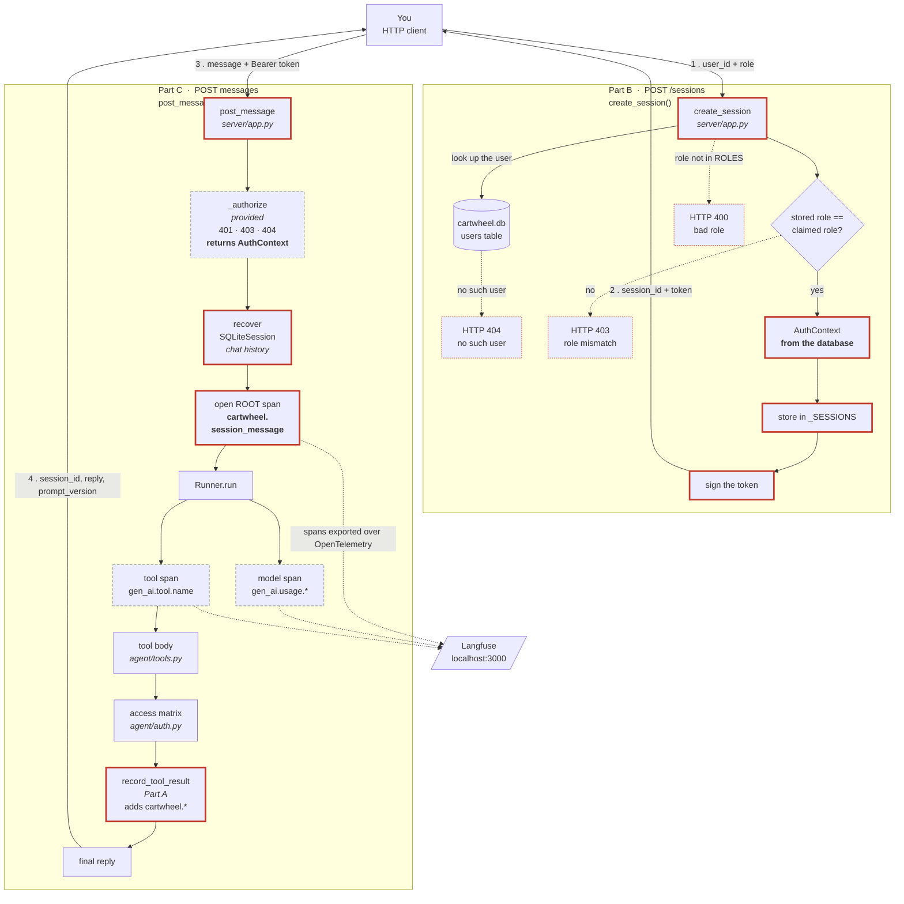
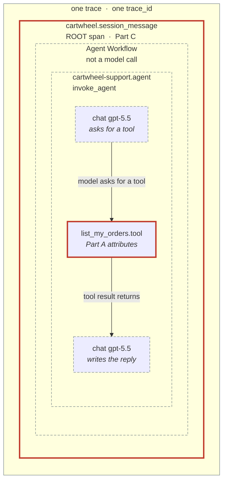
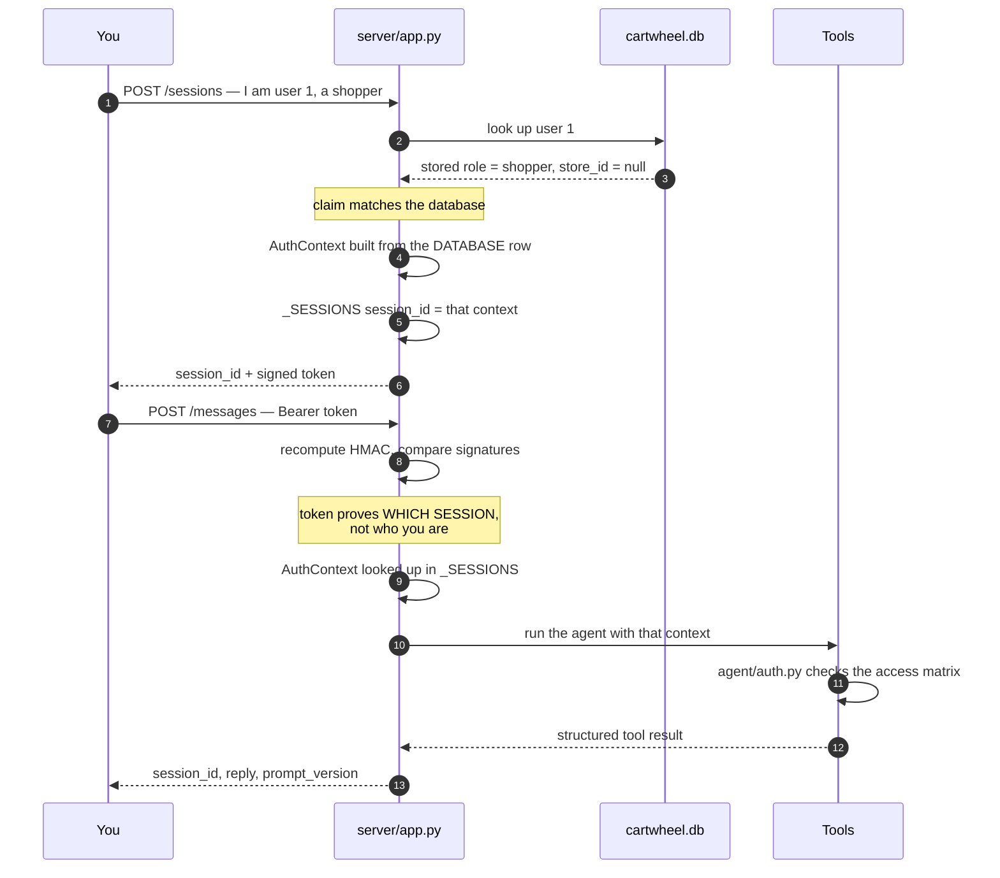

# Homework 2 — how a request becomes a trace

Three views of the same journey: the path a request takes, the tree of
spans it leaves behind, and what the session token actually is.

## Diagram 1 — from your message to the trace

How one request travels from an HTTP client, through the endpoint, into the
agent and its tools, and out to Langfuse as a trace.

Two things happen, in order: you **create a session** once, then you **send
messages** to it. The first establishes who you are; the second is where the
work and the tracing happen.



**Legend.** Thick red outline = code you write in Homework 2. Dashed grey =
provided or recorded automatically by OpenLLMetry. Dotted red = error paths the
handout requires.

**The two halves are two separate HTTP requests, not one sequence.** Everything
in the Part B box is `create_session` in `server/app.py`; everything in the
Part C box is `post_message`. `create_session` runs once, does a database read
and signs a token, and opens no span: nothing unpredictable happens in it.
`post_message` runs once per message and is where the model and the tools run,
which is why the root span lives there and is named `session_message` rather
than `session`. A session with five messages produces five traces.

**`_SESSIONS` holds a pair, and the two halves come out at different moments.**

```python
_SESSIONS: dict[str, tuple[AuthContext, SQLiteSession]] = {}
#                          who you are   what has been said

ctx = _authorize(session_id, authorization)   # returns [0], the AuthContext
_, session = _SESSIONS[session_id]            # takes [1], the SQLiteSession
```

`_authorize` ends with `return _SESSIONS[session_id][0]`, so identity is already
recovered by the time the endpoint fetches the conversation history. The `_` in
the second line discards the context it has just been handed. `Runner.run` needs
the `SQLiteSession` so the agent remembers earlier turns; that is a separate
concern from who the caller is.

### Reading the diagram

The boxes are kept short so nothing is clipped when the diagram renders. The
detail each one stands for is here.

| Stage | What happens | Why it matters |
|---|---|---|
| 1 | You claim a user id and a role | A *claim*, nothing more — not yet trusted |
| — | `create_session` reads the users table | The database is the authority, not the request |
| — | Claimed role vs stored role | Mismatch is HTTP 403. This is the check that stops "I am support staff" |
| — | `AuthContext` is built | Every field comes from the verified row, including `store_id`, which the request has no field to send |
| 2 | Server returns a session id and a signed token | Identity is now stored **server-side** |
| 3 | Each message carries the token | Proves entitlement to that session, not who you are |
| — | Root span opens | Everything below it shares one `trace_id` |
| — | Tools run and check the matrix | `agent/auth.py` enforces it in code, not in the prompt |
| — | `record_tool_result` fires | Your `cartwheel.*` attributes land on the tool span |
| 4 | Reply returns, spans export | The trace becomes the durable record |

**The `_authorize` box, in full.** It performs three checks before returning
anything, and raises rather than returning on each failure:

| Code | Condition |
|---|---|
| 401 | header missing, not `Bearer …`, or the HMAC signature does not verify |
| 403 | the token was issued for a different session |
| 404 | no such session on this server (it restarted, and `_SESSIONS` is in memory) |

Only after all three does it `return _SESSIONS[session_id][0]`, the
`AuthContext`. There is no path where the endpoint holds an identity that
skipped these checks.

**The "recover SQLiteSession" box.** `_SESSIONS` stores a pair per session, and
the halves come out at different moments: `_authorize` returns the
`AuthContext`, then the endpoint fetches the `SQLiteSession`, the conversation
history `Runner.run` needs so the agent remembers earlier turns. Identity never
comes from the message text.

**The root span box** carries `cartwheel.user_role`, `cartwheel.user_id`,
`cartwheel.prompt_version`, `cartwheel.scenario_id` when the request supplies a
nonempty one, and `gen_ai.input.messages` / `gen_ai.output.messages` when
`TRACELOOP_TRACE_CONTENT` is true. The attribute table in Diagram 2 lists the
types and which Part sets each one.

**The `record_tool_result` box** adds `cartwheel.user_role`,
`cartwheel.user_id`, `cartwheel.store_id` for merchants, and
`cartwheel.permission_denied` with `.reason` when a tool denied the request.

Note that `record_tool_result` runs **inside** the tool span, not after it.
`_call` in `agent/agent.py` invokes it while that span is still active, which is
why `trace.get_current_span()` finds the right span to write to.

---

## Diagram 2 — the span tree inside one trace

A **trace** is every span from one request, sharing a `trace_id`. A **span** is
one timed step with attributes attached. Langfuse draws them nested, so the
skeleton below is the shape you will actually see on screen.

Mermaid draws containment well but cannot fit an attribute list inside a
subgraph title, so the structure is here and the attributes are in the table
underneath.



Two naming details, both observed rather than guessed: the tool span is named
`<tool>.tool`, not `execute_tool <tool>` — the tool name lives in the
`gen_ai.tool.name` attribute, and the span name is its own thing. And there is a
`cartwheel-support.agent` span between `Agent Workflow` and the tool spans,
named after the agent and carrying `gen_ai.operation.name = invoke_agent`.

A real trace has more spans than this: one model span per turn of the loop, and
one tool span per tool call.

**What has been confirmed so far.** The nesting above down to the tool span was
observed offline, running one request through `post_message` with
`tests.eval.fake_model` and an in-memory OTel exporter:

```text
cartwheel.session_message
└── Agent Workflow
    └── cartwheel-support.agent
        └── list_my_orders.tool
```

The fake model is not an instrumented client, so **no model span appeared** in
that run. The two `chat gpt-5.5` boxes above are where model spans are expected
once a real provider is called. Confirm their exact placement and names against
Langfuse in Part E, and correct this diagram if they sit elsewhere.

### Every attribute, and who sets it

This table is also your implementation checklist for Parts A and C.

| Attribute | Which span | Set by | Part | Type / note |
|---|---|---|---|---|
| `cartwheel.user_role` | root | **you** | C | string |
| `cartwheel.user_id` | root | **you** | C | decimal id **stored as a string** |
| `cartwheel.prompt_version` | root | **you** | C | hash from `prompt_version()` |
| `cartwheel.scenario_id` | root | **you** | C | only when the request supplies a nonempty value |
| `gen_ai.input.messages` | root | **you** | C | `json.dumps` of the OTel GenAI message array |
| `gen_ai.output.messages` | root | **you** | C | same shape, role `assistant`, set after the run |
| `cartwheel.user_role` | each tool span | **you** | A | same value for every tool call in the request |
| `cartwheel.user_id` | each tool span | **you** | A | decimal id **stored as a string** |
| `cartwheel.store_id` | each tool span | **you** | A | **integer**, merchants only |
| `cartwheel.permission_denied` | each tool span | **you** | A | boolean, set on **every** call, not just denials |
| `cartwheel.permission_denied.reason` | each tool span | **you** | A | only when denied |
| `gen_ai.operation.name` | agent span | automatic | — | the value `invoke_agent` |
| `gen_ai.operation.name` | each tool span | automatic | — | the value `execute_tool` |
| `gen_ai.tool.name` | each tool span | automatic | — | e.g. `list_my_orders` |
| tool arguments and result | each tool span | automatic | — | needs `TRACELOOP_TRACE_CONTENT=true` |
| `gen_ai.request.model` | model span | automatic | — | Chat Completions and LiteLLM calls |
| `gen_ai.response.model` | model span | automatic | — | Responses API calls |
| `gen_ai.usage.input_tokens` | model span | automatic | — | *model* tokens, unrelated to the auth token |
| `gen_ai.usage.output_tokens` | model span | automatic | — | |

Two things the table makes obvious:

- **Identity is recorded twice**, deliberately. Once on the root span (the
  request as a whole) and again on every tool span (so a tool call can be
  audited without walking back up the tree).
- **`cartwheel.permission_denied` is always set**, even on success. A missing
  attribute and a `false` attribute are different things when you later count
  denials, which is exactly what Module 3 and the smoke report do.

### The same tree with attributes in place

Indentation carries the nesting, so nothing has to be squeezed into a box:

```text
trace_id: eaf80ae0ac8900ef…                  one trace = one request
│
└── cartwheel.session_message                ROOT span — you create it (Part C)
    │   cartwheel.user_role      = "shopper"
    │   cartwheel.user_id        = "1"
    │   cartwheel.prompt_version = "057b0f9f70cb"
    │   gen_ai.input.messages    = [{"role":"user",      "parts":[…]}]
    │   gen_ai.output.messages   = [{"role":"assistant", "parts":[…]}]
    │
    └── Agent Workflow                       automatic; groups the run,
        │                                    NOT another model call
        │
        └── cartwheel-support.agent          automatic; named after the agent
            │   gen_ai.operation.name = "invoke_agent"
            │
            ├── chat gpt-5.5                 automatic (model span)
            │   │   gen_ai.request.model       = "gpt-5.5"
            │   │   gen_ai.usage.input_tokens  = 1204
            │   │   gen_ai.usage.output_tokens = 37
            │
            ├── list_my_orders.tool          automatic (tool span)
            │   │   gen_ai.operation.name    = "execute_tool"   ┐ standard,
            │   │   gen_ai.tool.name         = "list_my_orders" ┘ free
            │   │   cartwheel.user_role      = "shopper"        ┐ yours,
            │   │   cartwheel.user_id        = "1"              │ added by
            │   │   cartwheel.permission_denied = false         ┘ Part A
            │
            └── chat gpt-5.5                 automatic; writes the final reply
                    gen_ai.usage.input_tokens  = 1631
                    gen_ai.usage.output_tokens = 88
```

Note where Part A and Part C write: **two different levels**. Identity once per
request on the root, identity *plus the permission decision* on every tool span.


## What the token is

"Token" means two unrelated things in this assignment, and both appear in your
traces:

| "token" | Meaning | Where you see it |
|---|---|---|
| **auth token** | a pass that proves who you are | `Authorization: Bearer …` |
| **model token** | a chunk of text the model reads or writes | `gen_ai.usage.input_tokens` |

Everything below is the first one.

### A coat-check ticket

You hand over your identity **once**, at the cloakroom (`POST /sessions`). The
server checks it against the database, stores your coat, and gives you a ticket.
Every later time you come to the counter you don't re-explain who you are — you
show the ticket.

Without it you would have to resend `user_id` and `role` with every message, and
the server would have to simply believe you. Anyone could claim the support role
and read every order in the system.

### What is actually inside it

Not magic — two pieces of text joined by a dot. The real code, from
`server/app.py`:

```python
def create_token(payload: dict[str, Any]) -> str:
    body = base64.urlsafe_b64encode(
        json.dumps(payload, sort_keys=True).encode()
    ).decode()
    sig = hmac.new(_secret(), body.encode(), hashlib.sha256).hexdigest()
    return f"{body}.{sig}"
```

So a token looks like this:

```
eyJpc3N1ZWRfYXQiOjE3NTc1…fQ==.4a7d1ed414474e4033ac29ccb8653d9b
└──────────── body ────────────┘└──────── signature ──────────┘
     the facts, base64-encoded     proof they were not edited
```

**The body** is JSON rewritten using only URL-safe characters — that is all
base64 is. Decoded, it holds the five fields the handout requires:

```json
{"issued_at": 1757500000, "role": "shopper",
 "session_id": "3f2a...", "store_id": null, "user_id": 1}
```

**The signature** is the half that does the work. The server holds a private
secret (`CARTWHEEL_DEV_SECRET`). It runs secret + body through a one-way
function to get that fingerprint. When the token comes back, `verify_token`
recomputes the fingerprint and compares:

```python
expected = hmac.new(_secret(), body.encode(), hashlib.sha256).hexdigest()
if not hmac.compare_digest(sig, expected):
    return None
```

Change one character of the body — `"role": "shopper"` to `"role": "support"` —
and the fingerprint no longer matches, so the token is rejected. You cannot
compute a new matching fingerprint without the secret.

Two properties worth remembering:

- **It is not encrypted.** Anyone holding the token can read the body. It is
  tamper-*evident*, not secret. Acceptable here because this is dev-only auth,
  as `server/app.py` says in its own docstring.
- **"Bearer"** means "whoever bears this." No extra password; possession is the
  claim. That is why real systems require HTTPS and expire their tokens.

### The part that matters most

Look at what `_authorize` actually returns:

```python
return _SESSIONS[session_id][0]
```

Not the token's contents — the `AuthContext` from the server's own dictionary.
The token's only job is to prove *which session* you may use. The identity
itself never left the server.



Same principle as the access matrix, one layer deeper: even the token is not
trusted to say who you are. It says only that you are entitled to a session the
server already decided the identity for.
