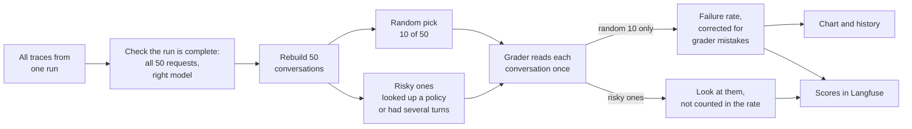
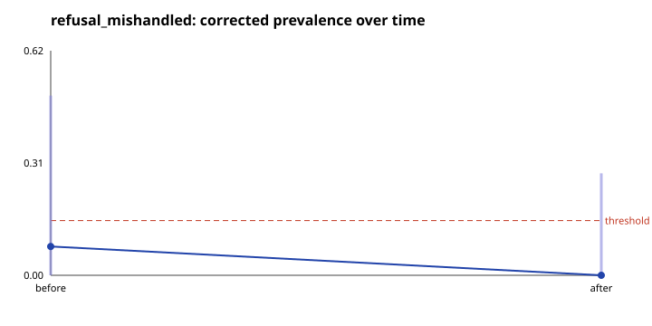

# Homework 7: monitoring `refusal_mishandled`

**The question:** how often does Cartwheel handle a refusal badly? For
example, it might refuse using the wrong rule, or say a return window has
closed when it has not.

**The method:** we ran the same 50 support requests twice, 13 days apart.
Each run stands in for one week of real traffic, since Cartwheel has no real
users. An automatic grader (the frozen Homework 5 judge) checks a random
handful of conversations from each run, and we correct its score for the
mistakes we know it makes.

**Important:** the agent itself was **not changed** between the two runs.
See "What changed between the two runs" below.

## How the monitor works



**Traces and conversations.** Every message the user sends creates one
record in Langfuse, called a trace. Most requests are a single message, but
10 of them have follow-up messages. So 50 requests make 64 traces. The
monitor puts each request's traces back together into one conversation,
and the grader reads the whole conversation at once.

**Why only the random 10 count.** A random pick is a fair sample of all 50
conversations, so its failure rate estimates the rate for everyone. The
"risky" conversations were picked *because* they are more likely to fail,
so counting them would make the rate look worse than it is. We look at them
separately to find problems, but leave them out of the rate.

## Facts

### Settings, chosen before any grading

| Setting | Value |
| --- | --- |
| What we measure | `refusal_mishandled`: a refusal handled badly |
| Grader | The frozen Homework 5 judge `refusal_mishandled-v2`, running on `gpt-4o-mini` (prompt hash `b182a9d5ce68`). Nothing about it was changed. |
| What the grader sees | The same format as in Homework 5: who the user is, the store rules, then every message, tool call and reply. For the 5 conversations it also graded in Homework 5, the text is exactly the same. |
| Cartwheel's model | `gpt-5.5`, specifically `gpt-5.5-2026-04-23`, in every call in both runs |
| Requests | The 50 in `scenarios/monitoring_scenarios.jsonl`: 40 single-message, 10 with follow-ups, 64 messages in total |
| Random pick | 20%, which is 10 of 50, with a fixed seed (7). Both runs pick the same 10 requests. |
| Risky groups | `policy_lookup`: the agent looked up a policy. `multi_turn`: the user sent more than one message. |
| Alarm level | 0.15. If the corrected failure rate goes above 15%, start a new error analysis. |

### The two runs

| | Before | After |
| --- | --- | --- |
| What it is | The Homework 3 run | A fresh run for Homework 7 |
| When (UTC) | 2026-09-14, 06:43 to 07:58 | 2026-09-27, 11:18 to 11:30 |
| Requests finished | 50 of 50 (`scenarios/final-results.jsonl`) | 50 of 50 (`scenarios/hw7-after-results.jsonl`) |
| Traces in Langfuse | 64 | 64 |
| Conversations | 50 | 50 |
| Random pick | 10 | 10 |
| Risky conversations | 20 | 21 |
| Conversations graded (random and risky together, each graded once) | 27 | 28 |

### What changed between the two runs

**The agent did not change.** Both runs used the same agent to answer the
same requests:

| Checked | Before | After |
| --- | --- | --- |
| Agent instructions (system prompt version stamped on every trace) | `87a13cef5393` | `87a13cef5393`, the same |
| Model version | `gpt-5.5-2026-04-23` | the same |
| Agent code (`agent/agent.py`) | | the same. The two test bugs from Homework 6 were removed again. |
| Supporting libraries | openai-agents 0.17.7, openai 2.44.0, litellm 1.91.0 | the same versions |
| Store data and policies | freshly reset | freshly reset, same policies |
| Requests | the 50 monitoring requests | the same 50 |

**What did change** is only background detail, none of which affects the
agent's answers:

| Change | Does it affect the answers? |
| --- | --- |
| The runs were 13 days apart | No. The store's data is always dated 2026-07-01. |
| Each trace now records its session ID, for the daily monitor | No. It is only a label on the trace. |
| A debugging tool from Homework 4 was added to the server | No. It is switched off. |
| Testing code from Homework 6 was added | No. It is not used when the agent answers. |
| The first run did all 250 Homework 3 requests; the second did only these 50 | No. The 50 requests themselves were identical. |

**So why can the results differ?** An AI model does not give exactly the
same answer every time, even to the same question. The two runs therefore
differ in wording and in which tools the agent used. For example, 14
conversations looked up a policy in the first run and 15 in the second.

### The failure rate (from the random 10 only)

| | Before | After |
| --- | --- | --- |
| Random conversations the grader flagged | 2 of 10 | 1 of 10 |
| Raw rate (flagged ÷ 10) | 0.20 | 0.10 |
| **Corrected rate** (allowing for grader mistakes) | **0.0789** | **0.0000** |
| 95% range of likely values | 0.00 to 0.49 | 0.00 to 0.28 |



**Why correct the rate?** The grader is not perfect. In Homework 5 we tested
it on 29 conversations that a person had already labelled (15 failures,
14 passes):

- it caught **87%** of the real failures (13 of 15), and missed the rest
  (failure sensitivity 0.8667)
- it passed **86%** of the good conversations (12 of 14), and wrongly
  flagged the rest (pass specificity 0.8571)

Because it sometimes flags good conversations, the raw rate overstates the
real failure rate. The correction (the Rogan-Gladen formula) adjusts for
both kinds of mistake:

```
corrected = (raw + 0.8571 - 1) / (0.8667 + 0.8571 - 1)
```

With only 10 conversations in the random pick, the corrected rate can take
only a few values:

| Flagged of 10 | 0 or 1 | 2 | 3 | 4 |
| --- | --- | --- | --- | --- |
| Corrected rate | 0.00 | 0.08 | 0.22 | 0.36 |

So the 0.15 alarm goes off when **3 or more of the 10** are flagged.

**What the "range of likely values" means.** We re-ran the calculation
20,000 times on reshuffled copies of the data: the 10 graded conversations
and the grader's 29 test results. The range covers the middle 95% of those
results. It is wide because 10 conversations is a small sample, and the
grader's own accuracy is only known from 29 tests.

### Risky conversations (looked at, not counted in the rate)

| Group | Before: flagged | After: flagged |
| --- | --- | --- |
| Looked up a policy (`policy_lookup`) | 5 of 14 | 3 of 15 |
| User sent several messages (`multi_turn`) | 1 of 10 | 0 of 10 |
| Either group | 6 of 20 | 3 of 21 |

In each run, 3 of the random 10 were also risky, so they appear in both
counts.

### Scores in Langfuse and the dashboard

Each grading result is saved in Langfuse next to its conversation:

| Score name | What it is | How many |
| --- | --- | --- |
| `refusal_mishandled_verdict` | grader result for a random conversation (1 = failure, 0 = fine) | 20 (10 per run) |
| `refusal_mishandled_risk_verdict` | grader result for a risky conversation | 41 (20 + 21) |
| `refusal_mishandled_corrected_prevalence` | the corrected rate for a run, with its range in the comment | 2 (one per run), in the `cartwheel-monitor` session |

- **No duplicates.** Each score has a fixed ID, so running the monitor again
  updates the score instead of adding a second copy. We checked by grading
  the "after" run twice: the totals stayed at 20, 41 and 2, and the grader
  gave the same result on all 28 conversations both times.
- **Dates.** Each score is dated by its conversation, not by when it was
  saved, so the dashboard shows the "before" run on 2026-09-14 and the
  "after" run on 2026-09-27.
- **Dashboard:** three charts, showing the random-pick results over time,
  the risky-conversation results over time, and a table of the 9
  conversations flagged by either score. The table has 12 flags in total,
  because 3 conversations were flagged by both.

### The daily monitor (GitHub Actions)

- `.github/workflows/monitor.yml` runs every day at 01:00 UTC, and can also
  be started by hand.
- It runs on this PC (a self-hosted runner), because Langfuse only runs
  here.
- Each run grades the conversations from the last 24 hours with the same
  steps as above (`uv run python -m monitoring.run --last-hours 24`). It
  groups traces into conversations by session ID and saves its output as a
  download, even when the job fails.
- It skips the two runs above, which are already graded, so it cannot
  overwrite their scores.
- **Test run:** run 36365745304 on 2026-09-28 finished successfully. It
  found no new conversations, so it made no grader calls and cost nothing.

## Questions

### 1. Did the corrected failure estimate move between the two periods?

- What changed: the corrected estimate dropped from 0.079 to 0.00, while the raw failure rate fell from 0.20 to 0.10.
- What caused it: the difference came down to just one conversation. Of the 10 randomly sampled conversations, 2 were flagged before and 1 was flagged after.
- Context: the agent itself did not change — the prompt version, model, code, and requests were the same. So the lower rate should not be treated as evidence that the agent improved. It reflects normal variation between two runs of the same agent.

### 2. Do the intervals support a conclusion, or is the result uncertain?

- The result is still uncertain. The intervals, 0–0.49 and 0–0.28, overlap substantially, and both include 0.
- Both intervals also include the 0.15 alarm threshold. This means neither period can rule out a true failure rate above 15%.
- The main reason is the small sample size. With only 10 randomly sampled conversations, a single flagged case can shift the estimate by about 0.08. The grader's accuracy estimate is also based on only 29 test cases.
- A firmer conclusion would require a larger random sample, for example by increasing the sampling rate.

### 3. What did the risk groups reveal that the random estimate did not?

- Where failures were concentrated. Conversations involving a policy lookup were flagged more often: 5 of 14 before (36%) and 3 of 15 after (20%). These rates were higher than the random sample's raw rates of 20% and 10%. This is also consistent with HW5, where 35 of the 40 labelled failures involved a policy lookup.
- Where failures were uncommon. Multi-turn conversations were rarely flagged: 1 of 10 before and 0 of 10 after. This suggests that users pushing back did not usually cause the agent's refusal to fail.
- More failure examples to investigate. The risk groups identified 9 flagged conversations, compared with only 3 from the random sample.
- Caveat: these are raw grader flags from a deliberately biased sample. They help identify where failures are more likely to occur, but they should not be used to estimate the overall failure rate.

**How often each group was flagged by the grader**

| Conversations | Before | After |
| --- | --- | --- |
| Random 10 (the normal rate) | 2 of 10 (20%) | 1 of 10 (10%) |
| Agent looked up a policy | 5 of 14 (36%) | 3 of 15 (20%) |
| User sent more than one message | 1 of 10 (10%) | 0 of 10 (0%) |
| Any risky conversation | 6 of 20 (30%) | 3 of 21 (14%) |

Policy lookups were flagged about twice as often as the random 10.
Conversations with several messages were rarely flagged.

**How many flagged conversations each method found (both runs together)**

| Method | Flagged conversations found |
| --- | --- |
| Random 10 only | 3 |
| Risky groups | 9, including the same 3 |

The risky groups found every problem the random pick found, plus 6 more to
look at.


### 4. What action should happen if the estimate crosses the threshold?

* The trigger is a corrected failure rate above 0.15. With 10 random records, this corresponds to 3 or more conversations being flagged.
* Then:
  1. Pull the flagged conversations from both the random sample and the risk groups using the dashboard's flagged-traces table.
  2. Perform error analysis, as in HW4: manually review each conversation and confirm whether the grader's flag is valid.
  3. Add each confirmed failure as a new test case in the HW6 evaluation suite so that CI can catch the same issue in future.
  4. Fix the agent, verify that the fix passes CI, and monitor the corrected estimate in the next period.
* Because the confidence intervals are still wide, an optional step is to temporarily increase the sampling rate to confirm that the threshold crossing is real before starting a full investigation.
